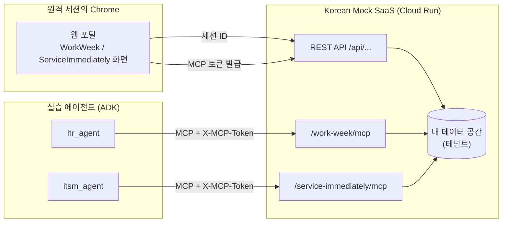
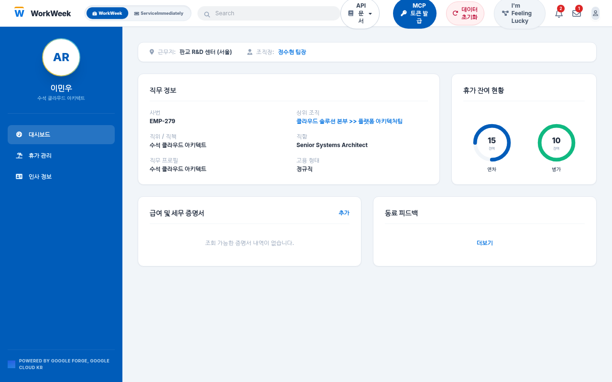

# Korean Mock SaaS 스펙

실습 에이전트가 휴가를 신청하고 IT 티켓을 발행할 때 호출하는 실습용 SaaS입니다. 실제 회사라면 인사 시스템(HRMS)과 IT 서비스 관리 시스템(ITSM)이 있을 자리에, 같은 역할을 하는 서비스 두 개를 Cloud Run 하나로 띄워 두었습니다.

| 서비스 | 실제로 대응하는 시스템 | 에이전트에서 쓰는 곳 |
|:---|:---|:---|
| WorkWeek | 인사 시스템(HRMS): 직원 정보, 휴가 잔여일수, 휴가 신청과 취소 | `hr_agent` |
| ServiceImmediately | IT 서비스 관리(ITSM): 장애·요청 티켓 조회, 발행, 댓글, 상태 변경 | `itsm_agent` |

이 문서는 다음 질문에 답합니다.

- 어디로, 어떤 인증으로 접속하나요? → 접속 정보
- 에이전트가 쓸 수 있는 도구와 인자는 무엇인가요? → 도구 명세
- 처음 상태에 어떤 데이터가 들어 있나요? → 기본 데이터
- 웹 화면과 에이전트가 보는 데이터가 왜 다를 수 있나요? → 토큰과 데이터 공간

---

## 구성과 동작 방식



동작 순서는 다음과 같습니다.

1. 웹 포털을 처음 열면 브라우저가 세션 ID를 만들어 브라우저 저장소에 보관합니다. 이 세션 ID마다 데이터 공간(테넌트)이 하나씩 생기고, 기본 데이터가 복사됩니다.
2. 포털의 **MCP 토큰 발급** 버튼으로 토큰을 만들면, 토큰 안에 이 데이터 공간이 기록됩니다.
3. 에이전트는 MCP 요청마다 이 토큰을 헤더에 넣어 보냅니다. 서버는 토큰을 보고 어느 데이터 공간을 읽고 쓸지 정합니다.
4. 그래서 에이전트가 신청한 휴가나 발행한 티켓이 같은 브라우저의 포털 화면에 그대로 나타납니다.

참가자마다 데이터 공간이 따로 있으므로, 다른 사람이 휴가를 신청하거나 취소해도 내 데이터에는 영향이 없습니다.

> [!NOTE]
> 휴가 사전 신청 기한이나 부서장 승인 같은 회사 규정은 이 SaaS가 검사하지 않습니다. SaaS는 잔여일수가 부족한 경우만 거절합니다. 규정 확인은 에이전트가 RAG로 규정 문서를 찾아 직접 해야 하며, 이것이 실습 1에서 만드는 에이전트의 역할입니다.

---

## 시작하기: 토큰 발급과 연결 확인

### 1. 포털 열기

원격 세션 안의 Chrome에서 포털을 엽니다. 실습 내내 같은 브라우저 창을 씁니다.

- 포털: <https://korean-mock-saas-dri5akvbzq-du.a.run.app/>



### 2. MCP 토큰 발급

화면 오른쪽 위 **MCP 토큰 발급** 버튼을 누릅니다. 창에 토큰 이름(예: `lab`)을 입력하고 **발급하기**를 누른 뒤, 표시된 `mcp_`로 시작하는 토큰을 복사합니다. 토큰은 발급 후 7일 동안 유효합니다.


### 3. 터미널에 토큰 저장

실습 1 Task 4 1단계와 같은 방법으로 `~/lab.env`에 저장합니다. 이 파일은 새 터미널 탭에서도 자동으로 읽힙니다.

```bash
echo 'export MCP_TOKEN="mcp_여기에_복사한_토큰"' >> ~/lab.env
source ~/lab.env
echo "${MCP_TOKEN:0:12}..."
```

### 4. 연결 확인

토큰으로 두 서비스에 접속해 도구 목록과 내 휴가 잔여일수를 확인합니다. 실습 1 Task 1에서 설치한 `mcp` 패키지를 씁니다.

```bash
python3 - <<'EOF'
import asyncio, os
from mcp import ClientSession
from mcp.client.streamable_http import streamablehttp_client

BASE = "https://korean-mock-saas-dri5akvbzq-du.a.run.app"
HEADERS = {"X-MCP-Token": os.environ["MCP_TOKEN"]}

async def check(path, tool, args):
    async with streamablehttp_client(f"{BASE}{path}", headers=HEADERS) as (r, w, _):
        async with ClientSession(r, w) as s:
            await s.initialize()
            print(path, [t.name for t in (await s.list_tools()).tools])
            print((await s.call_tool(tool, args)).content[0].text, "\n")

asyncio.run(check("/work-week/mcp", "get_employee_balances", {"employee_id": "EMP-10294"}))
asyncio.run(check("/service-immediately/mcp", "list_tickets", {"employee_id": "EMP-10294"}))
EOF
```

출력 앞부분이 다음과 같으면 연결된 것입니다. 잔여일수와 티켓은 이미 실습을 진행했다면 달라질 수 있습니다.

```text
/work-week/mcp ['get_employee_balances', 'request_time_off', 'update_personal_info', 'get_personal_info', 'get_leave_requests', 'cancel_leave_request', 'get_current_employee_id']
Employee EMP-10294 (이민우) Leave Balances:
- Vacation (연차): 12.0 days remaining (3.0/15.0 used)
- Sick (병가): 14.0 days remaining (0.0/14.0 used)
- Pending Approval (결재 대기): 3.0 days
- Status: 재직 (정규직)
```

> [!TIP]
> MCP 엔드포인트는 연결을 맺는 `initialize` 요청이 먼저 와야 합니다. `curl`로 `tools/list`만 바로 보내면 `Bad Request: Missing session ID`가 납니다. 위처럼 MCP 클라이언트를 쓰면 이 절차를 알아서 처리합니다.

---

## 접속 정보

| 항목 | 값 |
|:---|:---|
| 기본 URL | `https://korean-mock-saas-dri5akvbzq-du.a.run.app` |
| WorkWeek MCP | `/work-week/mcp` (Streamable HTTP) |
| ServiceImmediately MCP | `/service-immediately/mcp` (Streamable HTTP) |
| SSE 방식(참고) | `/work-week/sse/sse`, `/service-immediately/sse/sse` |
| 인증 헤더 | `X-MCP-Token: mcp_...` 또는 `Authorization: Bearer mcp_...` |
| 토큰 유효 기간 | 발급 후 7일 |
| 요청 제한 | 토큰당 분당 120회. 넘으면 HTTP 429 |
| 실습 코드의 환경 변수 | `MCP_TOKEN`(토큰), `KOREAN_MOCK_SAAS_URL`(기본 URL, 생략하면 위 주소) |

실습 에이전트는 ADK의 `McpToolset`과 `StreamableHTTPConnectionParams`로 두 MCP 엔드포인트에 연결하고, 요청 헤더에 `X-MCP-Token`을 넣습니다.

---

## 도구 명세: WorkWeek

엔드포인트: `/work-week/mcp`. 모든 도구는 사람이 읽는 텍스트를 돌려줍니다.

| 도구 | 하는 일 | 인자(모두 필수) | 구분 |
|:---|:---|:---|:---|
| `get_current_employee_id` | 로그인한 직원의 사번을 돌려줌. 항상 `EMP-10294` | 없음 | 조회 |
| `get_employee_balances` | 연차·병가 잔여일수와 결재 대기 일수 조회 | `employee_id` | 조회 |
| `get_personal_info` | 직책, 부서, 근무지, 상사, 이메일, 전화, 주소 조회 | `employee_id` | 조회 |
| `get_leave_requests` | 휴가 신청 이력 조회(요청 번호, 기간, 상태) | `employee_id` | 조회 |
| `request_time_off` | 휴가 신청. 잔여일수에서 바로 차감하고 결재 대기에 더함 | `employee_id`, `start_date`, `end_date`, `leave_type`, `days` | 쓰기 |
| `cancel_leave_request` | 신청한 휴가를 취소하고 일수를 되돌림 | `employee_id`, `request_id` | 쓰기, 파괴적 |
| `update_personal_info` | 주소와 전화번호를 덮어씀 | `employee_id`, `address`, `phone` | 쓰기, 파괴적 |

`request_time_off` 인자 작성 요령:

- `start_date`, `end_date`: `YYYY-MM-DD` 형식. 서버는 날짜를 검사하지 않으므로 기간과 `days`가 맞는지는 에이전트가 확인해야 합니다.
- `leave_type`: `연차`, `Vacation`처럼 연차 계열 단어가 들어가면 연차에서, `병가`, `Sick`가 들어가면 병가에서 차감합니다.
- `days`: 근무일 수. 잔여일수보다 크면 거절합니다.

성공과 거절 응답 예시:

```text
Time off requested successfully for EMP-10294:
- Request ID: #100
- Leave Type: 연차
- Period: 2026-10-19 ~ 2026-10-22 (4.0 work days)
- Status: 승인 대기
- Remaining Vacation: 8.0 days
- Remaining Sick: 14.0 days
```

```text
Failed to submit time off: 잔여 연차 일수(8.0일)가 신청 일수(15.0일)보다 부족합니다.
```

새로 신청한 휴가의 요청 번호는 `#100`부터 붙습니다. 없는 요청을 취소하면 `Leave request #N for EMP-10294 not found or already cancelled.`를 돌려줍니다.

---

## 도구 명세: ServiceImmediately

엔드포인트: `/service-immediately/mcp`. 티켓 관련 도구는 JSON 텍스트를 돌려줍니다.

| 도구 | 하는 일 | 필수 인자 | 선택 인자(기본값) | 구분 |
|:---|:---|:---|:---|:---|
| `list_tickets` | 직원이 요청한 티켓 목록. 해당 직원 티켓이 없으면 전체 티켓을 돌려줌 | `employee_id` | | 조회 |
| `create_ticket` | 새 티켓 발행. 상태는 `접수`, 담당자는 `(미배정)`으로 시작 | `requested_by`, `category`, `short_description`, `priority` | `assignment_group` (`IT 지원팀`) | 쓰기 |
| `add_ticket_comment` | 티켓 작업 이력에 댓글 추가 | `ticket_id`, `author`, `comment` | | 쓰기 |
| `update_ticket_status` | 티켓 상태 변경과 해결 메모 | `ticket_id`, `status` | `resolution_notes` (빈 값), `updated_by` (`System`) | 쓰기 |

- `priority`는 `1 - Critical`, `2 - High`, `3 - Moderate`, `4 - Low` 중 하나로 씁니다.
- `status` 예시: `New`, `In Progress`, `Resolved`, `Closed`.
- 새 티켓 번호는 `INC-88300`부터 붙습니다.

`create_ticket` 응답 예시:

```json
{
  "ticket_id": "INC-88300",
  "requested_by": "EMP-10294",
  "caller_name": "이민우",
  "category": "하드웨어",
  "short_description": "배터리 부풀음 긴급 교체",
  "priority": "1 - Critical",
  "status": "접수",
  "assignment_group": "IT 지원팀",
  "assigned_to": "(미배정)",
  "comments": []
}
```

---

## 도구 구분과 실습 2 거버넌스

도구 명세 표의 "구분"은 실습 2에서 Agent Registry에 등록하는 도구 주석(annotation)과 같습니다. MCP 서버 자체는 주석을 보내지 않고, 실습 2 6.3에서 [work-week.toolspec.json](../lab2/registry/work-week.toolspec.json), [service-immediately.toolspec.json](../lab2/registry/service-immediately.toolspec.json)으로 등록합니다.

| 주석 | 의미 | 해당 도구 |
|:---|:---|:---|
| `readOnlyHint: true` | 데이터를 바꾸지 않음 | `get_*`, `list_tickets` |
| `readOnlyHint: false`, `destructiveHint: false` | 데이터를 추가함 | `request_time_off`, `create_ticket`, `add_ticket_comment`, `update_ticket_status` |
| `destructiveHint: true` | 기존 데이터를 지우거나 덮어씀 | `cancel_leave_request`, `update_personal_info` |

실습 2 Step 4에서는 Agent Gateway와 접근 정책으로 `destructiveHint: true`인 두 도구 호출을 막습니다. 막힌 호출은 게이트웨이에서 HTTP 403으로 끝나며 Mock SaaS까지 도달하지 않습니다.

---

## 기본 데이터

데이터 공간이 새로 만들어지거나 초기화되면 아래 상태로 시작합니다. 실습 시나리오의 주인공은 `EMP-10294` 이민우입니다.

### 직원 EMP-10294

| 항목 | 값 |
|:---|:---|
| 이름 / 직책 | 이민우 / 수석 클라우드 아키텍트 |
| 부서 / 근무지 | 클라우드 플랫폼 아키텍처팀 / 판교 R&D 센터 (서울) |
| 상사 | 정수현 팀장 |
| 이메일 / 전화 | minwoo.lee@enterprise.example.com / 010-1234-5678 |
| 주소 | 경기도 성남시 분당구 판교역로 166 |
| 연차 | 15일 중 12일 남음 |
| 병가 | 14일 중 14일 남음 |
| 결재 대기 | 3일 |

이 밖에 `EMP-4` 김민준, `EMP-86` 이지은, `EMP-55102` 박영수가 있지만 실습에서는 쓰지 않습니다.

### 휴가 신청 이력

| 요청 | 유형 | 기간 | 일수 | 상태 |
|:---|:---|:---|:---|:---|
| #1 | 연차 | 2026-10-14 ~ 2026-10-16 | 3 | 승인 대기 |

### IT 티켓

| 티켓 | 요청자 | 분류 | 내용 | 우선순위 | 상태 |
|:---|:---|:---|:---|:---|:---|
| INC-88210 | EMP-10294 | 하드웨어 | 업무용 M3 Max 랩톱 교체 신청 | 2 - 높음 (High) | 처리중 |
| INC-88211 | EMP-10294 | 네트워크/VPN | 원격 근무용 보안 VPN 접속 권한 갱신 | 3 - 보통 (Moderate) | 접수 |
| INC0000048 | EMP-4 | 하드웨어 | 무선 마우스 수신기 분실 재지급 요청 | 4 - 낮음 (Low) | 처리중 |

> [!NOTE]
> Mock SaaS에는 지급 장비 목록이나 장비 사용 개월 수 데이터가 없습니다. `list_tickets`는 티켓만 돌려줍니다. 장비 교체 시나리오에서 교체 근거는 규정 문서(POL-IT-2026-009)와 사용자가 말한 증상으로 판단합니다.

---

## 토큰과 데이터 공간

| 상황 | 결과 |
|:---|:---|
| 같은 브라우저에서 토큰을 발급하고 포털을 봄 | 에이전트가 바꾼 데이터가 포털에 그대로 보임 |
| 다른 브라우저, 다른 Chrome 프로필, 닫았다 연 시크릿 창에서 포털을 엶 | 새 세션 ID와 새 데이터 공간이 생겨 기본 데이터만 보임 |
| 같은 브라우저에서 토큰을 다시 발급 | 데이터 공간은 그대로. 예전 토큰도 만료 전까지 같은 공간을 가리킴 |
| 포털의 **데이터 초기화** 버튼 | 내 데이터 공간이 기본 데이터로 돌아감. 다른 참가자에게는 영향 없음 |

터미널에서 초기화하려면 토큰으로 다음 요청을 보냅니다. 같은 데이터 공간이 초기화됩니다.

```bash
curl -s -X POST https://korean-mock-saas-dri5akvbzq-du.a.run.app/api/tenant/reset \
  -H "X-MCP-Token: ${MCP_TOKEN:?MCP_TOKEN이 비어 있습니다}"
```

```text
{"status":"SUCCESS","message":"테넌트 'sess_...'의 실습 데이터가 초기화되었습니다."}
```

> [!WARNING]
> 실습 2의 평가(Step 1)는 실제로 휴가를 신청하고 티켓을 발행합니다. 평가 뒤 포털에 신청 건이 늘어난 것은 정상입니다. 시나리오를 처음 상태에서 다시 확인하고 싶을 때 초기화하세요.

---

## 실습별 사용처

| 실습 | 단계 | Mock SaaS에서 일어나는 일 |
|:---|:---|:---|
| 실습 1 | Task 4 | 토큰 발급, 두 MCP 서버를 `hr_agent`, `itsm_agent`에 연결 |
| 실습 1 | Task 5 | 시나리오 1: `get_employee_balances` 후 `request_time_off`. 시나리오 2: `list_tickets` 후 `create_ticket`. 포털에서 결과 확인 |
| 실습 2 | Step 1 평가 | 평가 데이터셋이 실제 도구를 호출. Tier 4 데이터셋은 `cancel_leave_request` 같은 파괴적 요청을 시도 |
| 실습 2 | Step 2 배포 | 토큰을 Secret Manager에 넣어 배포된 에이전트가 같은 데이터 공간을 사용 |
| 실습 2 | Step 3 레지스트리 | 두 MCP 서버를 도구 주석과 함께 Agent Registry에 등록 |
| 실습 2 | Step 4 게이트웨이 | `cancel_leave_request`, `update_personal_info` 호출을 403으로 차단 |

---

## 자주 겪는 문제

| 증상 | 원인 | 해결 |
|:---|:---|:---|
| `MCP_TOKEN 환경 변수가 없습니다` 또는 `MCP_TOKEN이 비어 있습니다` | 토큰을 저장하지 않았거나, 에이전트가 `~/lab.env`를 읽지 않은 상태에서 명령을 실행 | `source ~/lab.env` 후 다시 실행. 에이전트에게 명령을 시킬 때도 먼저 `source ~/lab.env`를 실행하게 함 |
| HTTP 401 `Unauthorized. Invalid, expired, or revoked token.` | 토큰이 없거나, 잘렸거나, 7일이 지남 | 포털에서 토큰을 다시 발급해 `~/lab.env`의 값을 바꿈 |
| HTTP 429 `요청 한도(분당 120회)를 초과했습니다` | 에이전트가 같은 도구를 반복 호출 | 1분 기다린 뒤 다시 실행. 계속되면 에이전트 지침에서 반복 호출 원인을 찾음 |
| 에이전트는 신청했다는데 포털에 안 보임 | 토큰을 발급한 브라우저와 지금 보는 브라우저가 다름 | 토큰을 발급한 브라우저 창에서 확인하거나, 지금 브라우저에서 토큰을 새로 발급해 교체 |
| `Bad Request: Missing session ID` | `curl`로 MCP 엔드포인트를 직접 호출 | 시작하기 4번처럼 MCP 클라이언트로 호출 |
| 실습 2에서 취소 요청에 에이전트가 "서버 내부 오류"라고 답함 | Step 4 이후 게이트웨이가 파괴적 도구를 403으로 막은 결과 | 정상 동작. 게이트웨이 로그에서 거부 기록을 확인 |
