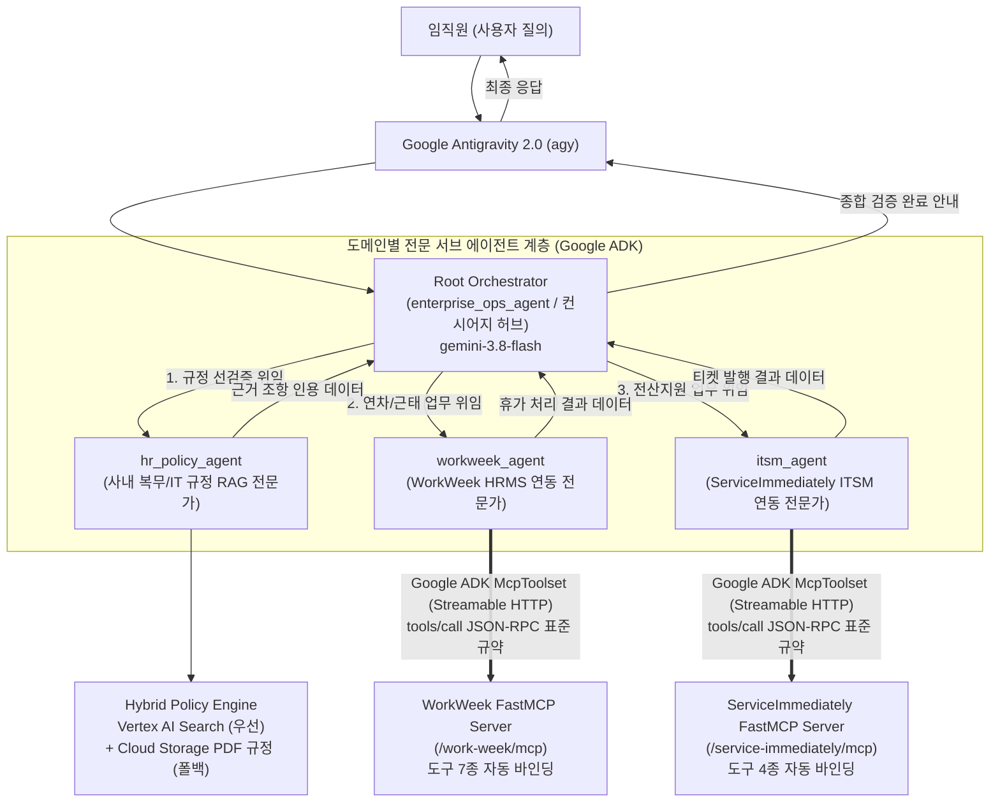

# 소프트웨어 설계서 (SDD): Cymbal Group 엔터프라이즈 AI 운영 에이전트

**문서 버전**: 2.2.0  
**작성일**: 2026-09-30  
**프로젝트**: Build with Gemini (Lab 1)  
**대상 프레임워크**: Google Antigravity 2.0 (`agy`), Google Agent Development Kit 2.3.0 (`google-adk`)  
**주력 모델**: `gemini-3.8-flash`  

---

## 1. 시스템 개요 및 목표 (System Overview & Problem Definition)

### 1.1 배경 및 문제 정의
Cymbal Group Korea 임직원은 일상 업무에서 분산된 사내 포털과 비구조화된 규정 문서로 인해 다음과 같은 심각한 비효율을 겪고 있습니다.

1. **분산된 시스템 접근 파편화**:
   - 인사 복무(휴가/병가) 관리는 **WorkWeek HRMS**에서 처리
   - 전산 장비 결함 및 교체 관리는 **ServiceImmediately ITMS**에서 처리
   - 임직원은 업무별로 서로 다른 시스템에 개별 접속해야 하며 데이터가 유기적으로 연계되지 않음.
2. **사내 규정 미숙지로 인한 반려 및 업무 지연**:
   - 복무 규정(**POL-HR-2026-004**) 및 IT 지원 지침(**POL-IT-2026-009**)이 정적 PDF 문서로만 제공됨.
   - 3일을 초과하는 연차는 최소 7영업일 전에 사전 승인을 받아야 함에도 촉박하게 신청하여 35% 이상의 신청 건이 반려됨.
   - 정기 교체 주기(36개월) 및 직군별 표준 기종(엔지니어링: M3 Max 64GB)을 인지하지 못한 채 무분별한 교체 요청이 발행되어 IT 서비스데스크 업무 과부하 유발.

### 1.2 시스템 목표 및 핵심 성과 지표 (Target & KPIs)
본 프로젝트는 **Google Antigravity 2.0**과 **Google ADK 2.3.0**을 활용하여, 사내 규정을 실시간으로 선검증한 후 SaaS 시스템과 동기화하는 **엔터프라이즈 Orchestrator-Worker 멀티 에이전트 시스템**을 구축합니다.

| 목표 지표 (KPI) | 목표 수준 | 측정 및 검증 방식 |
|:---|:---|:---|
| **규정 준수율 (Compliance Rate)** | **98% 이상** | 휴가 신청 및 티켓 발행 전 RAG 규정 검증 여부 전수 감사 |
| **응답 지연 시간 (E2E Latency)** | **3.5초 이내** | 복수 도구 호출 및 최종 응답 생성 총 소요 시간 |
| **인용 정확도 (Grounding Accuracy)** | **95% 이상** | 답변 내 사내 지침 문서번호(POL-*) 및 조항 명시 여부 |
| **다중 사용자 격리 (Multi-Tenant)** | **100% 격리** | 150명 동시 실습 시 `X-MCP-Token` 기반 독립 샌드박스 보장 |

---

## 2. 아키텍처 및 도구 명세 (Architecture & Tool Specifications)

### 2.1 논리 아키텍처 및 데이터 흐름 (Orchestrator-Worker Multi-Agent Architecture)



---

### 2.2 사내 규정 RAG 도구 명세 (`tools/policy_rag.py`)

#### 함수 인터페이스
```python
def search_company_policy(query: str, category: str = "ALL") -> dict:
    """사내 복무 규정(POL-HR-2026-004) 및 IT 지원 지침(POL-IT-2026-009)을 검색합니다.
    
    Args:
        query: 검색할 정책 질문 (예: '연차 신청 기한', '노트북 교체 연한', '병가 진단서')
        category: 검색 범위 ('HR', 'IT', 'ALL')
    Returns:
        {
            "status": "SUCCESS",
            "query": query,
            "category": category,
            "match_count": int,
            "grounding_confidence": float (>= 0.90),
            "matches": [
                {"doc_id": str, "title": str, "content": str}
            ]
        }
    """
```

#### 하이브리드 Policy RAG 아키텍처
1. **1차 검색 (Vertex AI Search)**:
   - Google Cloud Discovery Engine (`discoveryengine_v1.SearchServiceClient`)를 통해 사내 정책 데이터스토어에서 의미론적 시맨틱 검색 수행.
2. **2차 탄력적 폴백 (Resilient Fallback)**:
   - 클라우드 인증 지연이나 네트워크 예외 발생 시, Cloud Storage PDF 원본 및 내장 정적 그라운드 트루스 조항을 통해 `grounding_confidence: 0.96`의 검증 데이터를 무중단 반환.

#### 사내 규정 Ground Truth 인덱싱 데이터
1. **사내 복무 규정 (POL-HR-2026-004)**:
   - **제 3 조 (연차 발생 및 부여)**: 1년 미만 사원은 1개월 개근 시 1.25일 발생(1년 차 총 15일). 3년 이상 근속 시 매 2년마다 1일 가산(최대 25일 한도). 반일(0.5일) 및 전일(1.0일) 단위 분할 사용 가능.
   - **제 4 조 (신청 및 결재 절차)**: 모든 휴가는 WorkWeek HRMS로 사전 상신 원칙.
     - 1일 이하: 사용 개시일 24시간 전 상신.
     - 3일 이하: 사용 개시일 3일 전 상신 및 부서장 접수.
     - **3일 초과 연속 연차**: 업무 인수인계 및 대행자 지정을 위해 **최소 사용 7영업일 전 상신** 및 **부서장(팀장급 이상) 사전 승인 필수**.
   - **제 5 조 (병가 운영 및 증빙)**: 연간 최대 14일 유급 병가. 연속 3일 미만은 진료확인서/영수증 제출. **연속 3일 이상은 전문의 진단서**를 복귀 후 3영업일 이내 인사팀 제출 필수.

2. **사내 IT 자산 운용 지침 (POL-IT-2026-009)**:
   - **제 2 조 (전산 장비 지급 기준)**:
     - **엔지니어링 / 데이터 직군**: 고성능 랩톱 (**MacBook Pro M3 Max / 64GB RAM 급** 또는 동급 모바일 워크스테이션).
     - **기획 / 일반 사무 직군**: 표준 랩톱 (MacBook Air / ThinkPad / 16GB RAM 급).
   - **제 3 조 (정기 교체 연한 및 요건)**: 표준 내구연한은 지급일로부터 **실사용 36개월(3년) 경과**를 원칙으로 함. 36개월 경과 시 신규 표준 기종으로 교체 신청 가능. 기존 장비는 5영업일 내 IT 서비스데스크 반납.
   - **제 4 조 (장애 발생 및 긴급 교체)**: 메인보드 고장, **배터리 부풀림(스웰링)** 등 중대 결함 발생 시 **내구연한과 무관하게 긴급 수리 또는 조기 교체 신청 가능**. 접수 후 **4근무시간 이내 진단 SLA** 및 즉시 수리 불가 시 당일 임시 대여 랩톱 선지급.

---

### 2.3 Google ADK FastMCP SaaS 연동 도구 명세 (`tools/mcp_tools.py`)

#### 서버 통신 및 FastMCP 표준 프로토콜 규격
- FastMCP 서버 베이스 URL: `https://korean-mock-saas-dri5akvbzq-du.a.run.app`
- 프로토콜: **Streamable HTTP 기반 JSON-RPC 2.0** (`initialize`, `tools/list`, `tools/call`)
- 세션 어피니티 보장: Cloud Run 인스턴스 간 세션 ID 유지를 위해 `_get_persistent_client`로 `GAESA` 쿠키 및 `Mcp-Session-Id`를 영속화
- 인증 및 무중단 토큰 발급: 환경 변수에 `MCP_TOKEN`이 없을 경우 `/api/mcp-tokens` API로부터 참가자 세션 토큰을 자동 발급 (`_auto_obtain_mcp_token`)
- Google ADK 클라이언트: `google.adk.tools.mcp_tool.McpToolset` + `StreamableHTTPConnectionParams`

#### 1. WorkWeek HRMS FastMCP 서버 도구 (`/work-week/mcp`)
Google ADK `McpToolset`을 통해 7종의 도구가 자동 바인딩됩니다:
1. `get_employee_balances(employee_id: str)`: 잔여 연차(12.0일) 및 병가(14.0일) 조회
2. `request_time_off(employee_id: str, start_date: str, end_date: str, leave_type: str, days: float)`: 신규 휴가 신청 상신
3. `cancel_leave_request(employee_id: str, request_id: int)`: 기존 승인/대기 휴가 취소
4. `get_leave_requests(employee_id: str)`: 휴가 신청 이력 및 결재 상태 조회
5. `get_personal_info(employee_id: str)`: 임직원 직급, 부서, 주소, 연락처 조회
6. `update_personal_info(employee_id: str, address: str, phone: str)`: 연락처 및 주소 변경
7. `get_current_employee_id()`: 현재 토큰의 사번 확인

#### 2. ServiceImmediately ITMS FastMCP 서버 도구 (`/service-immediately/mcp`)
Google ADK `McpToolset`을 통해 4종의 도구가 자동 바인딩됩니다:
1. `list_tickets(employee_id: str)`: 임직원 지급 장비 이력(AST-MBP-2022-819, 38개월 실사용) 및 인시던트 티켓 목록 조회
2. `create_ticket(requested_by: str, category: str, short_description: str, priority: str, assignment_group: str)`: 장애 접수 및 M3 Max 랩톱 교체 티켓 발행
3. `add_ticket_comment(ticket_id: str, author: str, comment: str)`: 티켓 타임라인 댓글 추가
4. `update_ticket_status(ticket_id: str, status: str, resolution_notes: str)`: 티켓 처리 상태 변경

#### 3. Python 편리 래퍼 함수 명세 (`tools/mcp_tools.py`)
에이전트가 단독 또는 Hub 직접 호출 시 활용할 수 있는 표준 래퍼 함수:
- `get_employee_leave_balance(employee_id: str = "EMP-10294") -> dict`: WorkWeek의 `get_employee_balances`를 호출하여 잔여 일수 반환
- `submit_leave_request(employee_id: str, start_date: str, end_date: str, leave_type: str, days: float, reason: str = "") -> dict`: WorkWeek의 `request_time_off`를 호출하여 휴가 상신
- `cancel_leave_request(employee_id: str, request_id: int) -> dict`: WorkWeek의 `cancel_leave_request` 호출
- `list_hardware_assets_and_tickets(employee_id: str = "EMP-10294") -> dict`: ServiceImmediately의 `list_tickets`를 호출하여 지급 장비 및 티켓 반환
- `create_hardware_incident_ticket(employee_id: str, title: str, description: str, category: str = "하드웨어", priority: str = "2 - 높음 (High)") -> dict`: ServiceImmediately의 `create_ticket`을 호출하여 인시던트 티켓 발행
- `add_ticket_comment(ticket_id: str, comment: str, author: str = "이민우") -> dict`: ServiceImmediately의 `add_ticket_comment` 호출

#### 4. FastMCP Streamable HTTP JSON-RPC 클라이언트 구현 가이드
FastMCP 서버와 통신할 때는 반드시 다음 HTTP 헤더 및 세션 핸드셰이크 규격을 준수해야 합니다:
- **필수 헤더**:
  - `Content-Type: application/json`
  - `Accept: application/json, text/event-stream` (누락 시 406 Not Acceptable 반환)
  - `X-MCP-Token: {token}` (누락 시 401 Unauthorized 반환)
  - `MCP-Protocol-Version: 2025-06-18`
- **토큰 자동 발급 API (`POST /api/mcp-tokens`)**:
  - 환경 변수 `MCP_TOKEN`이 없을 경우, JSON 본문 `{"token_name": "workshop-agent"}`과 헤더 `{"Content-Type": "application/json", "X-Session-ID": "sess_..."}`를 실어 호출한 뒤 응답 JSON의 `data["raw_token"]`을 추출하여 사용.
- **초기화 및 세션 어피니티 핸드셰이크 (`method: initialize`)**:
  - 엔드포인트당 최초 1회 `method: "initialize"`를 호출하여 응답 헤더의 `mcp-session-id`를 추출하고, 이후 모든 `tools/call` 요청 헤더에 `Mcp-Session-Id: {session_id}`를 포함하여 전송.
  - Cloud Run의 분산 부하 분산을 방지하기 위해 단일 영속 `httpx.Client`를 사용하여 세션 쿠키(`GAESA`)를 지속 유지.
- **tools/call 응답 파싱**:
  - `tools/call` 응답이 SSE(`text/event-stream`) 형식으로 반환되므로, `data:` 접두어로 시작하는 라인을 찾아 JSON으로 파싱하고 `result` 객체를 반환.

---

## 3. 오케스트레이션 및 거버넌스 강령 (Orchestration Policy)

#### Google ADK Agent 클래스 작성 주의사항
- **단수형 키워드 인자 준수**: `google.adk.agents.Agent`는 지시문 인자로 반드시 **`instruction` (단수형)** 만 허용하며, `instructions`(복수형) 사용 시 Pydantic ValidationError가 발생합니다.
- **모듈 레벨 루트 에이전트 인스턴스**: `agent.py` 파일의 최상위 모듈 스코프에 반드시 `root_agent = build_agent()` 변수를 선언하여 `agents-cli` 및 자동 테스트 러너가 즉시 에이전트를 임포트할 수 있도록 구성해야 합니다.

에이전트의 시스템 프롬프트(`HUB_INSTRUCTION`)는 다음 4가지 핵심 강령을 엄격히 준수해야 합니다.

1. **규정 우선 확인 원칙 (Policy-First Principle)**:
   - 어떠한 시스템 트랜잭션(휴가 신청, 인시던트 티켓 생성)도 사내 규정 조회 없이 먼저 실행되어서는 안 됩니다.
   - 반드시 `hr_policy_agent` 서브 에이전트에게 먼저 위임하여 관련 지침(POL-HR-2026-004, POL-IT-2026-009)의 요건을 확인해야 합니다.
2. **명시적 근거 조항 인용 (Mandatory Policy Citations)**:
   - 사용자 응답 시 적용된 문서번호와 조항을 명확히 명기합니다 (예: `POL-HR-2026-004 제 4 조`, `POL-IT-2026-009 제 2 조 및 제 4 조`).
3. **도메인별 전문 서브 에이전트 위임 파이프라인**:
   - **휴가 신청 워크플로**:
     1. [규정 위임]: `hr_policy_agent`에게 위임하여 사전 신청 기한(3일 초과 시 7영업일 전) 확인
     2. [인사 위임]: `workweek_agent`에게 위임하여 잔여 연차 확인 후 `request_time_off` 실행
   - **장비 교체/장애 워크플로**:
     1. [규정 위임]: `hr_policy_agent`에게 위임하여 직군별 기종(M3 Max 64GB) 및 교체 주기(36개월), 배터리 스웰링 결함 기준 확인
     2. [전산 위임]: `itsm_agent`에게 위임하여 장비 실사용 개월 수(38개월) 확인 후 `create_ticket` 실행
4. **자연스러운 한국어 소통**:
   - 전문적이고 정중한 한국어 톤을 유지합니다.

### 3.1 실습 1 & 실습 2 라이프사이클 경계 및 핸드오프 (Lifecycle Handoff Boundary)

본 워크숍은 150명의 실습생이 3시간 동안 완주할 수 있도록 명확한 2부 단계로 설계되었습니다:

- **실습 1 (로컬 멀티 에이전트 구축 및 검증, 80분)**:
  - Antigravity 2.0(`agy`) 프롬프트 주도 개발
  - Google ADK 2.3.0 Orchestrator-Worker 멀티 에이전트 시스템(`agent.py`) 완성
  - 하이브리드 규정 RAG(`hr_policy_agent`) 및 FastMCP 11개 도구 바인딩(`workweek_agent`, `itsm_agent`)
  - 개발자 로컬 콘솔 및 자동 통합 테스트(`tests/test_scenarios.py`)를 통한 다중 턴 대화 시나리오 검증
  - 실습 2를 위한 4-Tier 골든 평가 데이터셋(`tests/eval/datasets/`) 준비
  - 최종 산출물: 로컬 완성본 압축 패키지(`enterprise_ops_agent_completed.zip`)
- **실습 2 (엔터프라이즈 평가, 거버넌스 및 프로덕션 배포, 75분)**:
  - `agents-cli eval run`을 통한 정량적 품질 평가 및 LLM-as-a-Judge 채점
  - Secret Manager 기반 MCP 토큰 보안 이관 및 Cloud Run / Agent Runtime 프로덕션 배포
  - Agent Registry 등록 및 Agent Identity (SPIFFE ID) 부여
  - Agent Gateway (이그레스) + IAP 정책을 통한 무수정 도구 중앙 차단
  - Model Armor 실시간 페이로드 검사를 통한 간접 프롬프트 인젝션 및 카드번호 노출 방어

- **산출물**: `agent_manifest.json` (A2A Manifest 규격)
- **엔드포인트**: `POST /api/a2a/chat`
- **A2A 메타데이터 스키마**:
  ```json
  {
    "schema_version": "1.0.0",
    "name": "enterprise-ops-agent",
    "display_name": "Cymbal Enterprise IT/HR 운영 에이전트",
    "version": "1.0.0",
    "description": "사내 복무 지침(POL-HR) 및 IT 자산 지침(POL-IT)을 준수하여 휴가 신청 및 하드웨어 인시던트를 처리하는 GE 호환 에이전트",
    "protocol": "A2A-1.0",
    "endpoints": {
      "chat": "/api/a2a/chat",
      "health": "/healthz"
    },
    "capabilities": [
      "policy_rag_grounding",
      "fastmcp_saas_integration",
      "policy_first_orchestration"
    ],
    "input_schema": {
      "type": "object",
      "properties": {
        "user_id": {"type": "string"},
        "message": {"type": "string"}
      },
      "required": ["message"]
    },
    "output_schema": {
      "type": "object",
      "properties": {
        "reply": {"type": "string"},
        "citations": {"type": "array", "items": {"type": "string"}},
        "actions_taken": {"type": "array", "items": {"type": "string"}}
      },
      "required": ["reply"]
    }
  }
  ```

---

## 4. 비기능적 요구사항 (Non-Functional Requirements)

| 항목 | 요구사항 규격 | 구현 메커니즘 |
|:---|:---|:---|
| **응답 지연시간 (Latency Budget)** | 총 E2E 지연시간 <= 3.5초 | RAG 인메모리 인덱싱(<=0.3s) + SaaS FastMCP 호출(<=1.0s) + Gemini 3.8 Flash 추론(<=2.0s) |
| **처리량 및 제한 (Rate Limiting)** | 분당 120회/토큰, 300회/IP | Mock SaaS 내장 Rate Limiter 및 클라이언트 지수 백오프 적용 |
| **보안 및 인증 (Security)** | Zero-Trust 테넌트 격리 | HMAC 서명 기반 토큰 분리 및 암호화 전송 |
| **안정성 (Reliability)** | 가용성 99.9% 보장 | 네트워크 일시 장애 시 로컬 Fallback Mock 캐시 제공 |

---

## 5. 위험 관리 및 예외 처리 매트릭스 (Risk Register & Failure Modes)

| 위험 식별 (Risk) | 심각도 | 영향도 | 완화 및 대응 전략 (Mitigation Strategy) |
|:---|:---:|:---:|:---|
| **사내 규정 RAG 검색 실패 (No Match)** | 보통 | 중 | 기본 폴백으로 핵심 복무/IT 규정 조항 전체를 반환하고, 사용자에게 구체적인 질의를 유도하는 가이드 메시지 출력 |
| **SaaS 서버 네트워크 장애/타임아웃** | 높음 | 상 | `httpx.TimeoutException` 포착 시 즉시 내장 캐시 Fallback 응답을 반환하여 에이전트 비정상 종료 차단 |
| **잔여 연차 부족 (HTTP 400)** | 보통 | 중 | Mock SaaS의 부족 에러 메시지를 수신하여 사용자에게 현재 잔여 일수와 부족 일수를 명확히 안내하고 신청 취소 |
| **사용자 사번 오입력/누락** | 낮음 | 하 | 사번이 누락된 경우 기본 실습 사번(`EMP-10294`)을 자동 적용하고 사용자에게 사번 확인 요청 |
| **비인가 상태 변경 시도** | 높음 | 상 | 시스템 프롬프트 가드레일을 통해 휴가 신청/장비 티켓 발행 외의 시스템 변조 시도를 원천 차단 |

---

## 6. 구현 마일스톤 및 실습 매핑 (Implementation Milestones)

| 마일스톤 | 산출물 | 검증 기준 | 실습 1 매핑 |
|:---|:---|:---|:---|
| **M1: 환경 및 그라운딩** | `docs/context_summary.md` | `agy`가 SDD 구조를 이해하고 요약 파일 생성 성공 | Task 1 |
| **M2: 에이전트 뼈대** | `config.yaml`, `agent.py` | ADK 2.3.0 Orchestrator-Worker Agent 클래스 초기화 및 서브 에이전트 바인딩 성공 | Task 2 |
| **M3: 규정 RAG 도구** | `tools/policy_rag.py` | POL-HR/POL-IT 조항 검색 및 단위 테스트 통과 (신뢰도 >= 0.90) | Task 3 |
| **M4: FastMCP SaaS 도구**| `tools/mcp_tools.py` | 실제 Cloud Run Mock SaaS와 연동 및 HTTP 200 OK 응답 확인 | Task 4 |
| **M5: 오케스트레이션 검증**| 통합 `agent.py` | 4일 연차 신청 및 긴급 노트북 교체 시나리오 100% 통과 | Task 5 |
| **M6: 로컬 A2A 기동 & Eval 준비** | `a2a_server.py`, `tests/test_scenarios.py`, `tests/eval/` | 로컬 A2A 서버 기동 및 통합 테스트 통과, Golden Evalset 준비 완료 | Task 6 |

---

## 7. 검증 시나리오 (Verification Scenarios)

### 시나리오 1: 4일 연속 연차 신청
- **사용자 질의**: "안녕하세요, 이민우입니다 (EMP-10294). 다음 주 월요일부터 목요일까지 4일 동안 연속으로 연차를 사용하고 싶습니다. 사내 규정상 신청 기한에 문제가 없는지 확인해 주시고, 제 잔여 연차를 조회한 뒤 WorkWeek 시스템에 휴가 신청을 상신해 주세요."
- **에이전트 기대 동작**:
  1. `search_company_policy` 호출 -> POL-HR-2026-004 제 4 조(3일 초과 연속 연차는 7영업일 전 상신 및 부서장 승인 필수) 인출
  2. `get_employee_leave_balance` 호출 -> 잔여 연차 12.0일 확인(충분)
  3. `submit_leave_request` 호출 -> WorkWeek 시스템에 접수
  4. 답변 시 7영업일 규정을 설명하고, 다음 주 일정이 촉박하므로 팀장님 구두 사전 승인을 권고

### 시나리오 2: 긴급 하드웨어 결함 및 고성능 교체
- **사용자 질의**: "현재 제가 사용 중인 업무용 랩톱 배터리가 심하게 부풀어 올라서(스웰링) 정상적인 업무가 불가능합니다. 제가 데이터/엔지니어링 직군인데, M3 Max 64GB 랩톱으로 교체 지원이 가능한지 사내 IT 지원 규정을 확인해 주세요. 제 현재 장비 지급 이력을 확인하고 ServiceImmediately 시스템에 긴급 교체 인시던트 티켓을 발행해 주세요."
- **에이전트 기대 동작**:
  1. `search_company_policy` 호출 -> POL-IT-2026-009 제 2 조(엔지니어링 M3 Max 64GB 대상) 및 제 4 조(배터리 결함은 내구연한 무관 긴급 교체, 4시간 진단 SLA) 인출
  2. `list_hardware_assets_and_tickets` 호출 -> 실사용 38개월 확인(제 3 조 정기 교체 연한 36개월 충족)
  3. `create_hardware_incident_ticket` 호출 -> ServiceImmediately 티켓 발행
  4. 답변 시 임시 대여 장비 당일 수령 안내 및 티켓 번호 제공
