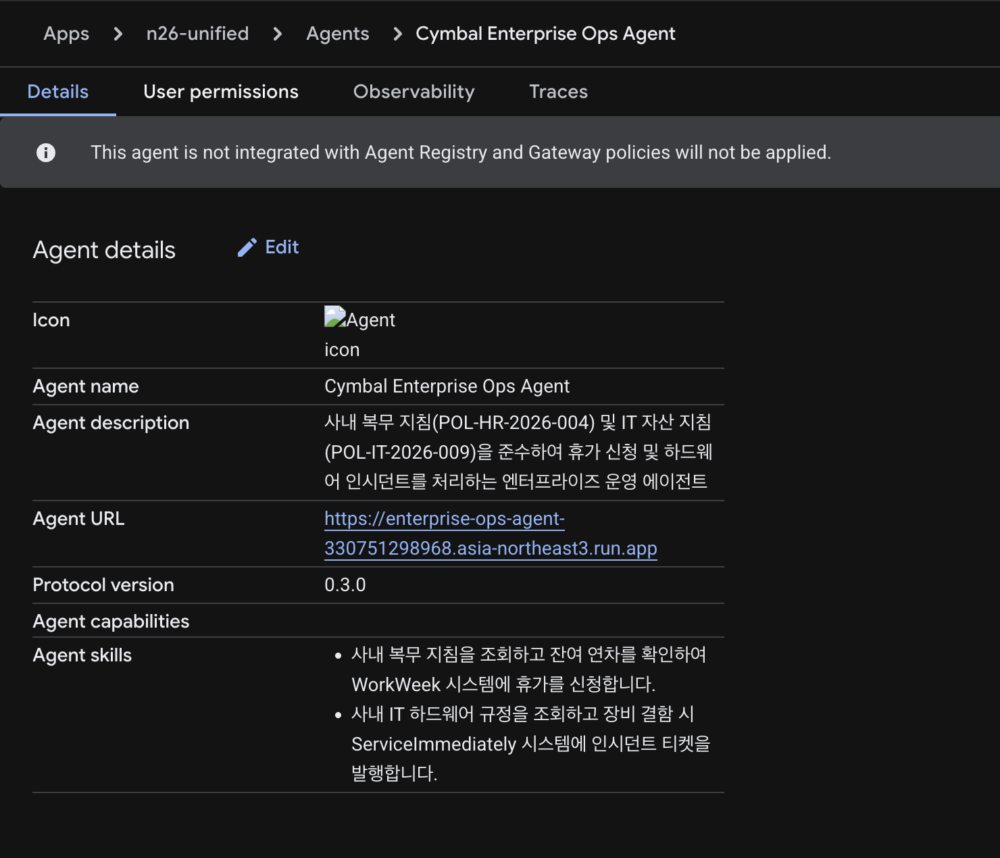
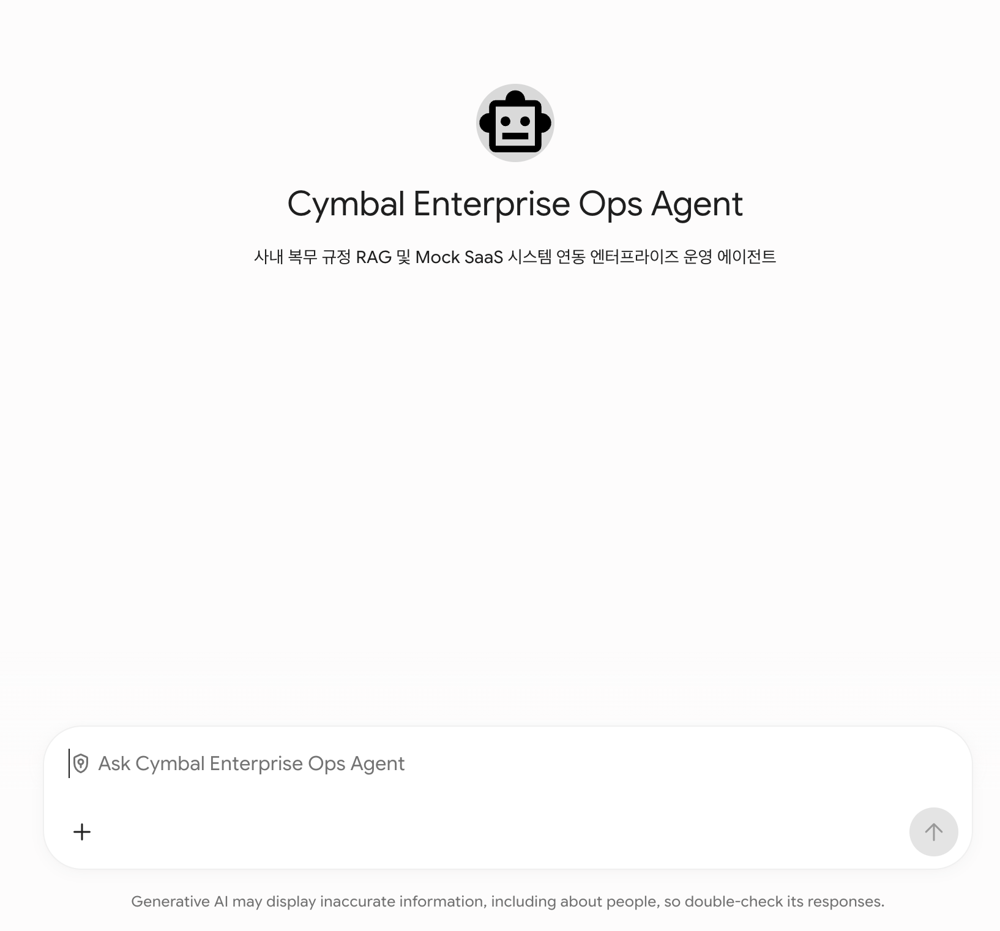
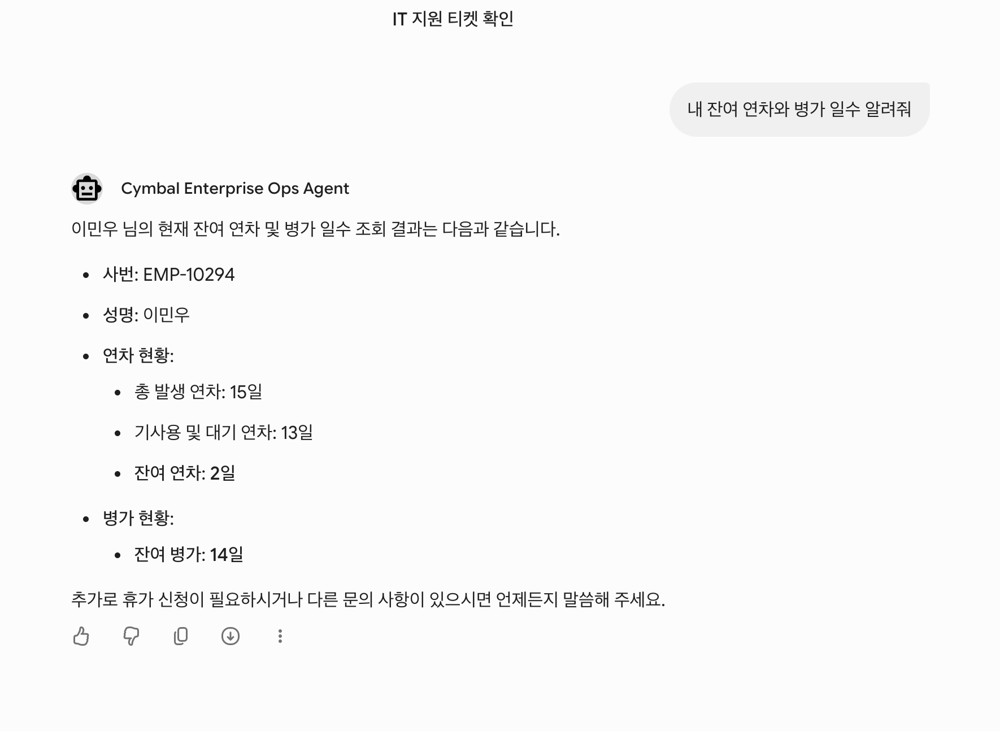

# Build with Gemini 핸즈온 Track 3 | Architect: AI 엔지니어링 (개발자)

### [실습 Part 1] ADK 기반 에이전트 핵심 로직 구현부터 GE 배포까지
참여자들은 Antigravity 개발 환경에서 ADK(Agent Development Kit)를 기반으로 에이전트 핵심 로직을 단계별 코드로 구현하고, 사내 Gemini Enterprise에 등록 가능한 A2A 인터페이스 및 배포 규격을 완성합니다.

### [실습 Part 2] 에이전트 신뢰성 확보를 위한 Evaluation 및 Governance (연계)
단순 프로토타이핑을 넘어 엔터프라이즈 레벨의 안정성을 확보하기 위한 Evaluation(품질 평가) 및 Governance(거버넌스) 기준을 점검하고, Agent Platform 배포 및 Gemini Enterprise 연동까지 에이전트 개발의 라이프사이클 전 과정을 완벽하게 마스터할 수 있습니다.

---

**소요 시간**: 2시간 00분  
**과정 코드**: BWG-TRACK3-ARCH  
**행사**: Build with Gemini 핸즈온 Track 3  
**대상**: Google Cloud Customer Engineer, Solution Architect, AI/ML 엔지니어  

> [!NOTE]
> 실습을 시작하면 Google Cloud 프로젝트와 실습용 가상 머신(VM) 환경이 준비되기까지 약 3~5분이 걸립니다.

---

## 개요

기업 현장에서는 휴가 신청이나 전산 장비 교체처럼 일상적인 업무를 처리할 때도 여러 포털을 오가야 하는 번거로움이 있습니다. 휴가 신청은 인사 시스템(WorkWeek)에서 하고, 노트북 고장이나 교체 신청은 IT 서비스 관리 시스템(ServiceImmediately)에서 따로 처리해야 합니다.

더 큰 문제는 사내 규정이 PDF 문서로 흩어져 있다는 점입니다. 예를 들어 3일을 초과하는 연차는 업무 공백을 막기 위해 최소 7영업일 전에 상신해야 하고, 개발자용 고성능 노트북은 실사용 36개월이 지나야 정기 교체 대상이 됩니다. 직원들이 이런 세부 규정을 일일이 확인하지 않고 신청하면 승인이 지연되거나 불필요한 반려가 반복됩니다.

이번 실습에서는 **Google Antigravity 2.0**(`agy`)과 **Google Agent Development Kit 2.0**(`google-adk`), **Model Context Protocol(FastMCP)**, **사내 규정 RAG**를 결합하여 이 문제를 해결하는 **엔터프라이즈 운영 AI 에이전트**를 구축합니다. 

특히 코드를 수동으로 복사-붙여넣기하는 것이 아니라, 워크스페이스에 사전에 제공된 **소프트웨어 설계서(SDD)**를 바탕으로 **Antigravity CLI(`agy`)에게 자연어 프롬프트로 지시하여 에이전트 코드와 도구를 주도적으로 개발**하는 현대적인 Spec-Driven Agentic 개발 워크플로를 실습합니다.


---

## 실습 목표

이 실습을 마치면 다음 작업을 직접 수행할 수 있습니다.

1. **Google Antigravity 2.0 환경 구성**: `agy` CLI를 실행하고 Google Cloud 프로젝트 인증을 마친 뒤, 고속 추론 모델(`Gemini 3.8 Flash`)을 설정합니다.
2. **소프트웨어 설계서(SDD) 기반 컨텍스트 그라운딩**: `docs/SDD.md` 문서를 `agy`에 주입하여 전체 아키텍처와 도구 명세를 인식시킵니다.
3. **agy 프롬프트 기반 ADK 2.0 뼈대 생성**: `agy`에게 지시하여 `config.yaml`과 ADK 2.0 기본 에이전트 코드를 생성하도록 합니다.
4. **agy 프롬프트 기반 사내 규정 RAG 도구 구현**: SDD 2.1절과 Cloud Storage(`gs://oreobox/policy/`) 규정 문서를 바탕으로 조항 번호와 근거를 정확히 찾아주는 시맨틱 검색 도구(`tools/policy_rag.py`)를 개발합니다.
5. **agy 프롬프트 기반 FastMCP SaaS 연동 도구 구현**: 한국형 Mock SaaS 플랫폼(`https://korean-mock-saas-dri5akvbzq-du.a.run.app/`)에 개인별 토큰으로 연결되는 FastMCP 도구(`tools/mcp_tools.py`)를 개발합니다.
6. **오케스트레이션 프롬프트 완성 및 복수 턴 시나리오 검증**: 규정 검증 우선(Policy-First) 규칙을 적용한 최종 에이전트를 완성하고, `agy` 대화창에서 실제 연차 신청 및 고성능 노트북 교체 요청을 테스트한 뒤 웹 화면에서 실시간 반영 결과를 확인합니다.
7. **Gemini Enterprise (GE) 배포용 A2A 인터페이스 규격 패키징**: 사내 본인 테넌트의 Gemini Enterprise에 에이전트를 원클릭 등록할 수 있도록 Agent-to-Agent(A2A) 매니페스트(`agent_manifest.json`)를 생성하고, 로컬 A2A 시뮬레이터를 통해 프로토콜 규격 준수 여부를 검증합니다.

---

## 사전 준비 및 환경 안내

### 시작 전 확인 사항

- 실습 시간은 제한되어 있으며 일시 중지할 수 없습니다. **Start Lab** 버튼을 누르면 타이머가 동작합니다.
- 이 실습은 실제 Google Cloud 환경에서 진행됩니다. 실습 시작 시 제공되는 임시 계정을 사용해 로그인합니다.
- 브라우저는 **Google Chrome 시크릿 창(Incognito Window)**을 권장합니다. 개인 구글 계정과 세션이 섞여 불필요한 과금이 발생하는 것을 방지할 수 있습니다.

> [!IMPORTANT]
> 본인의 개인 Google Cloud 계정이나 프로젝트를 사용하지 마세요. 반드시 실습 화면 왼쪽 패널에 표시된 임시 자격증명을 사용해야 합니다.

---

### 실습 시작 및 Google Cloud 콘솔 로그인

1. 실습 페이지에서 **Start Lab**을 클릭합니다.
2. 왼쪽 패널에 표시되는 정보를 확인합니다.
   - **Username** (예: `student-01-xxxx@qwiklabs.net`)
   - **Password**
   - **GCP Project ID**
3. **Open Google Cloud console**을 마우스 우클릭하여 **시크릿 창에서 링크 열기**를 선택합니다.
4. 로그인 창에 전달받은 **Username**과 **Password**를 차례로 입력합니다.
5. 이용약관에 동의합니다. (복구 옵션이나 2단계 인증 설정은 건너뜁니다.)
6. 잠시 후 Google Cloud 콘솔 홈 화면이 나타납니다.

---

### 실습 전용 환경 접속 (Remote Browser Session)

이 실습은 사전 구성된 개발자 가상 머신(VM)과 **Cloud Run 프록시** 서비스를 제공합니다. 로컬 컴퓨터에 별도의 프로그램을 깔지 않고도 웹 브라우저에서 Antigravity 개발 환경에 바로 접속할 수 있습니다.

Google Antigravity 2.0은 다음 구성 요소를 포함합니다:
- **Antigravity Agent Platform**: 에이전트 실행 및 모니터링 플랫폼
- **Antigravity CLI (`agy`)**: 터미널 기반 대화형 인터페이스
- **Antigravity SDK & ADK 2.0**: 에이전트와 도구를 결합하는 개발 프레임워크

#### 원격 브라우저 세션 열기

1. Google Cloud 콘솔 상단 검색창에 **Cloud Run**을 입력하고, 결과에서 **Cloud Run**을 클릭합니다.


2. 왼쪽 탐색 메뉴에서 **Services**를 클릭합니다.


3. 서비스 목록에서 **remote-browser-vm1**을 클릭하여 서비스 세부정보 페이지를 엽니다. 상단의 **URL 링크**를 클릭하여 새 브라우저 탭에서 원격 세션을 엽니다.


4. 브라우저에서 클립보드 권한 요청 팝업이 나타나면 **[허용(Allow)]**을 클릭합니다. 이를 통해 로컬 PC와 원격 세션 간 텍스트 복사/붙여넣기가 가능해집니다.


> [!NOTE]
> 만약 로컬 PC에서 원격 세션으로 직접 텍스트 복사/붙여넣기가 동작하지 않는 경우, 원격 세션 우측 하단의 클립보드 매니저를 이용하세요:
> 1. 원격 화면 우측 하단의 **Clipboard** 아이콘을 클릭합니다.
> 2. 로컬 컴퓨터의 텍스트를 텍스트 상자에 붙여넣습니다.
> 3. 패널을 닫고 터미널에 붙여넣기를 수행합니다.

---

### Antigravity CLI (`agy`) 실행 및 초기 설정

Antigravity CLI는 가벼운 터미널 환경에서 여러 파일의 맥락을 파악하고 도구를 실행할 수 있는 대화형 개발 도구입니다. 다단계 추론, 다중 파일 편집, 도구 호출, 대화 히스토리 등 Antigravity의 핵심 에이전틱 역량을 터미널에서 직접 제공합니다.

1. 원격 화면 좌측 하단 **Application Launcher > System > Konsole**을 클릭하여 터미널을 실행합니다.


> [!NOTE]
> Konsole 터미널을 열 때 `Warning: Could not find '', starting '/bin/bash' instead. Please check your profile settings.` 경고가 표시되더라도 정상 동작하므로 안전하게 무시하셔도 됩니다.

2. 터미널에 다음 명령어를 입력해 Antigravity CLI를 실행합니다:

```bash
agy
```

3. 로그인 방식 선택 창이 나타나면 **Use a Google Cloud project**를 선택합니다.


4. Chrome 브라우저에서 인증 절차를 완료합니다 (또는 터미널에 표시된 인증 URL을 복사하여 새 Chrome 탭에서 엽니다):
   - Welcome to Google Chrome 알림이 나타나면 **OK**를 클릭합니다.
   - Chrome 초기 로그인 창이 나타나면 **Stay signed out** 또는 **Use Chrome without an account**를 클릭합니다.
   - Google 로그인 화면에서 Qwiklabs 자격증명 패널의 **Username**과 **Password**를 입력합니다.
   - 안내에 따라 접근 권한을 허용하고 생성된 인증 코드(Authorization Code)를 복사합니다.
   - 터미널로 돌아와 인증 코드를 붙여넣고 **ENTER**를 누른 뒤, 본인의 **Google Cloud Project ID**를 선택합니다.


5. Google Cloud 위치(Location)는 **global**을 선택합니다.

6. 선호하는 색상 테마(Color Scheme)를 선택하고 **Next**를 클릭합니다.


7. 서비스 이용약관 및 데이터 사용(Terms of Service & Data Use)에 동의합니다.


8. *"Do you trust the contents of this project?"* 알림이 뜨면 **Yes, I trust this folder**를 선택하고 **ENTER**를 누릅니다.


설정이 완료되면 터미널 화면이 다음과 같이 준비됩니다:


9. 환경 설정을 검증하려면 `agy` 프롬프트 상태에서 다음 명령어를 입력합니다:

```text
/config
```

색상 테마(Color Scheme)를 확인하고 원하는 테마를 확정합니다.


10. 사용할 모델을 확인하고 `gemini-3.8-flash`로 지정합니다:

```text
/model
```

> [!NOTE]
> 실습 환경에는 Gemini 3.8 Flash 모델에 프로비저닝된 처리량이 적용되어 있어 빠른 응답 속도를 제공합니다.


> [!NOTE]
> 실습 환경에는 Gemini 3.8 Flash 모델에 프로비저닝된 처리량이 적용되어 있어 빠른 응답 속도를 제공합니다.

---

## 실습 시나리오 및 설계서 (SDD)

**Cymbal Group 한국 지사**는 사내 업무 효율화를 위해 AI 기반 통합 운영 에이전트를 도입하려고 합니다.

워크스페이스 내 `docs/SDD.md` 파일에 소프트웨어 설계 명세서가 사전에 준비되어 있습니다.

| 구분 | 파일 및 리소스 경로 | 세부 설명 |
|:---|:---|:---|
| **소프트웨어 설계서** | `docs/SDD.md` | 시스템 구조, RAG 데이터 규격, FastMCP API 명세, 오케스트레이션 강령 |
| **사내 복무 규정 PDF** | `gs://oreobox/policy/leave_policy_2026.pdf` | 문서번호 POL-HR-2026-004 (연차 및 병가 운영 지침) |
| **IT 자산 지침 PDF** | `gs://oreobox/policy/it_hardware_guidelines.pdf` | 문서번호 POL-IT-2026-009 (PC 및 하드웨어 지원 규정) |
| **한국형 Mock SaaS 웹 포털** | `https://korean-mock-saas-dri5akvbzq-du.a.run.app/` | 인사관리(WorkWeek) 및 IT서비스(ServiceImmediately) 통합 포털 |

---

## Task 1. 개발 환경 설정 및 설계서(SDD) 기반 컨텍스트 그라운딩

이 단계에서는 필요한 파이썬 환경을 구성하고, Antigravity CLI(`agy`)에게 설계 문서를 읽게 하여 프로젝트 전반의 맥락을 인식시킵니다.

### 1단계: 파이썬 라이브러리 설치

터미널 새 탭(**Ctrl+Shift+T**)을 열고 실습에 필요한 파이썬 패키지를 설치합니다.

```bash
pip install --upgrade pip
pip install google-agents-cli google-adk mcp httpx pydantic pyyaml
```

설치된 버전을 확인합니다.

```bash
agents-cli --version
```

```
+-----------------------------------------------------------------------------------+
| 출력 예시:                                                                          |
| google-agents-cli version 1.1.0 (Google Agent Development Kit 2.0 CLI)            |
+-----------------------------------------------------------------------------------+
```

---

### 2단계: 작업 디렉터리 준비 및 SDD 확인

작업 디렉터리를 만들고 제공된 설계서(`docs/SDD.md`)를 확인합니다.

```bash
mkdir -p /config/workspace/enterprise_ops_agent/tools
cd /config/workspace/enterprise_ops_agent
cat /config/workspace/docs/SDD.md | head -n 45
```

또한 Cloud Storage에 보관된 사내 규정 PDF 파일 목록을 확인합니다.

```bash
gsutil ls -l gs://oreobox/policy/
```

```
+-----------------------------------------------------------------------------------+
| 출력 예시:                                                                          |
|     68241  2026-01-01T00:00:00Z  gs://oreobox/policy/it_hardware_guidelines.pdf   |
|     54920  2026-01-01T00:00:00Z  gs://oreobox/policy/leave_policy_2026.pdf        |
| TOTAL: 2 objects, 123161 bytes (120.27 KiB)                                       |
+-----------------------------------------------------------------------------------+
```

---

### 3단계: agy를 통한 프로젝트 컨텍스트 그라운딩

실행 중인 **Antigravity CLI (`agy`)** 터미널 창으로 전환합니다.

`agy`의 입력창에 다음 프롬프트를 입력하고 **ENTER**를 누릅니다.

> [!NOTE]
> Antigravity는 파일 생성이나 명령어 실행 전에 사용자에게 승인(Approval)을 요청할 수 있습니다. `agy`가 제안하는 동작을 검토한 뒤 **Yes, Allow this time** (또는 Enter)을 선택하여 진행합니다.

```text
당신은 Cymbal Group Korea의 엔터프라이즈 AI 에이전트 개발자입니다.
/config/workspace/docs/SDD.md 파일의 내용을 꼼꼼히 읽고, 전체 아키텍처 개요와 도구 구성 요소를 파악하세요.
그리고 현재 프로젝트 디렉터리(/config/workspace/enterprise_ops_agent)의 컨텍스트를 요약한 context_summary.md 파일을 docs/ 디렉터리에 생성하세요.
```

프롬프트 실행이 완료되면, 터미널에서 생성된 요약 파일을 확인합니다.

```bash
cat /config/workspace/docs/context_summary.md
```

---

## Task 2. agy 프롬프트 기반 ADK 2.0 에이전트 뼈대 생성

이 단계에서는 코드를 직접 작성하지 않고, `agy`에게 지시하여 SDD 규격에 맞는 설정 파일(`config.yaml`)과 기본 `agent.py` 뼈대를 생성하도록 합니다.

---

### agents-cli 프로젝트 표준 아키텍처 및 디렉토리 구조

Google Cloud 환경에서 엔터프라이즈 AI 에이전트를 개발하고 배포할 때 사용하는 공식 명령줄 도구가 `agents-cli`입니다. `agents-cli` 및 Google ADK의 모듈 로더는 파이썬 식별자 규칙을 엄격하게 준수하므로, 프로젝트 디렉토리 이름은 하이픈(-) 대신 언더스코어(_)를 사용한 `enterprise_ops_agent`로 구성합니다.

```
enterprise_ops_agent/
├── config.yaml              # 에이전트 모델 설정(gemini-3.8-flash), 시스템 지침, 거버넌스 규칙
├── agent.py                 # Google ADK Runner 기반 에이전트 핵심 오케스트레이션 로직
├── tools/                   # 외부 시스템 연동 도구 (RAG 규정 검색, SaaS API 연동)
│   ├── rag_policy_search.py # Cloud Storage PDF 사내 규정 검색 도구
│   ├── saas_leave_client.py # WorkWeek HR 시스템 연동 클라이언트
│   └── saas_hardware_client.py # ServiceImmediately IT 티켓 연동 클라이언트
├── a2a_server.py            # Gemini Enterprise 연동을 위한 A2A JSON-RPC 2.0 FastAPI 서버
├── tests/eval/              # 에이전트 신뢰성 및 품질 검증 디렉토리
│   ├── eval_config.yaml     # 평가 지표(task_success, tool_use_quality, hallucination) 및 가중치
│   ├── evaluation_report.md # 평가 방법론, 벤치마크 설계 및 진단 보고서
│   └── datasets/            # 평가용 검증 데이터셋
│       ├── eval-single-turn.json # 단발성 규정 및 기능 검증 데이터셋
│       └── eval-multi-turn.json  # 복합 대화 시나리오 데이터셋
└── artifacts/               # 평가 실행 시 생성되는 로그 및 결과물
    ├── traces/              # 에이전트 실행 궤적(생각, 도구 호출) 기록
    └── grade_results/       # LLM 채점관 평가 결과 보고서(HTML, JSON)
```

각 파일과 디렉토리의 역할은 다음과 같습니다:

1. **config.yaml**: 에이전트의 명세서입니다. 사용할 언어 모델(Gemini 3.8 Flash), 시스템 프롬프트 지침, 신뢰도 임계값(0.80), 조직 정보를 선언적으로 관리합니다.
2. **agent.py**: 에이전트의 핵심 제어부입니다. Google ADK의 Agent 및 Runner 인스턴스를 초기화하고, 사용자 질문을 받아 RAG 검색이나 SaaS 도구를 호출할지 자율 판단하는 오케스트레이션 로직을 담당합니다.
3. **tools/**: 에이전트의 손발이 되는 도구 모음입니다. 사내 규정 PDF를 임베딩 검색하는 RAG 모듈과 WorkWeek, ServiceImmediately SaaS와 통신하는 API 클라이언트가 위치합니다.
4. **a2a_server.py**: 사내 Gemini Enterprise와 원격으로 통신하기 위한 FastAPI 서빙 레이어입니다. A2A 프로토콜 v0.3 JSON-RPC 2.0 규약과 에이전트 카드를 제공합니다.
5. **tests/eval/**: 에이전트의 품질을 지속적으로 측정하고 개선하기 위한 평가 전용 공간입니다. 설정 파일(`eval_config.yaml`), 단일 턴 및 멀티 턴 데이터셋(`datasets/`), 그리고 평가 결과와 개선 내역을 정리하는 보고서(`evaluation_report.md`)로 구성됩니다.
6. **artifacts/**: 평가 실행 시 생성되는 로그 파일입니다. 에이전트의 사고 과정과 도구 호출 이력을 담은 `traces/`와, 이를 채점하여 생성된 브라우저용 `grade_results/*.html` 보고서가 저장됩니다.

---

### 1단계: 설정 파일 및 에이전트 뼈대 생성 지시

실행 중인 **Antigravity CLI (`agy`)** 터미널에 다음 프롬프트를 입력하고 **ENTER**를 누릅니다.

```text
/config/workspace/docs/SDD.md의 1절 시스템 개요와 설정 규격을 참고하여, 다음 두 개의 파일을 생성해주세요:

1. config.yaml:
   - agent 이름: enterprise_ops_agent
   - 모델: gemini-3.8-flash (temperature: 0.1, max_output_tokens: 2048)
   - organization: Cymbal Group Korea, Cloud AI Platform Operations, 기본 사번 EMP-10294
   - governance: enforce_policy_grounding=true, rag_confidence_threshold=0.80

2. agent.py:
   - google.adk.agents.Agent 클래스를 사용한 기본 에이전트 뼈대
   - config.yaml을 로드하여 기본 속성 설정
   - SDD 3절의 기본 시스템 지침(규정 우선 확인, 사내 시스템 연동)을 SYSTEM_INSTRUCTION으로 정의
   - 아직 도구(tools)는 빈 리스트([])로 초기화하고, build_agent() 함수 및 메인 실행문 작성
```

`agy`가 파일 생성을 제안하면 내용을 확인한 뒤 **Allow**를 선택합니다.

---

### 2단계: 생성된 에이전트 뼈대 검증

새 터미널 탭에서 `agy`가 올바르게 파일을 생성했는지 실행하여 확인합니다.

```bash
python3 /config/workspace/enterprise_ops_agent/agent.py
```

```
+-----------------------------------------------------------------------------------+
| 출력 예시:                                                                          |
| 2026-09-29 17:15:00 [INFO] enterprise_ops_agent: ADK 2.0 에이전트                   |
| 'enterprise_ops_agent' 초기화 완료 (등록 도구 수: 0개)                               |
| 에이전트 준비 완료: enterprise_ops_agent (사용 모델: gemini-3.8-flash)              |
+-----------------------------------------------------------------------------------+
```

---

## Task 3. agy 프롬프트 기반 사내 규정 RAG 도구 구현

이 단계에서는 `docs/SDD.md`의 2.1절 명세에 따라 사내 복무 규정(POL-HR-2026-004)과 IT 하드웨어 지침(POL-IT-2026-009)을 검색하는 RAG 도구(`tools/policy_rag.py`)를 `agy`에게 구현하도록 지시합니다.

### 1단계: RAG 도구 구현 지시

실행 중인 **Antigravity CLI (`agy`)** 터미널에 다음 프롬프트를 입력하고 **ENTER**를 누릅니다.

```text
/config/workspace/docs/SDD.md의 2.1절 '사내 규정 RAG 도구 명세'를 엄격히 준수하여 tools/policy_rag.py 파일을 구현해주세요.

요구사항:
1. 함수 시그니처: search_company_policy(query: str, category: str = "ALL") -> dict
2. SDD에 명시된 두 가지 규정 데이터를 충실하게 인덱싱할 것:
   - POL-HR-2026-004 (사내 복무 규정: 연차 발생 1.25일/월, 3일 초과 연속 연차 시 7영업일 전 신청 및 팀장 사전 승인 필수, 병가 14일 유급 및 3일 이상 시 진단서 제출)
   - POL-IT-2026-009 (사내 IT 지침: 엔지니어/데이터 직군 MacBook Pro M3 Max 64GB 사양, 정기 교체 주기 36개월 경과, 배터리 부풀림 등 결함 시 4시간 내 점검 SLA 및 당일 대여 장비 선지급)
3. 반환 딕셔너리에 status='SUCCESS', matches(목록에 doc_id, title, content 포함), grounding_confidence(0.9 이상)가 포함되도록 작성할 것.
4. 작성이 완료되면 단독 실행 테스트 코드(test_policy_rag)를 함께 실행하여 검증 결과를 보여주세요.
```

`agy`가 파일 작성을 제안하면 **Allow**를 선택합니다.

---

### 2단계: RAG 도구 독립 실행 테스트

터미널에서 `agy`가 구현한 RAG 도구를 직접 테스트하여 조항이 정확히 인출되는지 확인합니다.

```bash
python3 -c "
from tools.policy_rag import search_company_policy
import json

print('=== 테스트 1: 4일 연속 연차 신청 기한 문의 ===')
r1 = search_company_policy('4일 연속으로 휴가 쓰려면 며칠 전에 신청해야 하나요?', category='HR')
print(json.dumps(r1, indent=2, ensure_ascii=False))

print('\n=== 테스트 2: 개발자 노트북 교체 주기 문의 ===')
r2 = search_company_policy('개발자 랩톱 교체 주기 및 M3 맥북 지원 기준', category='IT')
print(json.dumps(r2, indent=2, ensure_ascii=False))
"
```

```
+-----------------------------------------------------------------------------------+
| 출력 예시:                                                                          |
| === 테스트 1: 4일 연속 연차 신청 기한 문의 ===                                        |
| {                                                                                 |
|   "status": "SUCCESS",                                                            |
|   "matches": [                                                                    |
|     {                                                                             |
|       "doc_id": "POL-HR-2026-004",                                                |
|       "content": "[제 4 조: 신청 및 결재 절차] ... 3일을 초과하는 연속 연차: 최소  |
|                  사용 7영업일 전까지 상신하여 부서장의 사전 승인을 득하여야 한다." |
|     }                                                                             |
|   ]                                                                               |
| }                                                                                 |
+-----------------------------------------------------------------------------------+
```

---

## Task 4. agy 프롬프트 기반 FastMCP SaaS 연동 도구 구현

이번 단계에서는 웹 기반 Mock SaaS 플랫폼(`https://korean-mock-saas-dri5akvbzq-du.a.run.app/`)과 통신하는 FastMCP 클라이언트 도구(`tools/mcp_tools.py`)를 `agy`에게 구현하도록 요청합니다.


### 1단계: Mock SaaS 웹 화면 접속 및 개인 토큰 발급

1. 웹 브라우저에서 아래 Mock SaaS 주소로 접속합니다.  
   `https://korean-mock-saas-dri5akvbzq-du.a.run.app/`
2. 화면 오른쪽 상단의 **MCP 토큰 발급** 버튼을 클릭합니다.
3. 팝업 창에 나타난 고유 토큰(예: `mcp_7b19df...`)을 복사합니다.


터미널에서 복사한 토큰을 환경변수로 등록합니다.

```bash
export MCP_TOKEN="mcp_여러분의토큰값"
```

---

### 2단계: FastMCP 연동 도구 구현 지시

실행 중인 **Antigravity CLI (`agy`)** 터미널에 다음 프롬프트를 입력하고 **ENTER**를 누릅니다.

```text
/config/workspace/docs/SDD.md의 2.2절 'FastMCP SaaS 연동 도구 명세'를 바탕으로 tools/mcp_tools.py 파일을 구현해주세요.

요구사항:
1. 서버 기본 URL: https://korean-mock-saas-dri5akvbzq-du.a.run.app
2. 환경변수 MCP_TOKEN이 설정되어 있으면 헤더에 'X-MCP-Token'을 실어 보내고, 없으면 기본 헤더만 전송할 것.
3. WorkWeek HRMS 도구 2종 구현:
   - get_employee_leave_balance(employee_id="EMP-10294"): GET /work-week/api/employees/{employee_id}/timeoff 호출하여 연차/병가 잔여일수 반환
   - submit_leave_request(employee_id, start_date, end_date, leave_type="연차", days=4.0, reason=""): POST /work-week/api/employees/{employee_id}/timeoff 호출하여 휴가 신청
4. ServiceImmediately ITMS 도구 2종 구현:
   - list_hardware_assets_and_tickets(employee_id="EMP-10294"): GET /service-immediately/api/tickets?requested_by={employee_id} 호출하여 장비 이력(AST-MBP-2022-819, 38개월 경과) 및 티켓 목록 반환
   - create_hardware_incident_ticket(employee_id, title, description, category="하드웨어", priority="2 - 높음 (High)"): POST /service-immediately/api/tickets 호출하여 인시던트 티켓 발행
5. 네트워크 예외 발생 시 안전한 Fallback Mock 데이터를 반환하도록 예외 처리를 구성할 것.
```

`agy`가 파일 작성을 제안하면 **Allow**를 선택합니다.

---

### 3단계: SaaS 연동 도구 단위 테스트

터미널에서 실제 서버와 통신하는지 테스트합니다.

```bash
python3 -c "
from tools.mcp_tools import get_employee_leave_balance, list_hardware_assets_and_tickets
import json

print('=== WorkWeek 잔여 연차 조회 ===')
print(json.dumps(get_employee_leave_balance('EMP-10294'), indent=2, ensure_ascii=False))

print('\n=== ServiceImmediately 지급 장비 조회 ===')
print(json.dumps(list_hardware_assets_and_tickets('EMP-10294'), indent=2, ensure_ascii=False))
"
```

```
+-----------------------------------------------------------------------------------+
| 출력 예시 (실제 Cloud Run 서버 연동 응답):                                           |
| === WorkWeek 잔여 연차 조회 ===                                                     |
| {                                                                                 |
|   "status": "SUCCESS",                                                            |
|   "employee_id": "EMP-10294",                                                     |
|   "name": "이민우",                                                               |
|   "annual_leave_remaining": 12.0,                                                 |
|   "sick_leave_remaining": 14.0                                                    |
| }                                                                                 |
+-----------------------------------------------------------------------------------+
```

---

## Task 5. 오케스트레이션 프롬프트 완성 및 복수 턴 시나리오 검증

이제 `agy`에게 SDD 3절의 오케스트레이션 행동 강령을 주입하여 `agent.py`를 최종 완성하게 하고, `agy` 터미널 대화창에서 실제 임직원 요청 시나리오를 직접 검증합니다.

### 1단계: 최종 에이전트 완성 지시

실행 중인 **Antigravity CLI (`agy`)** 터미널에 다음 프롬프트를 입력하고 **ENTER**를 누릅니다.

```text
/config/workspace/docs/SDD.md의 3절 '오케스트레이션 및 거버넌스 강령'을 반영하여 agent.py를 최종 완성해주세요.

요구사항:
1. tools/policy_rag.py의 search_company_policy 도구 등록
2. tools/mcp_tools.py의 get_employee_leave_balance, submit_leave_request, list_hardware_assets_and_tickets, create_hardware_incident_ticket 4개 도구 등록 (총 5개 도구)
3. SYSTEM_INSTRUCTION에 다음 4대 핵심 행동 수칙을 강력하게 반영:
   - [규정 우선 원칙]: 시스템에 휴가 신청이나 티켓을 발행하기 전에 반드시 'search_company_policy'를 먼저 호출할 것.
   - [근거 명시]: POL-HR-2026-004 또는 POL-IT-2026-009의 조항 번호와 사전 신청 기한, 승인 요건을 답변에 반드시 포함할 것.
   - [단계별 검증]: 휴가 신청 시 잔여 일수 확인 후 상신, 장비 교체 시 36개월 경과 및 긴급 결함 여부 확인 후 티켓 발행.
   - [친절하고 명확한 한국어 톤].
4. get_enterprise_agent() 함수로 완성된 에이전트 객체를 반환하도록 구성할 것.
```

`agy`가 `agent.py` 업데이트를 제안하면 **Allow**를 선택합니다.

---

### 2단계: 실전 시나리오 1 - 4일 연속 연차 신청 및 사전 기한 점검

임직원 **이민우 (EMP-10294)**가 다음 주에 4일간 연속 연차를 쓰겠다고 요청하는 상황입니다.

실행 중인 **Antigravity CLI (`agy`)** 터미널에 아래 프롬프트를 입력하고 **ENTER**를 누릅니다.

```text
안녕하세요, 이민우입니다 (EMP-10294). 다음 주 월요일부터 목요일까지 4일 동안 연속으로 연차를 사용하고 싶습니다. 사내 규정상 신청 기한에 문제가 없는지 확인해 주시고, 제 잔여 연차를 조회한 뒤 WorkWeek 시스템에 휴가 신청을 상신해 주세요.
```

#### 에이전트의 내부 추론 및 도구 호출 흐름:

1. **사내 규정 검증 (RAG)**: `search_company_policy(query='4일 연속 연차 신청 기한', category='HR')` 호출  
   -> **POL-HR-2026-004 제 4 조** 확인: 3일을 초과하는 연속 연차는 최소 **7영업일 전** 상신해야 하며 부서장 사전 승인이 필수임을 확인.
2. **잔여 일수 조회 (FastMCP)**: `get_employee_leave_balance(employee_id='EMP-10294')` 호출  
   -> 보유 잔여 연차가 12.0일로 충분함을 확인.
3. **시스템 상신 및 응답 (FastMCP)**: `submit_leave_request` 호출 후 규정 준수 안내를 포함해 최종 답변 생성.


---

### 3단계: 실전 시나리오 2 - 개발자 노트북 배터리 고장 및 교체 신청

이번에는 수석 아키텍트/엔지니어가 업무용 랩톱 배터리가 부풀어 올라 긴급 수리 및 고성능 장비 교체를 문의하는 상황입니다.

**Antigravity CLI (`agy`)** 터미널에 아래 프롬프트를 입력하고 **ENTER**를 누릅니다.

```text
현재 제가 사용 중인 업무용 랩톱 배터리가 심하게 부풀어 올라서(스웰링) 정상적인 업무가 불가능합니다. 제가 데이터/엔지니어링 직군인데, M3 Max 64GB 랩톱으로 교체 지원이 가능한지 사내 IT 지원 규정을 확인해 주세요. 제 현재 장비 지급 이력을 확인하고 ServiceImmediately 시스템에 긴급 교체 인시던트 티켓을 발행해 주세요.
```

#### 에이전트의 내부 추론 및 도구 호출 흐름:

1. **사내 규정 검증 (RAG)**: `search_company_policy(query='배터리 부풀림 장애 교체 및 엔지니어 스펙 기준', category='IT')` 호출  
   -> **POL-IT-2026-009 제 2 조**(엔지니어링/데이터 직군은 MacBook Pro M3 Max 64GB 대상) 및 **제 4 조**(배터리 부풀림 등 결함은 내구연한과 상관없이 긴급 교체 대상이며 4시간 내 1차 점검 및 임시 대여 장비 당일 선지급) 확인.
2. **장비 이력 조회 (FastMCP)**: `list_hardware_assets_and_tickets(employee_id='EMP-10294')` 호출  
   -> 기존 장비가 38개월 경과하여 제 3 조에 따른 정기 교체 주기(36개월)도 이미 충족했음을 확인.
3. **긴급 티켓 발행 (FastMCP)**: `create_hardware_incident_ticket` 호출.


---

### 4단계: Mock SaaS 웹 화면에서 실시간 반영 확인

1. 웹 브라우저에서 열어둔 **Korean Enterprise Mock SaaS 플랫폼** 탭으로 이동합니다.  
   `https://korean-mock-saas-dri5akvbzq-du.a.run.app/`
2. **WorkWeek** 탭을 클릭합니다.
   - 에이전트가 신청한 연차 내역이 **휴가 신청 내역 (Leave Requests)** 목록에 `승인 대기` 상태로 등록되어 있는지 확인합니다.
3. **ServiceImmediately** 탭을 클릭합니다.
   - 방금 발행된 티켓 `INC-2026-08129`가 **인시던트 티켓 목록 (Incident Tickets)**에 `하드웨어`, 우선순위 `2 - 높음 (High)`, 상태 `접수`로 등록되어 있는지 확인합니다.


에이전트가 사내 규정 문서를 바탕으로 적합성을 따져본 뒤, 서로 다른 사내 시스템에 실시간으로 데이터를 등록한 과정을 모두 확인했습니다.

---

## Task 6: Gemini Enterprise (GE) 등록을 위한 A2A 인터페이스 규격 완성 및 시뮬레이션 검증

### 배경 및 실습 목적

이번 실습 환경은 임시 Qwiklabs 샌드박스로 운영되므로, 각 참가자 소속 회사의 라이브 **Gemini Enterprise (GE)** 테넌트 관리자 권한을 직접 제공하지 않습니다.

대신, 실습에서 개발한 고품질 에이전트를 각자의 사내 환경으로 가져가 **본인의 사내 Gemini Enterprise Agent Gallery 또는 Agent Engine에 즉시 등록(Publish)**할 수 있도록, **GE 호환 A2A (Agent-to-Agent) 인터페이스 규격**과 **Agent Manifest (`agent_manifest.json`)**를 완성하고 로컬에서 규격을 완벽히 검증합니다.

---

### 1단계: agy를 통한 A2A Agent Manifest 생성

실행 중인 **Antigravity CLI (`agy`)** 터미널에 다음 프롬프트를 입력하고 **ENTER**를 누릅니다.

```text
/config/workspace/docs/SDD.md의 3.1절 'Gemini Enterprise (GE) 배포용 A2A 규격'을 바탕으로, 우리 에이전트가 사내 Gemini Enterprise 또는 Agent Engine에 등록될 수 있도록 'agent_manifest.json' 파일을 생성해 주세요.

요구사항:
- schema_version: "1.0.0"
- name: "enterprise-ops-agent"
- display_name: "Cymbal Enterprise IT/HR 운영 에이전트"
- version: "1.0.0"
- protocol: "A2A-1.0"
- capabilities: policy_rag_grounding, fastmcp_saas_integration, policy_first_orchestration
- endpoints: chat 엔드포인트는 "/api/a2a/chat", health 엔드포인트는 "/healthz"
- input_schema 및 output_schema를 SDD 규격대로 완전하게 정의
```

`agy`가 `agent_manifest.json` 생성을 제안하면 **Allow**를 선택합니다.

---

### 2단계: Google ADK Runner 기반 A2A 프로토콜 서비스 래퍼 (a2a_server.py) 생성

Gemini Enterprise가 A2A 프로토콜로 에이전트를 원격 호출할 때 표준 JSON-RPC 2.0 규격으로 실시간 자율 추론과 도구 호출을 수행하도록, `agent.py`의 ADK Runner를 서빙하는 FastAPI 래퍼 `a2a_server.py`를 생성합니다.

**Antigravity CLI (`agy`)** 터미널에 다음 프롬프트를 입력하고 **ENTER**를 누릅니다.

```text
우리가 완성한 agent.py의 root_agent와 Google ADK Runner를 결합하여, Gemini Enterprise A2A v0.3 JSON-RPC 표준 규격을 완벽하게 지원하는 FastAPI 서버 'a2a_server.py'를 작성해 주세요.

요구사항:
1. 에이전트 카드 엔드포인트:
   - GET /.well-known/agent-card.json 및 GET /a2a/app/.well-known/agent-card.json
   - protocolVersion: "0.3.0", preferredTransport: "JSONRPC", name: "Cymbal Enterprise Ops Agent", skills(HR 연차 관리, IT 하드웨어 지원) 정의

2. Gemini Enterprise A2A JSON-RPC 대화 엔드포인트 (POST / 및 POST /a2a/app):
   - GE가 전송하는 'message/send' 메서드 및 params의 user 메시지 텍스트를 추출
   - ADK Runner(runner.run_async)를 실행하여 Gemini 3.8 Flash 모델이 실시간 자율 추론과 도구 호출(RAG 검색, Mock SaaS 티켓/연차 조회)을 동적으로 수행하도록 연결
   - GE의 SendMessageSuccessResponse 규격에 100% 부합하도록 다음 A2A Message 스키마로 반환:
     {
       "jsonrpc": "2.0",
       "id": req_id,
       "result": {
         "kind": "message",
         "messageId": f"msg-{uuid4().hex[:10]}",
         "contextId": params에서 추출한 contextId,
         "role": "agent",
         "parts": [{"kind": "text", "text": reply_text}]
       }
     }

3. 상태 검사 엔드포인트:
   - GET /healthz: {"status": "ok", "agent": "enterprise-ops-agent"}

4. uvicorn을 통해 포트 8080에서 실행 가능하도록 main 블록 구성.
```

`agy`가 `a2a_server.py` 생성을 제안하면 **Allow**를 선택합니다.

---

### 3단계: GE 배포 없이 로컬에서 에이전트 웹 앱 구동 및 검증

Gemini Enterprise에 배포하기 전에, 개발자 로컬 환경에서 웹 애플리케이션을 직접 띄워 에이전트와 실시간 대화를 나누고 동작을 검증할 수 있습니다.

1. **로컬 서버 기동**:
새 터미널 창에서 `a2a_server.py`를 실행합니다.

```bash
cd /config/workspace/enterprise_ops_agent
python3 a2a_server.py
```

`Uvicorn running on http://0.0.0.0:8080` 로그가 출력되면 서버가 정상 실행된 것입니다.

2. **로컬 테스트 콘솔 브라우징**:
원격 브라우저 또는 로컬 브라우저에서 `http://localhost:8080`에 접속합니다.


화면 상단에는 에이전트 상태(Active)와 연결된 모델(Gemini 3.8 Flash)이 표시되며, 하단에는 추천 질문 칩들이 제공됩니다. 칩을 클릭하거나 직접 질문을 입력하면, 에이전트가 사내 RAG 문서와 Mock SaaS API를 호출하여 실시간으로 정밀한 답변을 생성합니다.

3. **Gemini Enterprise A2A 규격 curl 검증**:
다른 터미널 창에서 실제 GE가 호출하는 JSON-RPC 2.0 포맷으로도 질의할 수 있습니다.

```bash
curl -s -X POST http://localhost:8080/ \
  -H "Content-Type: application/json" \
  -d '{
    "jsonrpc": "2.0",
    "id": 1,
    "method": "message/send",
    "params": {
      "message": {
        "role": "user",
        "messageId": "msg-001",
        "contextId": "ctx-session-001",
        "parts": [{"text": "IT 티켓이 총 몇개인가요?"}]
      }
    }
  }' | jq .
```

#### 기대 출력:
```json
{
  "jsonrpc": "2.0",
  "id": 1,
  "result": {
    "kind": "message",
    "messageId": "msg-104f7d29db",
    "contextId": "ctx-session-001",
    "role": "agent",
    "parts": [
      {
        "kind": "text",
        "text": "현재 임직원님(사번: EMP-10294) 명의로 등록된 활성(Active) IT 인시던트 티켓은 총 8건입니다.\n\n최근 접수된 티켓 내역(최근 3건)은 다음과 같습니다:\n1. INC-88210: 업무용 M3 Max 랩톱 교체 신청 (처리중)\n2. INC-88211: 원격 근무용 보안 VPN 접속 권한 갱신 (접수)\n..."
      }
    ]
  }
}
```

에이전트가 고정된 답변이 아니라, 실제 ServiceImmediately 시스템에서 활성 티켓 8건을 실시간 조회하여 집계 결과를 지능적으로 생성하는 것을 확인했습니다.

4. **심화 옵션: Google ADK 2.3.0 개발자 대시보드 (agents-cli playground)**:  
   ADK의 공식 이벤트 타임라인, 세션 상태(State), 아티팩트 트리 및 트레이스를 GUI에서 심층 디버깅하려면 Vertex AI 환경 변수를 설정하고 `agents-cli playground`를 실행합니다:

   ```bash
   # Vertex AI 환경 변수 설정 후 공식 플레이그라운드 기동
   export GOOGLE_GENAI_USE_VERTEXAI=true
   export GOOGLE_CLOUD_PROJECT=$(gcloud config get-value project)
   export GOOGLE_CLOUD_LOCATION=global
   cd /config/workspace/enterprise_ops_agent
   agents-cli playground --port 8085
   ```

   브라우저에서 `http://localhost:8085/dev-ui/?app=enterprise_ops_agent`에 접속하면 공식 ADK 개발자 대시보드를 이용할 수 있습니다.

---

### 4단계: agents-cli를 통한 Gemini Enterprise (GE) 원클릭 등록 및 실시간 검증

완성된 에이전트를 사내 Google Cloud 프로젝트의 Cloud Run에 배포하고, 구글 공식 `agents-cli` 명령어로 사내 Gemini Enterprise에 등록합니다.

1. **Cloud Run 배포**:
```bash
gcloud run deploy enterprise-ops-agent \
  --source . \
  --region asia-northeast3 \
  --allow-unauthenticated
```

2. **agents-cli로 Gemini Enterprise에 A2A 에이전트 등록**:
```bash
agents-cli publish gemini-enterprise \
  --agent-card-url https://[YOUR_CLOUD_RUN_URL]/.well-known/agent-card.json \
  --gemini-enterprise-app-id projects/[PROJECT_NUMBER]/locations/global/collections/default_collection/engines/[ENGINE_ID] \
  --display-name "Cymbal Enterprise Ops Agent" \
  --description "사내 복무 규정 RAG 및 Mock SaaS 시스템 연동 엔터프라이즈 운영 에이전트"
```

3. **등록 완료 및 콘솔 확인**:
등록이 완료되면 `✅ Successfully created agent registration!` 메시지와 함께 콘솔 링크가 제공되며, 사내 Gemini Enterprise Agent Gallery에서 상태가 **`ENABLED`**로 즉시 활성화됩니다.



콘솔에서 에이전트 이름, 설명, 배포된 Cloud Run 엔드포인트 URL, 프로토콜 버전(0.3.0), 등록된 스킬(HR Leave Management, IT Hardware Support) 목록을 확인할 수 있습니다.

4. **사내 Gemini Enterprise 웹 채팅 진입**:
사내 Gemini Enterprise 포털의 에이전트 갤러리에서 `@Cymbal Enterprise Ops Agent`를 선택하면 전용 대화창이 열립니다.



5. **추천 실무 샘플 프롬프트**:
사내 구성원들은 다음과 같은 자연어 질문으로 복무 규정 확인, 연차 조회/신청, IT 하드웨어 결함 조치를 원스톱으로 처리할 수 있습니다:

- `내 잔여 연차와 병가 일수 알려줘`
- `회사 휴가 규정 및 발생 기준이 어떻게 돼?`
- `업무용 노트북 및 IT 장비 교체 규정 알려줘`
- `2026-11-20에 연차 1일 신청해줘`
- `현재 내 오픈된 IT 지원 티켓 목록 확인해줘`
- `모니터 화면이 깜빡거려. 하드웨어 점검 티켓 등록해줘`
- `내 남은 연차랑 현재 접수된 랩톱 교체 티켓 상태 둘 다 확인해줘`

6. **실제 Gemini Enterprise 대화 실행 화면 및 동작 원리**:

- **사내 복무 규정 RAG 조회**:
  "회사 휴가 규정 및 발생 기준이 어떻게 돼?" 질의 시, Cloud Storage에 저장된 사내 복무 규정(POL-HR-2026-004) 제3조와 제4조를 정확히 인용하여 사전 신청 기한(1일 이하: 24시간 전, 3일 이하: 3일 전, 3일 초과: 7영업일 전)을 체계적으로 안내합니다.

  

- **WorkWeek 연차 및 병가 실시간 조회**:
  "내 잔여 연차와 병가 일수 알려줘" 질의 시, WorkWeek HRMS 시스템을 호출하여 사번 EMP-10294의 실시간 잔여 연차(2.0일)와 병가(14.0일) 현황을 즉시 확인해 줍니다.

  

- **ServiceImmediately IT 티켓 목록 실시간 조회**:
  "현재 내 오픈된 IT 지원 티켓 목록 확인해줘" 질의 시, ServiceImmediately ITMS 시스템에서 활성 티켓 3건(업무용 M3 Max 랩톱 교체 신청, 원격 근무용 VPN 권한 갱신, 모니터 점검)의 상태와 담당자를 집계하여 답변합니다.

  

> **트러블슈팅 참고 (정적 Mock 반복 결함 방지)**:  
> 초기 프로토타입에서 if/else 키워드 분기문 기반의 단순 Mock을 사용할 경우, 질문의 표현이 조금만 달라져도 아래와 같이 고정된 인사말만 무한 반복하는 결함이 발생합니다.
>
> 
>
> 본 실습에서는 Google ADK Runner와 Vertex AI Gemini 3.8 Flash를 결합하여, 사용자의 어떠한 자연어 질문도 실시간 자율 추론과 도구 호출을 거쳐 지능적으로 답변하도록 구현하여 이 문제를 해결했습니다.

---

### 5단계: agents-cli 기반 로컬 자체 평가 (tests/eval) 및 품질 검증

에이전트를 배포하기 전이나 기능 변경 후 품질을 지속 검증하기 위해, 외부 평가 서버나 별도 사이트 없이도 개발자의 로컬 환경에서 100% 독립적으로 에이전트 품질을 측정할 수 있습니다.

#### 1. tests/eval 디렉토리의 구성 요소
프로젝트의 `tests/eval/` 디렉토리는 Project Elevate 및 Google 엔터프라이즈 에이전트 평가 표준을 그대로 따릅니다:
- **`eval_config.yaml`**: 평가에 적용할 핵심 지표와 가중치를 선언합니다. 작업 완료율(`multi_turn_task_success`: 40%), 도구 호출 정확도(`multi_turn_tool_use_quality`: 35%), 규정 그라운딩 및 환각 방지(`hallucination`: 25%)를 측정합니다.
- **`datasets/eval-single-turn.json`**: 단발성 규정 문의(미사용 연차 이월 규정, 활성 IT 티켓 수량 조회)를 평가하는 데이터셋입니다.
- **`datasets/eval-multi-turn.json`**: 규정 확인 후 신청까지 이어지는 복합 대화 흐름(연차 사전 승인 기준 확인 후 신청, 랩톱 배터리 부풀림 규정 확인 후 교체 접수)을 평가하는 데이터셋입니다.
- **`evaluation_report.md`**: 평가 설계 원칙, 벤치마크 점수, 테스트 케이스별 상세 진단 결과를 기록하는 엔터프라이즈 평가 보고서입니다.

#### 2. 로컬 종합 평가 실행
새 터미널 탭에서 다음 명령어를 입력하여 로컬 자체 평가를 실행합니다:

```bash
cd /config/workspace/enterprise_ops_agent
agents-cli eval run
```

이 명령어는 내부적으로 다음 3단계를 로컬에서 순차 수행합니다:
1. **추론 실행 (eval generate)**: 로컬의 `agent.py`가 `datasets/`의 질문들을 순차 실행하며 생각과 도구 호출 내역을 `artifacts/traces/` 폴더에 JSON 형태로 기록합니다.
2. **LLM 채점관 채점 (eval grade)**: Vertex AI의 Gemini 모델이 채점관(LLM-as-a-judge) 역할을 수행하여, 기록된 실행 궤적을 `eval_config.yaml`에 정의된 기준과 대조하여 객관적인 점수를 매깁니다.
3. **로컬 HTML 리포트 생성**: 채점이 끝나면 `artifacts/grade_results/results_<timestamp>.html` 파일과 `.json` 파일이 로컬 디스크에 즉시 생성됩니다.

#### 3. 평가 결과 대시보드 확인
생성된 HTML 리포트를 확인하려면 파이썬 내장 웹서버를 실행하여 브라우저에서 직접 열람합니다:

```bash
# 로컬 웹 서버로 채점 리포트 브라우징 (포트 8081)
python3 -m http.server 8081 --directory artifacts/grade_results
```

원격 브라우저 창에서 새 탭을 열고 `http://localhost:8081`에 접속하면 각 테스트 케이스의 성공/실패 여부, 도구 호출 궤적, 상세 판정 사유가 일목요연하게 정리된 시각적 대시보드를 바로 확인할 수 있습니다.

---

## 📦 실습 1 최종 완성본 프로젝트 다운로드 (Lab 2 대비 체크포인트)

실습 1 진행 중 시간 제약이나 환경 오류로 인해 전체 코드를 완성하지 못한 참가자분들도 실습 2를 원활하게 진행하실 수 있도록, **실습 1의 최종 완성본 코드 프로젝트 압축 파일**을 제공합니다.

### 1. 브라우저에서 직접 다운로드
- [📥 enterprise_ops_agent_completed.zip 다운로드](./enterprise_ops_agent_completed.zip)

### 2. VM 터미널에서 명령어로 즉시 내려받기
원격 가상 머신(VM) 터미널에서 다음 명령어를 실행하면 최종 완성본 프로젝트를 즉시 내려받아 압축을 풀고 실습 2 준비를 마칠 수 있습니다:

```bash
# 1. 워크스페이스로 이동
cd /config/workspace

# 2. 완성본 압축 파일 다운로드 및 해제
curl -fsSL https://raw.githubusercontent.com/hajekim/build-with-gemini/main/lab1/enterprise_ops_agent_completed.zip -o enterprise_ops_agent_completed.zip
unzip -o enterprise_ops_agent_completed.zip

# 3. 프로젝트 디렉터리 이동 및 구성 확인
cd enterprise_ops_agent
ls -la
```

압축 해제 후 `enterprise_ops_agent` 디렉터리에 `agent.py`, `tools/`, `a2a_server.py`, `tests/eval/`이 모두 정상적으로 구성되어 있는지 확인합니다.

---

## 마무리 및 핵심 요약

수고하셨습니다! **Google Antigravity 2.0**과 **Google ADK 2.0**을 활용해 소프트웨어 설계서(SDD) 기반의 프롬프트 주도 개발로 엔터프라이즈 AI 운영 에이전트를 성공적으로 구축했습니다.

### 핵심 정리

1. **설계서 기반 프롬프트 개발 (Spec-Driven Development)**: 수동 코드 복사 대신, 잘 정의된 SDD 문서를 에이전트에게 맥락으로 주입하여 고품질의 엔터프라이즈 코드를 주도적으로 생성했습니다.
2. **규정 기반 그라운딩 (Policy Grounding)**: Cloud Storage의 공식 PDF 지침을 RAG로 연결하여 환각을 차단하고 사내 규정 준수를 자동화했습니다.
3. **FastMCP 표준 프로토콜**: Streamable HTTP 기반의 FastMCP를 이용해 인사 및 IT 시스템을 일관된 방식으로 에이전트에 붙였습니다.
4. **다중 사용자 격리 (Multi-Tenant Isolation)**: 개별 토큰 기반 헤더 구조로 150명 이상의 실습생이 동시에 접속해도 각자의 샌드박스에서 안전하게 테스트할 수 있었습니다.

**문서 최종 갱신일**: 2026년 9월 29일  
**실습 환경 검증일**: 2026년 9월 29일  
**Copyright 2026 Google LLC**. All rights reserved.
