# Build with Gemini 핸즈온 Track 3 | Architect: AI 엔지니어링 (개발자)

### [실습 Part 1] ADK 멀티 에이전트 구현과 A2A 인터페이스 로컬 검증
Antigravity 2.0(데스크톱 앱 또는 CLI `agy`)으로 ADK(Agent Development Kit) 멀티 에이전트를 단계별로 만들고 시나리오로 동작을 확인합니다. 시간이 남으면 A2A 인터페이스를 로컬에서 띄워 봅니다.

### [실습 Part 2] 에이전트 신뢰성 확보를 위한 Evaluation 및 Governance (연계)
Lab 1에서 만든 에이전트를 정량 평가하고 Agent Runtime에 배포한 뒤, Agent Registry, Agent Gateway, Model Armor로 통제하고 Gemini Enterprise에 등록합니다.

---

**소요 시간**: 95분 (Task 6 진행 시 +15분)  
**과정 코드**: BWG-TRACK3-ARCH  
**행사**: Build with Gemini 핸즈온 Track 3  
**대상**: Google Cloud Customer Engineer, Solution Architect, AI/ML 엔지니어  

> [!NOTE]
> 실습을 시작하면 Google Cloud 프로젝트와 실습용 가상 머신(VM) 환경이 준비되기까지 약 3~5분이 걸립니다.

| Task | 내용 | 시간 |
|:---|:---|:---:|
| 시작 준비 | 콘솔 로그인, 원격 세션 접속, API 활성화, Antigravity 2.0 앱 또는 agy CLI 인증 | 10분 |
| Task 1 | 개발 환경 설정, 프로젝트 생성, SDD 다운로드, 규정 검색 앱 인덱싱 시작 | 17분 |
| Task 2 | ADK Orchestrator-Worker 멀티 에이전트 뼈대 | 10분 |
| Task 3 | Vertex AI Search + GCS PDF 하이브리드 Policy RAG (Task 1에서 시작한 인덱싱 결과 사용) | 13분 |
| Task 4 | ADK McpToolset으로 Mock SaaS MCP 서버 연동 | 15분 |
| Task 5 | 시나리오 통합 테스트, playground 확인, 4-Tier Golden Evalset 생성 | 30분 |
| Task 6 (선택) | A2A 인터페이스 로컬 검증 (시간 여유 시, 실습 2와 무관) | +15분 |

---

## 개요

기업 현장에서는 휴가 신청이나 전산 장비 교체처럼 일상적인 업무를 처리할 때도 여러 포털을 오가야 하는 번거로움이 있습니다. 휴가 신청은 인사 시스템(WorkWeek)에서 하고, 노트북 고장이나 교체 신청은 IT 서비스 관리 시스템(ServiceImmediately)에서 따로 처리해야 합니다.

더 큰 문제는 사내 규정이 PDF 문서로 흩어져 있다는 점입니다. 예를 들어 3일을 초과하는 연차는 업무 공백을 막기 위해 최소 7영업일 전에 상신해야 하고, 개발자용 고성능 노트북은 실사용 36개월이 지나야 정기 교체 대상이 됩니다. 직원들이 이런 세부 규정을 일일이 확인하지 않고 신청하면 승인이 지연되거나 불필요한 반려가 반복됩니다.

이 실습에서는 Antigravity 2.0(데스크톱 앱 또는 CLI `agy`), ADK(`google-adk`), MCP, 사내 규정 RAG로 휴가 신청과 장비 교체를 처리하는 에이전트를 만듭니다.

코드는 직접 붙여넣지 않습니다. 워크스페이스의 설계서(SDD)를 Antigravity에 읽힌 뒤 자연어 프롬프트로 코드를 생성하게 합니다(스펙 기반 개발).

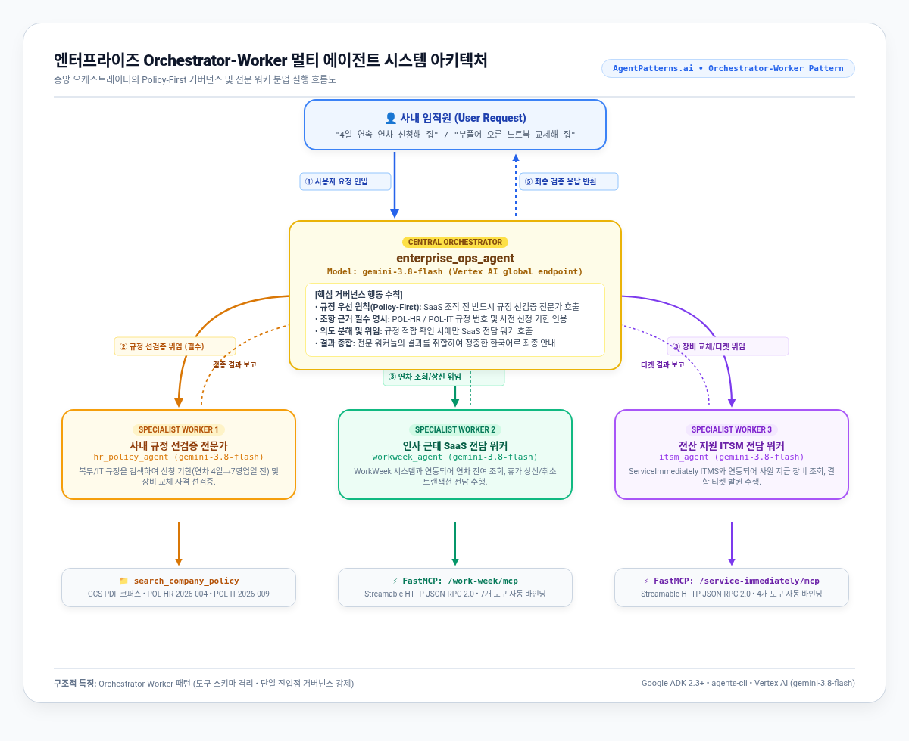

---

## 실습 목표

이 실습을 마치면 다음 작업을 직접 수행할 수 있습니다.

1. Antigravity 2.0 앱 또는 `agy` CLI에서 Google Cloud 프로젝트 인증을 마치고 모델을 Gemini 3.8 Flash로 설정합니다.
2. `docs/SDD.md`를 Antigravity에 읽혀 아키텍처와 도구 명세를 컨텍스트로 넣습니다.
3. Antigravity로 `config.yaml`과 ADK 멀티 에이전트 뼈대 코드를 생성합니다.
4. SDD 2.2절과 내 프로젝트 Cloud Storage 버킷에 올린 규정 PDF를 바탕으로 조항 번호와 근거를 반환하는 검색 도구(`app/tools/policy_rag.py`)를 만듭니다.
5. Mock SaaS 플랫폼(`https://korean-mock-saas-dri5akvbzq-du.a.run.app/`)의 MCP 서버에 개인 토큰으로 연결하는 도구(`app/tools/mcp_tools.py`)를 만듭니다.
6. 규정 검증 우선 규칙을 적용해 에이전트를 완성하고, `agents-cli run`으로 연차 신청과 노트북 교체 요청을 실행한 뒤 웹 화면에서 결과를 확인합니다. `agents-cli playground`에서 도구 호출 순서를 확인하고, 실습 2에서 쓸 4-Tier 평가 데이터셋도 만듭니다.
7. (선택) A2A 매니페스트(`agent_manifest.json`)와 A2A 서버(`a2a_server.py`)를 만들고 로컬에서 curl로 응답 형식을 확인합니다.

---

## 사전 준비 및 환경 안내

### 시작 전 확인 사항

- 실습 시간은 제한되어 있으며 일시 중지할 수 없습니다. **Start Lab** 버튼을 누르면 타이머가 동작합니다.
- 이 실습은 실제 Google Cloud 환경에서 진행됩니다. 실습 시작 시 제공되는 임시 계정을 사용해 로그인합니다.
- 브라우저는 Google Chrome 시크릿 창을 권장합니다. 개인 Google 계정과 실습 계정이 섞이지 않게 하기 위해서입니다.

> [!IMPORTANT]
> 본인의 개인 Google Cloud 계정이나 프로젝트를 사용하지 마세요. 실습 화면 왼쪽 패널의 임시 자격증명을 사용합니다.

---

### 실습 시작 및 Google Cloud 콘솔 로그인

1. 실습 페이지에서 **Start Lab**을 클릭합니다.
2. 왼쪽 패널에 표시되는 정보를 확인합니다.
   - **Username** (예: `student-01-xxxx@qwiklabs.net`)
   - **Password**
   - **GCP Project ID**
3. **Open Google Cloud console**을 마우스 우클릭하여 **시크릿 창에서 링크 열기**를 선택합니다.
4. 로그인 창에 전달받은 **Username**과 **Password**를 차례로 입력합니다.
5. 이용약관에 동의합니다. (복구 옵션이나 2단계 인증 설정은 건너뜁니다.)
6. 잠시 후 Google Cloud 콘솔 홈 화면이 나타납니다.

---

### 실습용 원격 브라우저 접속

이 실습은 미리 구성된 개발자 가상 머신(VM)과 Cloud Run 프록시 서비스를 제공합니다. 로컬에 아무것도 설치하지 않고 브라우저로 개발 환경에 접속합니다.

Antigravity 2.0에는 데스크톱 앱(Agent Platform), 터미널용 CLI(`agy`), SDK가 있습니다. 이 실습은 앱과 CLI 중 하나를 골라 진행합니다.

#### 원격 브라우저 세션 열기

1. Google Cloud 콘솔 상단 검색창에 **Cloud Run**을 입력하고, 결과에서 **Cloud Run**을 클릭합니다.
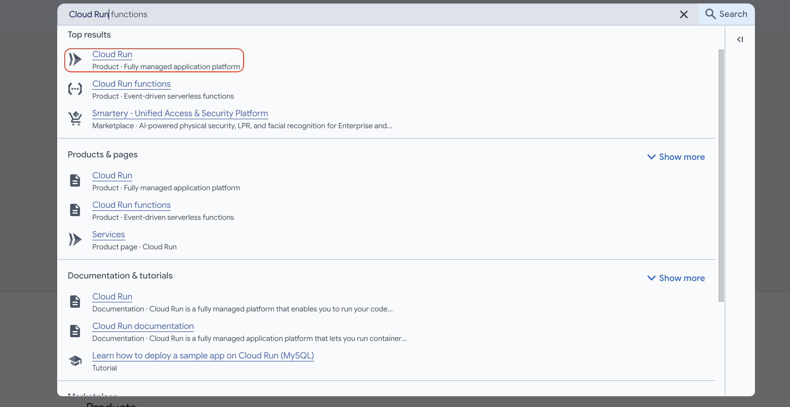

2. 왼쪽 탐색 메뉴에서 **Services**를 클릭합니다.
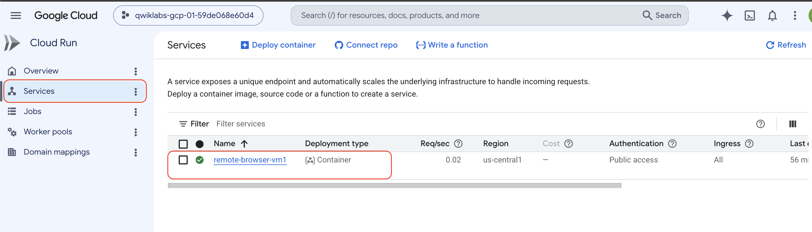

3. 서비스 목록에서 **remote-browser-vm1**을 클릭하여 서비스 세부정보 페이지를 엽니다. 상단의 URL 링크를 클릭하여 새 브라우저 탭에서 원격 세션을 엽니다.
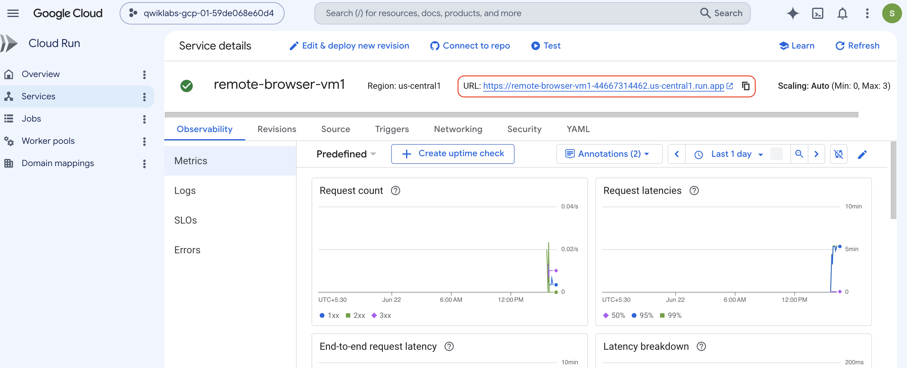

4. 브라우저에서 클립보드 권한 요청 팝업이 나타나면 **[허용]**을 클릭합니다. 허용해야 로컬 PC와 원격 세션 사이에 복사/붙여넣기가 됩니다.


> [!NOTE]
> 로컬 PC에서 원격 세션으로 텍스트 복사/붙여넣기가 되지 않으면 원격 세션 우측 하단의 클립보드 매니저를 이용하세요.
> 1. 원격 화면 우측 하단의 **Clipboard** 아이콘을 클릭합니다.
> 2. 로컬 컴퓨터의 텍스트를 텍스트 상자에 붙여넣습니다.
> 3. 패널을 닫고 터미널에 붙여넣기를 수행합니다.

---

### 터미널 열기와 API 활성화

1. 원격 화면 좌측 하단 **Application Launcher > System > Konsole**을 클릭하여 터미널을 실행합니다.
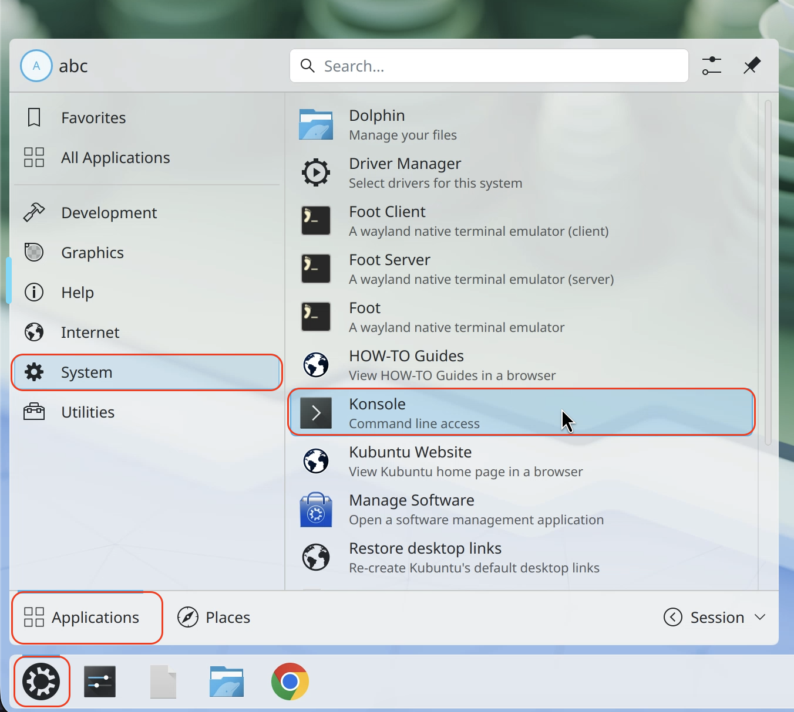

> [!NOTE]
> Konsole 터미널을 열 때 `Warning: Could not find '', starting '/bin/bash' instead. Please check your profile settings.` 경고가 표시되어도 무시해도 됩니다.

2. Lab 1과 Lab 2에서 쓰는 API를 미리 켭니다. VM의 gcloud는 실습 계정과 프로젝트로 미리 설정되어 있습니다. `gcloud config list`로 account와 project를 확인할 수 있습니다.

```bash
gcloud services enable \
  aiplatform.googleapis.com \
  agentregistry.googleapis.com \
  networkservices.googleapis.com \
  serviceextensions.googleapis.com \
  networksecurity.googleapis.com \
  modelarmor.googleapis.com \
  discoveryengine.googleapis.com \
  secretmanager.googleapis.com
```

1~2분 걸리며 `Operation ... finished successfully.`가 나오면 완료입니다.

3. RAG 도구와 `agents-cli run`은 ADC(Application Default Credentials, 애플리케이션 기본 사용자 인증 정보)로 Google Cloud API를 호출합니다. 다음 명령에서 `ADC OK`가 출력되면 ADC가 준비된 것입니다.

```bash
gcloud auth application-default print-access-token > /dev/null && echo "ADC OK"
```

오류가 나면 `gcloud auth application-default login`을 실행하고 실습 계정(Qwiklabs **Username**)으로 로그인합니다.

---

### Antigravity 2.0 사용 방식 선택

이 실습의 프롬프트는 Antigravity 2.0 데스크톱 앱과 CLI(`agy`) 어느 쪽에서도 같은 내용으로 입력합니다. 아래 (가)와 (나) 중 편한 쪽 하나를 골라 진행합니다. 둘 다 설정해도 됩니다.

| 방식 | 특징 |
|:---|:---|
| (가) Antigravity 2.0 앱 | 데스크톱 앱(Agent Platform)입니다. 대화, 작업 기록, 예약 작업을 창 하나에서 관리합니다. |
| (나) agy CLI | Konsole 터미널에서 실행하는 코딩 에이전트입니다. 여러 파일을 읽고 고치며 명령을 실행합니다. |

#### (가) Antigravity 2.0 앱 로그인

> [!IMPORTANT]
> 로그인할 때는 항상 **Use Google Cloud project instead**를 선택합니다. 앱이 실행 중인데 창이 뜨지 않으면 터미널에서 `sudo pkill -9 antigravity`를 실행한 뒤 다시 엽니다.

1. 원격 화면 좌측 하단 **Application Launcher > Development > Antigravity**를 클릭합니다.
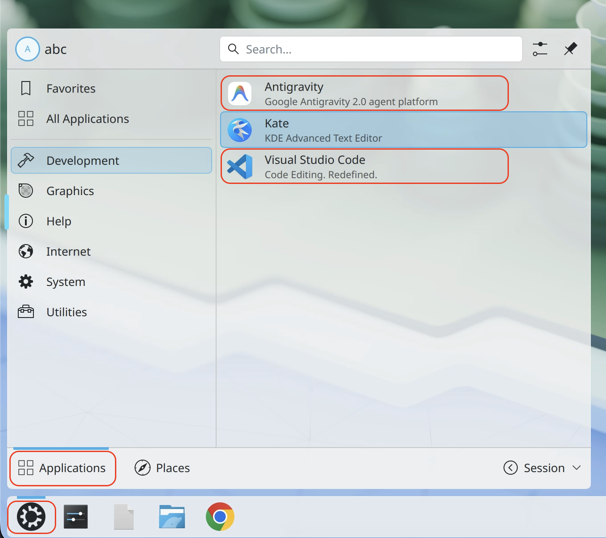

2. Welcome to Antigravity 화면에서 **Use Google Cloud project instead**를 클릭합니다.
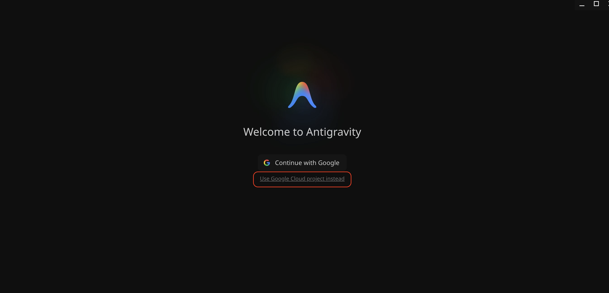

3. Welcome to Google Chrome 창이 나타나면 **OK**를 클릭합니다.
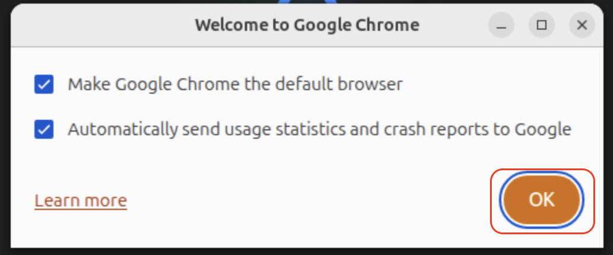

4. Sign in to Chrome 화면에서 **Stay signed out**을 클릭합니다.
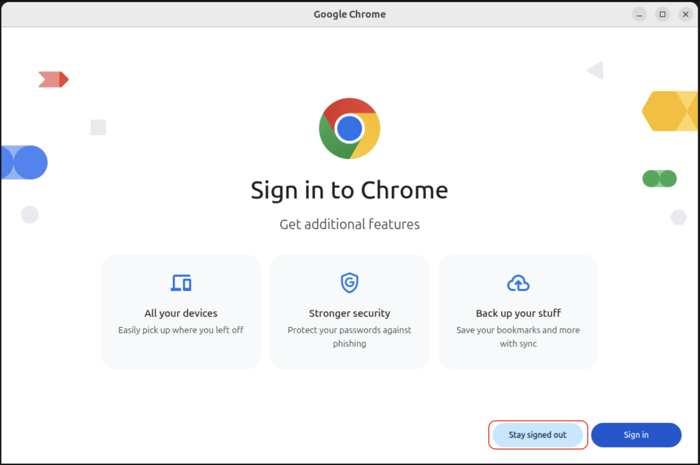

5. Qwiklabs 자격증명 패널의 **Username**과 **Password**로 로그인합니다. Sign in to Chrome? 창이 나타나면 **Use Chrome without an account**를 클릭하고, 이어지는 확인 화면에서 **Sign in**을 클릭합니다.
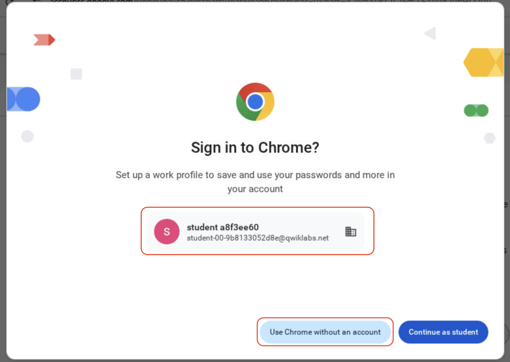
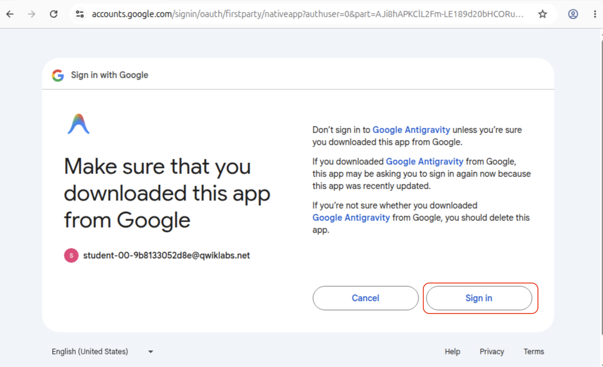

6. Open Antigravity? 대화상자가 나타나면 **Cancel**을 클릭해 닫고 Chrome 창을 최소화합니다.
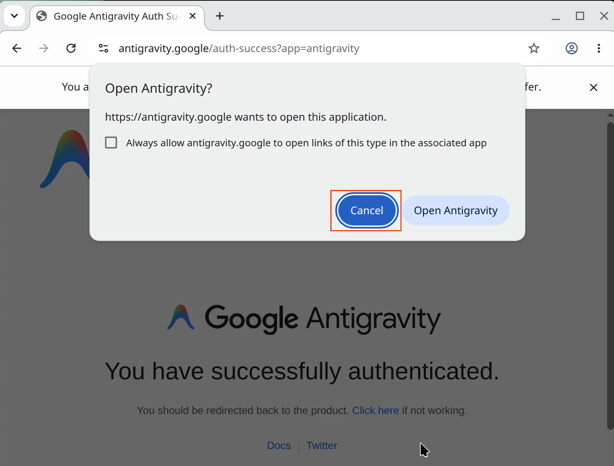

7. Antigravity 창에서 본인의 **Google Cloud Project ID**를 입력하고 **Next**를 클릭합니다.
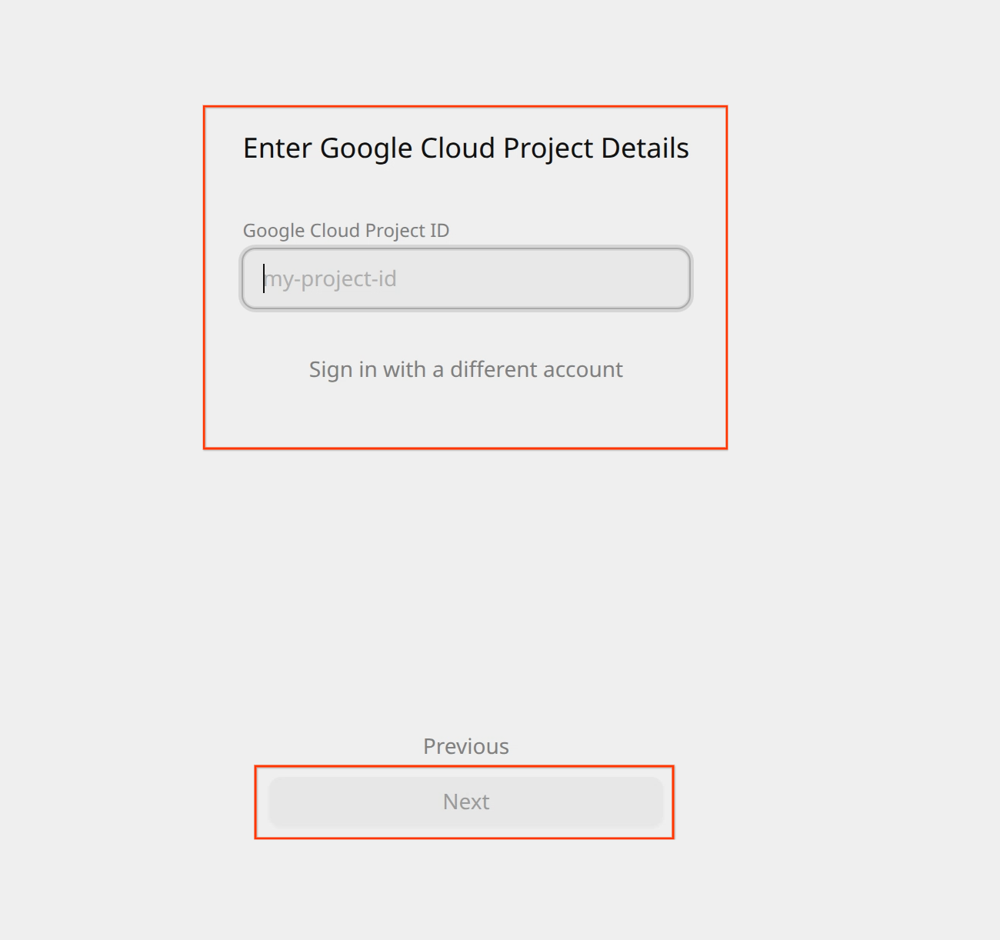

8. 설정 마법사는 다음과 같이 진행하고 나머지는 기본값으로 둔 채 페이지마다 **Next**를 클릭합니다.

| 페이지 | 설정 |
|---|---|
| Terms of Service & Data Use | **Next** 클릭 |
| Select Antigravity Theme | 원하는 테마 선택 (System / Light / Dark) |
| Build with Google | **Google Antigravity SDK** 선택 |

9. **Finish**를 클릭합니다. 다음과 같은 화면이 보이면 준비가 끝난 것입니다.
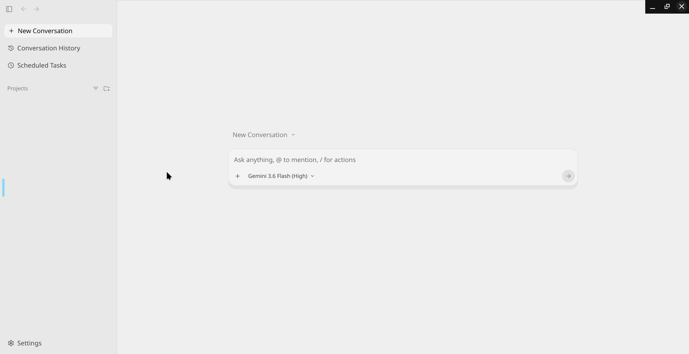

앱에서 모델을 고르는 메뉴가 보이면 Gemini 3.8 Flash 계열을 선택합니다(메뉴 이름은 앱 버전에 따라 다를 수 있음). 앱 창은 그대로 두고, Task 1 5단계에서 프로젝트 폴더를 엽니다.

#### (나) agy CLI 초기 설정

1. 터미널에 다음 명령어를 입력해 Antigravity CLI를 실행합니다.

```bash
agy
```

2. 로그인 방식 선택 창이 나타나면 **Use a Google Cloud project**를 선택합니다.
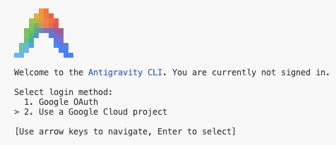

3. Chrome 브라우저에서 인증 절차를 완료합니다. 터미널에 표시된 인증 URL을 복사해 새 Chrome 탭에서 열어도 됩니다.
   - Welcome to Google Chrome 알림이 나타나면 **OK**를 클릭합니다.
   - Chrome 초기 로그인 창이 나타나면 **Stay signed out** 또는 **Use Chrome without an account**를 클릭합니다.
   - Google 로그인 화면에서 Qwiklabs 자격증명 패널의 **Username**과 **Password**를 입력합니다.
   - 안내에 따라 접근 권한을 허용하고 생성된 인증 코드를 복사합니다.
   - 터미널로 돌아와 인증 코드를 붙여넣고 **ENTER**를 누른 뒤, 본인의 **Google Cloud Project ID**를 선택합니다.
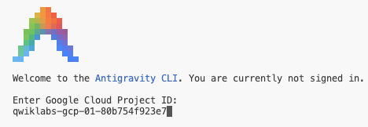

4. Google Cloud Location은 **global**을 선택합니다.

5. 선호하는 색상 테마를 선택하고 **Next**를 클릭합니다.
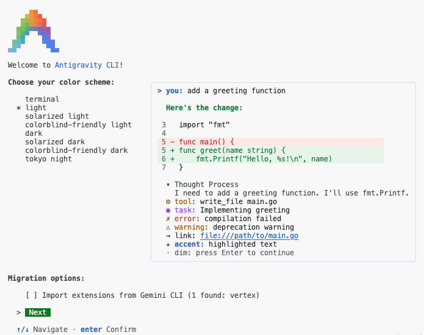

6. 서비스 이용약관과 데이터 사용 정책에 동의합니다.
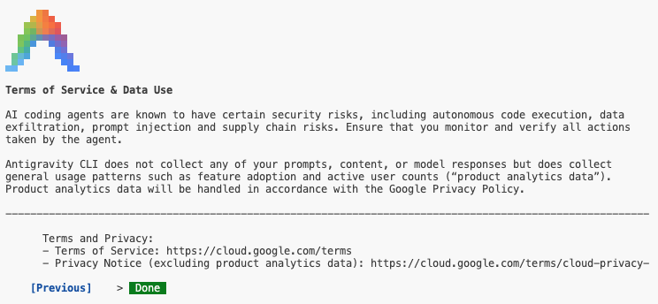

7. *"Do you trust the contents of this project?"* 알림이 뜨면 **Yes, I trust this folder**를 선택하고 **ENTER**를 누릅니다.
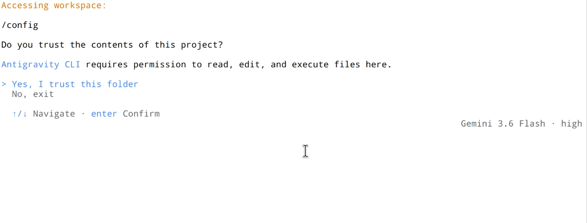

설정이 완료되면 터미널 화면이 다음과 같이 준비됩니다.
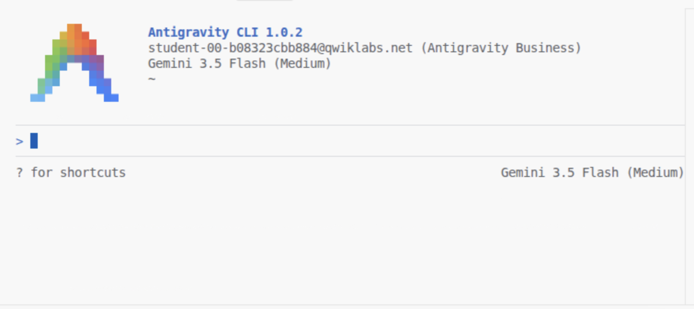

8. 설정을 다시 확인하거나 바꾸려면 `agy` 프롬프트에서 다음 명령어를 입력합니다.

```prompt
/config
```

색상 테마를 확인하고 원하는 테마를 확정합니다.
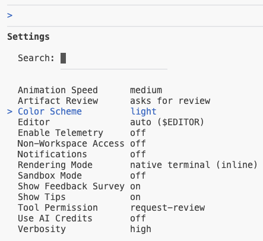

9. 사용할 모델을 확인합니다. 목록에서 Gemini 3.8 Flash 계열(예: `Gemini 3.8 Flash (High)`)을 선택합니다.

```prompt
/model
```

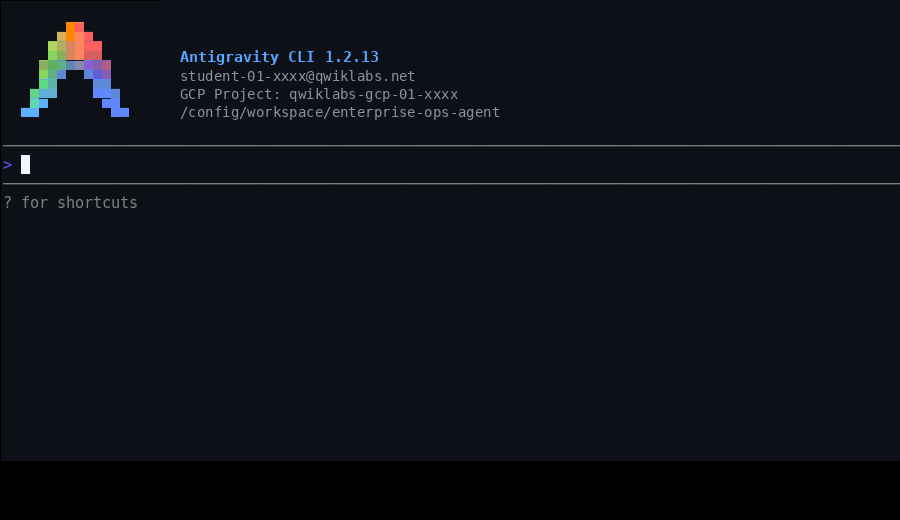

CLI 초기 설정이 끝났으면 `/exit`로 agy를 종료합니다. 작업용 agy는 Task 1 5단계에서 프로젝트 폴더로 이동한 뒤 다시 실행합니다.

---

## 실습 시나리오와 설계서

Cymbal Group 한국 지사는 사내 업무 효율화를 위해 AI 기반 통합 운영 에이전트를 도입하려고 합니다.

워크스페이스 내 `docs/SDD.md` 파일에 소프트웨어 설계 명세서가 준비되어 있습니다.

| 구분 | 파일 및 리소스 경로 | 세부 설명 | 링크 |
|:---|:---|:---|:---|
| 소프트웨어 설계서 | `docs/SDD.md` | 시스템 구조, RAG 데이터 규격, MCP 도구 명세, 오케스트레이션 규칙 | [보기](../index.html?tab=sdd) |
| 사내 복무 규정 PDF | `docs/policies/leave_policy_2026.pdf` | 문서번호 POL-HR-2026-004 (연차 및 병가 운영 지침) | [PDF](../docs/policies/leave_policy_2026.pdf) |
| IT 자산 지침 PDF | `docs/policies/it_hardware_guidelines.pdf` | 문서번호 POL-IT-2026-009 (PC 및 하드웨어 지원 규정) | [PDF](../docs/policies/it_hardware_guidelines.pdf) |
| 한국형 Mock SaaS 웹 포털 | `https://korean-mock-saas-dri5akvbzq-du.a.run.app/` | 인사관리(WorkWeek) 및 IT서비스(ServiceImmediately) 통합 포털 | [포털 열기](https://korean-mock-saas-dri5akvbzq-du.a.run.app/) |

### SDD의 역할과 스펙 기반 개발

SDD는 AI 에이전트를 개발할 때 시스템 구조, 입출력 스키마, 호출 제약, 도구 명세를 미리 정해 둔 문서입니다. 코드와 프롬프트는 이 문서를 기준으로 합니다.

프롬프트만으로 코딩을 지시하면 모델이 API 경로나 함수 인자를 추측해 틀리게 만들 수 있습니다. 그래서 SDD를 에이전트에 먼저 읽힌 뒤 코드를 생성하게 합니다.

| SDD 절 | 내용 |
|:---|:---|
| 1절 시스템 개요 및 목표 | 에이전트 목표(휴가 신청 자동화, 하드웨어 교체 접수), 모델(Gemini 3.8 Flash, Temperature 0.1), RAG 신뢰도 임계값(0.80), 사번 기본값(EMP-10294) |
| 2절 아키텍처 및 도구 명세 | 규정 검색 RAG 도구(`tools/policy_rag.py`)와 인사/전산 SaaS 연동 MCP 도구(`tools/mcp_tools.py`)의 함수 시그니처와 HTTP 엔드포인트 |
| 3절 오케스트레이션 및 거버넌스 강령 | 규정 검증 우선 원칙, 위험 작업 사전 승인, 멀티턴 대화 상태 추적 |

SDD의 `tools/`는 프로젝트의 `app/tools/`를 가리킵니다.

---

## Task 1. 개발 환경 설정, agents-cli 프로젝트 스캐폴딩 및 SDD 다운로드

Python 패키지를 설치하고 `agents-cli`로 프로젝트를 만든 뒤, SDD와 규정 PDF를 내려받아 에이전트에 읽힙니다.

### 1단계: 필수 라이브러리 및 런타임 툴 설치

시작 준비에서 연 Konsole 터미널(이하 터미널 창)에서 시스템 도구와 ADK CLI를 설치합니다. 설치에는 몇 분 걸릴 수 있습니다. 실습 환경에는 Python 가상 환경 `/opt/venv`가 미리 만들어져 있고 `PATH`에도 들어 있어, ADK CLI는 이 가상 환경에 설치합니다. `/opt/venv`는 root 소유라 `sudo`를 붙입니다.

`PATH`와 Vertex AI 환경 변수는 `~/lab.env` 파일에 저장합니다. 터미널, agy CLI, Antigravity 앱이 모두 같은 값을 읽을 수 있게 하기 위해서입니다. `~/.bashrc`에는 이 파일을 읽는 한 줄만 추가하므로, 이후 새로 여는 Konsole 탭에는 값이 자동으로 적용됩니다.

```bash
# 1. pip, git, 압축 해제 유틸리티, JSON 처리 도구 설치
#    (실습 환경에서 apt-get이 PackageKit 오류를 내지 않도록 packagekit을 먼저 제거)
sudo apt-get purge -y -qq packagekit
sudo apt-get update -qq && sudo apt-get install -y -qq python3-pip git unzip jq
type pip3 git unzip jq

# 2. 실습 환경의 Python 가상 환경(/opt/venv)에 ADK CLI와 필수 라이브러리 설치
sudo /opt/venv/bin/pip install --upgrade pip
sudo /opt/venv/bin/pip install google-agents-cli==1.8.0 "google-adk>=2.9.2,<=2.11.0" mcp httpx pydantic pyyaml uv

# 3. 사용자 바이너리 경로와 Vertex AI global 엔드포인트 환경 변수를 ~/lab.env에 저장
#    (GOOGLE_CLOUD_PROJECT는 지금 시점의 프로젝트 ID 값으로 저장됩니다)
cat > ~/lab.env <<EOF
export PATH="\$HOME/.local/bin:\$PATH"
export GOOGLE_GENAI_USE_VERTEXAI=true
export GOOGLE_CLOUD_LOCATION=global
export GOOGLE_CLOUD_PROJECT="$(gcloud config get-value project 2>/dev/null)"
EOF

# 4. 새 Konsole 탭에서도 ~/lab.env를 읽도록 ~/.bashrc에 한 번만 등록하고, 현재 셸에 적용
grep -q lab.env ~/.bashrc || echo '[ -f ~/lab.env ] && . ~/lab.env' >> ~/.bashrc
source ~/lab.env
```

`cat ~/lab.env`로 `GOOGLE_CLOUD_PROJECT`에 본인 프로젝트 ID가 들어갔는지 확인할 수 있습니다. 이 블록은 `~/lab.env`를 새로 씁니다. Task 4 이후에 다시 실행했다면 Task 4 1단계의 토큰 저장 명령도 다시 실행합니다.

설치를 확인합니다. `agents-cli, version 1.8.0`이 출력되면 설치된 것입니다. 실습은 이 버전으로 검증했고, 이 버전이 만드는 프로젝트에는 `google-adk` 2.9.2가 고정되어 있습니다.

```bash
agents-cli --version
```

`command not found`가 나오면 위 설치 블록의 출력에서 `ERROR`로 시작하는 줄을 찾아 원인을 확인합니다.

> [!NOTE]
> 이 실습의 명령 출력에는 `WARNING` 또는 `Warning`으로 시작하는 줄(NumPy, npx, 실험 기능 안내 등)이 섞여 나올 수 있습니다. 실습 환경에서는 `uv run`마다 `warning: VIRTUAL_ENV=/lsiopy does not match the project environment path .venv and will be ignored`도 나옵니다. uv가 프로젝트의 `.venv`를 제대로 쓰고 있다는 안내입니다. 이런 줄은 무시하고, 각 단계에 적힌 성공 기준만 확인합니다.

---

### 2단계: agents-cli로 에이전트 프로젝트 만들기

`agents-cli`로 에이전트 프로젝트를 만듭니다.

#### agents-cli 주요 명령
`agents-cli`는 ADK 에이전트의 생성, 로컬 실행, 평가, 배포, 등록 명령을 제공합니다.

| 명령 | 하는 일 |
|:---|:---|
| `create`, `install`, `scaffold enhance` | 프로젝트 구조를 만들고, `pyproject.toml`의 의존성을 uv로 `.venv`에 설치합니다. |
| `run`, `playground` | `agents-cli run "질의"`는 질의 하나를 실행하고, `agents-cli playground`는 이벤트와 도구 호출을 볼 수 있는 ADK 개발 UI를 엽니다. |
| `eval run`, `generate`, `grade` | 골든 데이터셋으로 LLM 판정 지표와 코드 기반 지표를 채점합니다. |
| `deploy` | Agent Runtime, Cloud Run, GKE 배포를 지원합니다(Lab 2는 Agent Runtime 사용). |
| `publish gemini-enterprise` | Gemini Enterprise에 에이전트를 등록합니다(Lab 2 Step 6). |

#### agents-cli-manifest.yaml의 역할
프로젝트 루트에 생성되는 `agents-cli-manifest.yaml`은 `agents-cli`가 이 폴더를 에이전트 프로젝트로 인식하게 하는 파일입니다. 주요 항목은 다음과 같습니다.
- `agent_directory`: 에이전트 패키지 디렉터리 경로 (`app`)
- `create_params.deployment_target`: 배포 대상 (`cloud_run`)
- `create_params.session_type`: 세션 저장 방식 (`in_memory`)

터미널에서 다음 명령어를 실행하여 Cloud Run 배포와 인메모리 세션을 기본으로 하는 프로젝트를 생성합니다.

```bash
cd ~

# agents-cli 공식 템플릿으로 프로젝트 스캐폴딩 생성
agents-cli create enterprise-ops-agent \
  --deployment-target cloud_run \
  --session-type in_memory \
  --cicd-runner skip \
  --prototype \
  --yes \
  --skip-checks

cd enterprise-ops-agent
```

#### 플래그 설명
- `--deployment-target cloud_run`: 배포 대상을 Cloud Run으로 지정해 `Dockerfile`과 FastAPI 서빙 코드를 함께 만듭니다.
- `--session-type in_memory`: 로컬 테스트에 맞는 인메모리 세션 저장소를 사용합니다.
- `--cicd-runner skip`: GitHub Actions 등 CI/CD 파이프라인 파일 생성을 건너뜁니다.
- `--prototype` (`-p`): 인프라 리소스 생성 없이 프로토타입 모드로 프로젝트를 만듭니다.
- `--yes` (`-y`): 대화형 확인 질문을 모두 자동 승인합니다.
- `--skip-checks` (`-s`): 생성 전 GCP 환경 점검을 건너뜁니다.

```
+-----------------------------------------------------------------------------------+
| 출력 예시:                                                                          |
| Agents CLI v1.8.0                                                                 |
| Info: --agent not specified. Defaulting to 'adk' in auto-approve mode.            |
|                                                                                   |
| ✅ Success! Your agent project is ready.                                          |
|                                                                                   |
| 📖 Documentation                                                                  |
|    README:    cat enterprise-ops-agent/README.md                                  |
|                                                                                   |
| 💡 Tip                                                                            |
|    Once ready for production, run: agents-cli scaffold enhance                    |
|                                                                                   |
| 🚀 Get Started                                                                    |
|    cd enterprise-ops-agent && agents-cli install && agents-cli playground         |
+-----------------------------------------------------------------------------------+
```

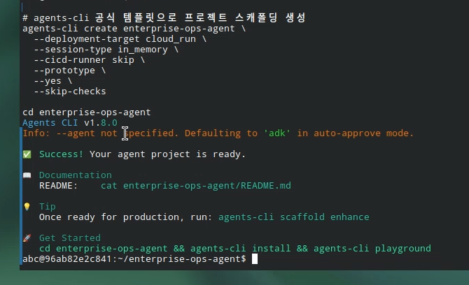

출력 끝의 Get Started 안내는 지금 실행하지 않습니다. `agents-cli install`은 4단계에서 실행합니다.

---

### 3단계: SDD와 사내 규정 PDF 다운로드

프로젝트 디렉터리(`~/enterprise-ops-agent/`)의 `docs/` 폴더에 설계서와 규정 PDF를 내려받습니다.

> [!NOTE]
> 실습 중에 설계서나 규정 원문을 확인하려면 아래 링크를 사용하세요. 모두 새 탭에서 열립니다.
> - [소프트웨어 설계서 SDD.md](../index.html?tab=sdd): 이 사이트의 `sdd.md` 탭
> - [연차 및 병가 운영 지침 (POL-HR-2026-004) PDF](../docs/policies/leave_policy_2026.pdf)
> - [PC 및 하드웨어 지원 규정 (POL-IT-2026-009) PDF](../docs/policies/it_hardware_guidelines.pdf)

실습 저장소(GitHub)에서 내려받습니다. 이 사이트에서 보는 설계서와 같은 파일입니다.

```bash
cd ~/enterprise-ops-agent
mkdir -p docs/policies
RAW=https://raw.githubusercontent.com/hajekim/build-with-gemini/main/docs
curl -fsSL ${RAW}/SDD.md -o docs/SDD.md
curl -fsSL ${RAW}/policies/leave_policy_2026.pdf -o docs/policies/leave_policy_2026.pdf
curl -fsSL ${RAW}/policies/it_hardware_guidelines.pdf -o docs/policies/it_hardware_guidelines.pdf
```

다운로드된 파일 목록을 확인합니다.

```bash
ls -lh docs/
ls -lh docs/policies/
```

```
+-----------------------------------------------------------------------------------+
| 출력 예시:                                                                          |
| total 28K                                                                         |
| -rw-r--r-- 1 abc abc  22K Oct  2 04:53 SDD.md                                     |
| drwxr-xr-x 2 abc abc 4.0K Oct  2 04:53 policies                                   |
| total 96K                                                                         |
| -rw-r--r-- 1 abc abc  50K Oct  2 04:53 it_hardware_guidelines.pdf                 |
| -rw-r--r-- 1 abc abc  43K Oct  2 04:53 leave_policy_2026.pdf                      |
+-----------------------------------------------------------------------------------+
```

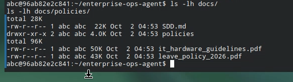

`SDD.md`와 PDF 두 개가 보이면 됩니다. 날짜와 시각은 실행 시점에 따라 다릅니다.

---

### 4단계: `agents-cli install`로 가상 환경 구성

프로젝트 루트에서 `agents-cli install`을 실행하여 `pyproject.toml`의 의존성을 프로젝트 전용 가상 환경(`.venv`)에 설치합니다.

```bash
cd ~/enterprise-ops-agent
agents-cli install
```

```
+-----------------------------------------------------------------------------------+
| 출력 예시:                                                                          |
|   ▸ uv sync                                                                       |
| warning: `VIRTUAL_ENV=/lsiopy` does not match the project environment path ...    |
| Using CPython 3.13.14                                                             |
| Creating virtual environment at: .venv                                            |
| Resolved 169 packages in 1ms                                                      |
| Installed 150 packages in 136ms                                                   |
|  + a2a-sdk==1.1.5                                                                 |
|  ...                                                                              |
|  + google-adk==2.9.2                                                              |
|  ...                                                                              |
+-----------------------------------------------------------------------------------+
```

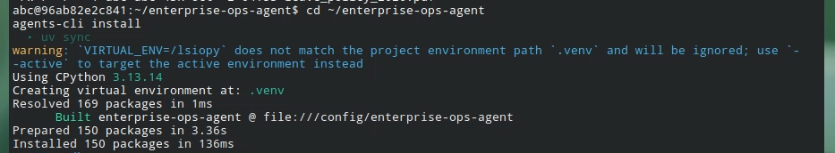

uv가 Python 3.13을 직접 내려받아 `.venv`를 만듭니다. 패키지 목록에서 `google-adk==2.9.2`가 보이면 정상입니다. 첫 줄의 `VIRTUAL_ENV` 경고는 무시해도 됩니다.

---

### 5단계: 에이전트 창과 터미널 창 준비

이후 실습은 창 두 개로 진행합니다.

- 에이전트 창: 프롬프트를 입력하는 곳입니다. 문서의 `prompt` 코드 블록은 여기에 입력합니다.
- 터미널 창: 명령을 실행하는 Konsole 탭입니다. 문서의 `bash` 코드 블록은 여기서 실행합니다.

에이전트는 열어 둔 프로젝트 폴더를 워크스페이스로 인식합니다. `~/enterprise-ops-agent` 폴더를 열어야 `docs/SDD.md`와 `app/`을 읽을 수 있습니다.

| 사용 방식 | 프로젝트 폴더 열기 | 에이전트 창 | 터미널 창 |
|:---|:---|:---|:---|
| (가) Antigravity 2.0 앱 | 아래 "Antigravity 2.0 앱에서 프로젝트 폴더 연결" 순서를 따릅니다. | 앱의 대화 입력창 | 지금까지 쓴 Konsole 탭 |
| (나) agy CLI | Konsole 탭 1에서 `cd ~/enterprise-ops-agent && agy`를 실행합니다. | 탭 1의 agy | Konsole 새 탭(**Ctrl+Shift+T**)인 탭 2 |

#### Antigravity 2.0 앱에서 프로젝트 폴더 연결

1. 왼쪽 사이드바의 **Projects** 오른쪽에 있는 폴더 추가 아이콘(+ 모양 폴더)을 클릭합니다.

   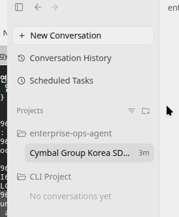

2. **Create Project** 대화상자에서 **Add Folder**를 클릭합니다.

   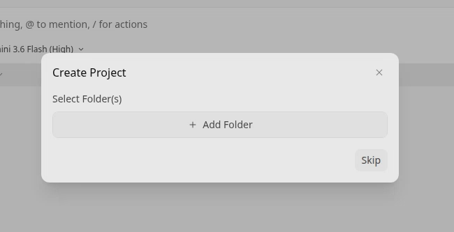

3. **Open workspace** 창에서 `enterprise-ops-agent` 폴더를 선택하고 **Open**을 클릭합니다. 실습 환경의 홈 폴더는 `/config`입니다.

   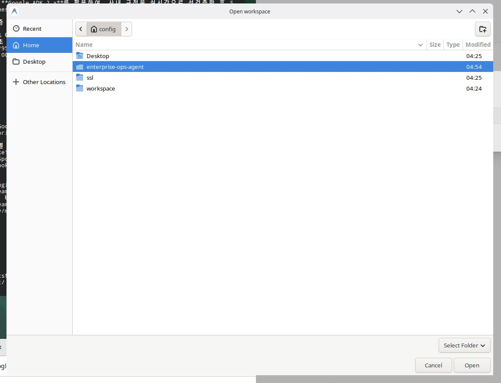

4. **Next**를 클릭하면 만들어진 프로젝트로 자동으로 이동합니다. 입력창 위에 `enterprise-ops-agent`가 표시되면 연결된 것입니다.

   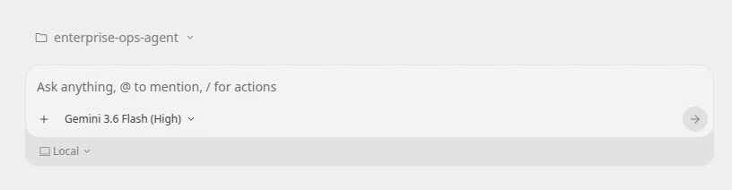

새 대화와 이어서 하기:
- 앱: 사이드바의 **New Conversation**으로 새 대화를 시작합니다. 이전 대화는 **Conversation History** 또는 **Projects**의 `enterprise-ops-agent` 아래 대화 목록에서 골라 이어서 진행합니다.
- CLI: `agy`는 새 대화를 시작하고, `agy --continue`(또는 `agy -c`)는 직전 대화를 이어서 진행합니다.

agy CLI에서 폴더 신뢰 확인이 나오면 **Yes, I trust this folder**를 선택합니다.

> [!NOTE]
> Antigravity 앱은 Konsole에서 `export`한 값을 이어받지 않습니다. 그래서 에이전트에게 명령 실행을 맡기는 프롬프트에는 `source ~/lab.env`를 먼저 실행하라는 줄이 들어 있습니다. 터미널 창은 1단계에서 등록한 `~/.bashrc` 설정으로 값을 자동으로 읽습니다.

#### 프로젝트 컨텍스트 읽히기

에이전트 창에 다음 프롬프트를 입력하고 **ENTER**를 누릅니다.

```prompt
당신은 Cymbal Group Korea의 엔터프라이즈 AI 에이전트 개발자입니다.
docs/SDD.md 파일의 내용을 꼼꼼히 읽고, 전체 시스템 아키텍처와 도구 구성 요소를 파악하세요.
그리고 현재 프로젝트 디렉터리의 컨텍스트를 요약한 context_summary.md 파일을 docs/ 디렉터리에 생성하세요.
```


에이전트가 파일 생성을 제안하면 **Allow**를 선택합니다. 생성이 완료되면 터미널 창에서 요약 파일을 확인합니다.

```bash
cd ~/enterprise-ops-agent
cat docs/context_summary.md
```

요약에 서브 에이전트 3개, 규정 RAG 도구, MCP 엔드포인트 두 개(`/work-week/mcp`, `/service-immediately/mcp`)가 나오면 됩니다.

---

### 6단계: Vertex AI Search로 사내 규정 검색 앱 만들기 (터미널 창)

Task 3의 규정 RAG 도구가 호출할 Vertex AI Search 검색 앱을 지금 만들어 둡니다. 데이터스토어와 검색 앱 생성 요청은 바로 접수되지만, PDF 가져오기(인덱싱)는 PDF 2건 기준으로 보통 4~11분 걸립니다. 지금 시작해 두면 Task 2를 진행하는 동안 끝나므로 Task 3에서 기다릴 필요가 없습니다.

Vertex AI Search는 `global`/`us`/`eu` 멀티리전만 지원하므로 검색 앱은 `global`에 만들고, 원본 PDF 버킷은 서울(`asia-northeast3`)에 둡니다. 아래 네 블록은 같은 터미널 창에서 순서대로 실행합니다. ② 이후 블록은 ①에서 만든 변수를 씁니다.

> [!TIP]
> 응답에 `ALREADY_EXISTS`(또는 `409`)가 보이면 이미 만들어진 것이므로 무시하고 다음 블록으로 넘어갑니다. 그 밖의 `error`가 보이면 30초 뒤 그 블록만 다시 실행합니다.

① 변수, 서비스 에이전트, 버킷

```bash
PROJECT_ID=$(gcloud config get-value project 2>/dev/null)
DE="https://discoveryengine.googleapis.com/v1/projects/${PROJECT_ID}/locations/global/collections/default_collection"
AUTH=(-H "Authorization: Bearer $(gcloud auth print-access-token)" -H "X-Goog-User-Project: ${PROJECT_ID}" -H "Content-Type: application/json")

# Vertex AI Search 서비스 에이전트 생성과 역할 부여
# (새 프로젝트에는 서비스 에이전트가 없고, 만들어도 역할이 자동으로 붙지 않아 GCS 가져오기가 403으로 실패합니다)
PROJECT_NUMBER=$(gcloud projects describe ${PROJECT_ID} --format="value(projectNumber)")
gcloud beta services identity create --service=discoveryengine.googleapis.com
gcloud projects add-iam-policy-binding ${PROJECT_ID} \
  --member="serviceAccount:service-${PROJECT_NUMBER}@gcp-sa-discoveryengine.iam.gserviceaccount.com" \
  --role=roles/discoveryengine.serviceAgent --condition=None --quiet > /dev/null

# 3단계에서 받은 규정 PDF를 내 프로젝트 버킷(서울)에 올림
gcloud storage buckets create gs://${PROJECT_ID}-policy-docs --location=asia-northeast3
gcloud storage cp ~/enterprise-ops-agent/docs/policies/*.pdf gs://${PROJECT_ID}-policy-docs/policy/
```

서비스 에이전트 이메일(`service-...@gcp-sa-discoveryengine.iam.gserviceaccount.com`)과 PDF 2건 복사 결과가 출력되면 됩니다. 역할 부여가 반영되기까지 1분 정도 걸릴 수 있습니다. ③의 가져오기 응답에 403 권한 오류가 나오면 1분 뒤 ③만 다시 실행합니다.

② 비정형 문서용 데이터스토어 생성

```bash
curl -s -X POST "${AUTH[@]}" "${DE}/dataStores?dataStoreId=company-policy-ds" \
  -d '{"displayName":"company-policy-ds","industryVertical":"GENERIC","solutionTypes":["SOLUTION_TYPE_SEARCH"],"contentConfig":"CONTENT_REQUIRED"}'
```

③ GCS PDF 가져오기 (비동기, 4~11분 소요. 결과를 기다리지 않고 다음으로 진행)

```bash
curl -s -X POST "${AUTH[@]}" "${DE}/dataStores/company-policy-ds/branches/0/documents:import" \
  -d "{\"gcsSource\":{\"inputUris\":[\"gs://${PROJECT_ID}-policy-docs/policy/*.pdf\"],\"dataSchema\":\"content\"},\"reconciliationMode\":\"INCREMENTAL\"}"
```

④ Enterprise 검색 앱 생성 (발췌 세그먼트 반환에 필요)

```bash
curl -s -X POST "${AUTH[@]}" "${DE}/engines?engineId=company-policy-app" \
  -d '{"displayName":"company-policy-app","solutionType":"SOLUTION_TYPE_SEARCH","industryVertical":"GENERIC","dataStoreIds":["company-policy-ds"],"searchEngineConfig":{"searchTier":"SEARCH_TIER_ENTERPRISE","searchAddOns":["SEARCH_ADD_ON_LLM"]}}'
```

응답에서 다음을 확인합니다. 데이터스토어와 검색 앱은 빈 상태로 바로 만들어지고, 시간이 걸리는 것은 PDF를 색인하는 ③입니다.

| 요청 | 확인할 응답 | 의미 |
|:---|:---|:---|
| ② 데이터스토어 | `"done": true`와 `"name": ".../dataStores/company-policy-ds"` | 생성 완료 |
| ③ PDF 가져오기 | `"name": ".../operations/import-documents-..."`만 있고 `done`이 없음 | 접수됨. 4~11분 뒤 완료되며, Task 3 0단계에서 확인 |
| ④ 검색 앱 | `"done": true`와 `"name": ".../engines/company-policy-app"` | 생성 완료 |

③을 두 번 실행해도 같은 PDF는 중복으로 들어가지 않습니다(`INCREMENTAL` 모드).

---


## Task 2. Antigravity로 ADK 2.0 멀티 에이전트 구조 만들기

`agents-cli create`가 만든 단일 에이전트(`app/agent.py`)를 SDD에 따라 오케스트레이터 1개와 워커 3개 구조로 바꿉니다.

---

### 멀티 에이전트 구성

에이전트 하나에 도구를 모두 붙이면 지시문이 길어지고 모델이 엉뚱한 도구를 고르기 쉽습니다. 쓰기 권한이 있는 도구만 따로 묶기도 어렵습니다.
그래서 이 실습에서는 오케스트레이터(`enterprise_ops_agent`)와 업무별 워커 3개로 나눈 Orchestrator-Worker 패턴(참고: [AgentPatterns.ai - Orchestrator-Worker Pattern](https://agentpatterns.ai/patterns/multi-agent/orchestrator-worker/))을 씁니다.

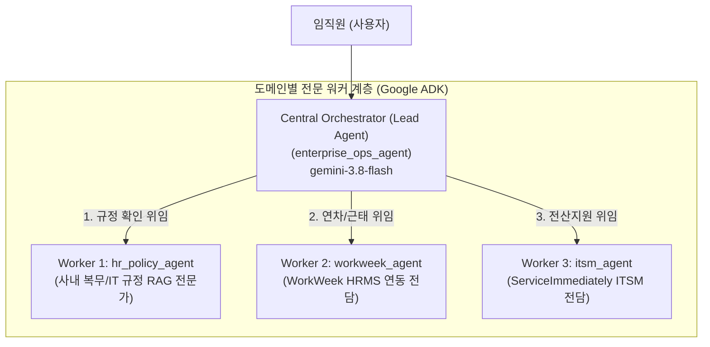
```mermaid
flowchart TD
    User["임직원 (사용자)"] --> Orch["Central Orchestrator (Lead Agent)<br/>(enterprise_ops_agent)<br/>gemini-3.8-flash"]

    subgraph Specialist_Workers ["도메인별 전문 워커 계층 (Google ADK)"]
        Orch -->|"1. 규정 확인 위임"| W1["Worker 1: hr_policy_agent<br/>(사내 복무/IT 규정 RAG 전문가)"]
        Orch -->|"2. 연차/근태 위임"| W2["Worker 2: workweek_agent<br/>(WorkWeek HRMS 연동 전담)"]
        Orch -->|"3. 전산지원 위임"| W3["Worker 3: itsm_agent<br/>(ServiceImmediately ITSM 전담)"]
    end
```

Task 5까지 마쳤을 때의 목표 구조입니다. 지금은 `app/agent.py`, `app/fast_api_app.py`, `docs/`, `pyproject.toml` 등만 있습니다.

```text
enterprise-ops-agent/
├── agents-cli-manifest.yaml # CLI 프로젝트 식별 매니페스트 (agent_directory: app)
├── config.yaml              # 모델 파라미터(gemini-3.8-flash), 멀티 에이전트 역할 정의, 거버넌스 규칙
├── app/
│   ├── __init__.py
│   ├── agent.py             # 루트 에이전트와 서브 에이전트 3개
│   ├── fast_api_app.py      # 로컬 SSE 스트리밍 서버 및 평가 엔드포인트
│   └── tools/               # 외부 시스템 연동 도구 디렉터리 (app/tools/)
│       ├── policy_rag.py    # 하이브리드 사내 규정 RAG 검색 도구
│       └── mcp_tools.py     # WorkWeek & ITSM MCP 연동 클라이언트
├── docs/                    # 소프트웨어 설계서(SDD.md) 및 사내 규정 원본 PDF
├── tests/
│   ├── test_scenarios.py    # 시나리오 5개 통합 테스트
│   └── eval/                # 실습 2를 위한 정량 평가 디렉터리
├── Dockerfile               # Cloud Run 컨테이너 빌드 명세
└── pyproject.toml           # 파이썬 의존성 패키지 명세
```

#### 서브 에이전트 역할

| 에이전트 | 역할 |
|:---|:---|
| `enterprise_ops_agent` (오케스트레이터) | 사용자 질의의 의도를 분류해 서브 에이전트에 위임하고 최종 응답을 정리합니다. |
| `hr_policy_agent` | `search_company_policy` 도구는 이 에이전트에만 붙입니다. 사내 복무 규정(POL-HR)과 IT 지침(POL-IT)을 검색해 조항과 조건을 확인합니다. |
| `workweek_agent` | WorkWeek MCP 도구 7종으로 연차/병가 조회, 휴가 신청, 휴가 취소를 맡습니다. |
| `itsm_agent` | ServiceImmediately MCP 도구 4종으로 인시던트 티켓 조회, 생성, 댓글 작성을 맡습니다. |

---

### 1단계: 설정 파일 생성 및 멀티 에이전트 뼈대 리팩토링 지시

에이전트 창에 다음 프롬프트를 입력하고 **ENTER**를 누릅니다.

```prompt
docs/SDD.md의 2.1절 '논리 아키텍처 및 데이터 흐름'과 1절 '시스템 개요 및 목표'를 참고하여, 우리가 방금 생성한 기본 뼈대를 Cymbal Group Korea의 Orchestrator-Worker 멀티 에이전트 시스템으로 전면 개편해주세요:

1. config.yaml 생성:
   - agent 이름: enterprise_ops_agent, architecture: Orchestrator-Worker Multi-Agent System (MAS)
   - 모델: gemini-3.8-flash (temperature: 0.1, max_output_tokens: 2048)
   - sub_agents 정의: hr_policy_agent(규정 RAG), workweek_agent(HRMS MCP), itsm_agent(ITSM MCP)
   - organization: Cymbal Group Korea, Cloud AI Platform Operations, 기본 사번 EMP-10294
   - governance: enforce_policy_grounding=true, rag_confidence_threshold=0.80

2. app/agent.py 리팩토링:
   - 기존 더미 날씨 함수(get_weather, get_current_time)를 완전히 제거
   - google.adk.agents.Agent 클래스를 사용한 Orchestrator-Worker 멀티 에이전트 작성
   - 전문 서브 에이전트 3개 선언:
     1) hr_policy_agent: 사내 복무 규정(POL-HR) 및 IT 지침(POL-IT) RAG 검색 전문가
     2) workweek_agent: WorkWeek HRMS MCP 연동 전문가 (연차 조회, 휴가 신청/취소)
     3) itsm_agent: ServiceImmediately ITSM MCP 연동 전문가 (장비 조회, 티켓 생성/댓글)
   - 중앙 오케스트레이터 root_agent(enterprise_ops_agent): sub_agents=[hr_policy_agent, workweek_agent, itsm_agent]로 구성
   - SDD 3절의 규정 우선 확인(Policy-First) 및 위임 규칙을 HUB_INSTRUCTION으로 정의
   - build_agent() 및 get_enterprise_agent() 함수 작성
   - 주의사항: 
     * Agent 생성자 지시문은 반드시 단수형 'instruction' 키워드를 사용하고(instructions 복수형 사용 금지), 모듈 최상위에 'root_agent = build_agent()' 변수와 'app = App(root_agent=root_agent, name="app")'을 선언할 것
     * 아직 app/tools/ 구현 전이므로 초기 뼈대의 sub_agents tools는 빈 리스트(tools=[])로 선언할 것
     * 파일 끝에 if __name__ == "__main__": 블록을 두고 root_agent 이름과 서브 에이전트 이름 목록을 출력할 것
```

에이전트가 파일 수정을 제안하면 변경 사항을 확인한 뒤 **Allow**를 선택합니다.

---

### 2단계: 생성된 멀티 에이전트 뼈대 검증

터미널 창에서 멀티 에이전트 구성을 실행해 확인합니다.

```bash
cd ~/enterprise-ops-agent
uv run python3 -m app.agent
```

```
+-----------------------------------------------------------------------------------+
| 출력 예시:                                                                          |
| Root Agent Name: enterprise_ops_agent                                             |
| Sub-Agents (3): hr_policy_agent, workweek_agent, itsm_agent                       |
+-----------------------------------------------------------------------------------+
```

에러 없이 서브 에이전트 3개 이름이 출력되면 성공입니다. 위에 `Warning` 줄이 함께 나와도 됩니다. 출력 형식은 생성된 코드에 따라 다를 수 있습니다. ValidationError가 나면 Agent 생성자에 `instruction` 키워드를 썼는지 확인하세요.

---

## Task 3. 프롬프트 기반 사내 규정 RAG 도구 구현

SDD 2.2절에 따라 사내 복무 규정(POL-HR-2026-004)과 IT 하드웨어 지침(POL-IT-2026-009)을 검색하는 RAG 도구(`app/tools/policy_rag.py`)를 에이전트로 만듭니다.

### 사내 규정 원본 문서와 주요 조항

규정 원문은 아래에서 내려받을 수 있습니다.

- [사내 복무 규정 (POL-HR-2026-004) PDF](../docs/policies/leave_policy_2026.pdf)
- [사내 IT 자산 운용 지침 (POL-IT-2026-009) PDF](../docs/policies/it_hardware_guidelines.pdf)

#### 1. 사내 복무 규정 (POL-HR-2026-004) 주요 조항
- 연차 발생 기준: 1개월 개근 시 1.25일 발생 (연간 기본 15일 부여).
- 연속 연차 신청 기한: 3일을 초과하는 연속 연차는 업무 인수인계를 위해 **최소 사용 7영업일 전까지 상신**하여 팀장의 사전 승인을 받아야 함.
- 병가 규정: 연간 14일 유급 병가 지원, 연속 3일 초과 시 의사 진단서 제출 필수.

#### 2. 사내 IT 자산 운용 지침 (POL-IT-2026-009) 주요 조항
- 직군별 표준 기종: 데이터 및 엔지니어링 직군은 MacBook Pro 16 M3 Max (64GB RAM), 일반 사무직군은 M3 Pro 모델 지급.
- 정기 교체 주기: 지급일로부터 36개월 경과 시 신규 기종 교체 신청 가능.
- 긴급 결함 조치: 배터리 부풀림(스웰링) 등 안전 결함 발생 시 내구연한과 무관하게 4시간 내 접수 점검 및 당일 대여 장비 선지급.

> [!NOTE]
> 하이브리드 RAG 구조: 1차로 Cloud Storage에 올린 규정 PDF를 인덱싱한 Vertex AI Search 검색 앱을 호출하고, 검색 앱이 아직 준비되지 않았거나 장애가 나면 PDF에서 발췌한 로컬 조항 인덱스로 폴백합니다. 응답의 `source` 필드(`vertex_ai_search` / `local_fallback`)로 어느 경로가 쓰였는지 확인할 수 있습니다. 관련 조항이 없으면 `NO_MATCH`를 반환해 에이전트가 추측하지 않도록 합니다.

---

### 0단계: 검색 앱 인덱싱 완료 확인 (터미널 창)

Task 1의 6단계에서 시작한 PDF 가져오기가 끝났는지 확인합니다. 문서 수가 `2`이면 완료입니다.

```bash
PROJECT_ID=$(gcloud config get-value project 2>/dev/null)
DE="https://discoveryengine.googleapis.com/v1/projects/${PROJECT_ID}/locations/global/collections/default_collection"
AUTH=(-H "Authorization: Bearer $(gcloud auth print-access-token)" -H "X-Goog-User-Project: ${PROJECT_ID}" -H "Content-Type: application/json")
curl -s "${AUTH[@]}" "${DE}/dataStores/company-policy-ds/branches/0/documents" | grep -c '"name"'
```

`0`이 나와도 다음 단계로 넘어가세요. 가져오기가 끝나기 전까지 RAG 도구는 `local_fallback`으로 동작합니다. Task 1의 6단계를 건너뛰었다면 지금 실행합니다.

콘솔에서도 같은 내용을 확인할 수 있습니다.

1. 원격 Chrome의 Google Cloud 콘솔 상단 검색창에 `AI Applications`를 입력해 이동합니다.
2. Apps 목록에서 `company-policy-app`(App type `Search`)과 연결된 데이터 스토어 `company-policy-ds`를 확인합니다. 실습 2에서 만드는 Gemini Enterprise 앱도 나중에 같은 목록에 나타납니다.

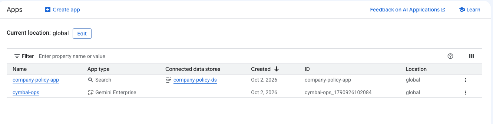

3. Connected data stores 열의 `company-policy-ds`를 누릅니다. 가져오기가 진행 중이면 Documents 탭에 `Processing data...`가 보이고 Number of documents는 `-`입니다. Refresh를 눌러 다시 확인합니다.

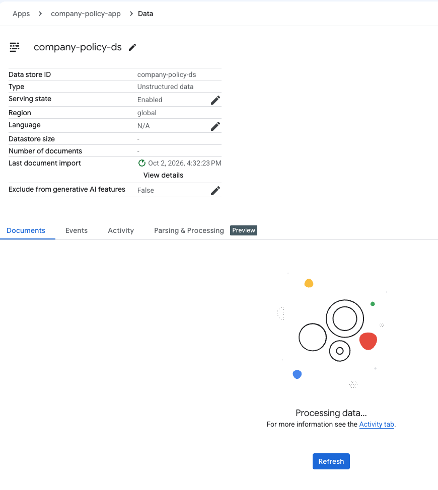

4. 완료되면 Number of documents가 `2`가 되고, Documents 탭의 PDF 2건(`leave_policy_2026.pdf`, `it_hardware_guidelines.pdf`)의 Index Status가 `Indexed`로 바뀝니다.

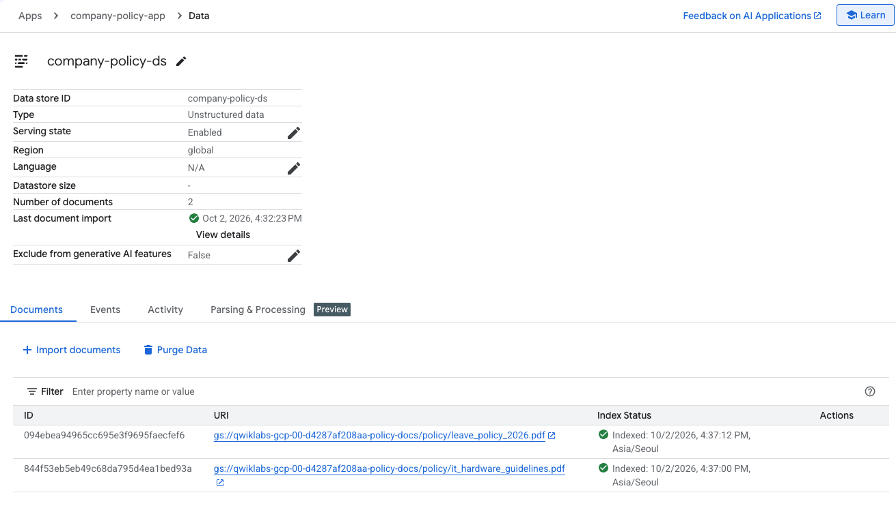

---

### 1단계: RAG 도구 구현 지시

에이전트 창에 다음 프롬프트를 입력하고 **ENTER**를 누릅니다.

```prompt
docs/SDD.md의 2.2절 '사내 규정 RAG 도구 명세'와 '하이브리드 Policy RAG 아키텍처'를 엄격히 준수하여 app/tools/policy_rag.py 파일을 구현해주세요.

요구사항:
1. 함수 시그니처: search_company_policy(query: str, category: str = "ALL") -> dict
2. 1차 검색: Vertex AI Search 검색 앱(engine ID는 환경 변수 POLICY_SEARCH_ENGINE_ID, 기본값 company-policy-app, 위치 global)의
   servingConfigs/default_search:search REST API를 google.auth 기본 자격증명과 httpx로 호출하고,
   extractiveContentSpec(maxExtractiveSegmentCount=2)으로 받은 발췌 세그먼트를 matches로 변환할 것.
   PDF 파일명으로 문서번호를 매핑: leave_policy_2026.pdf -> POL-HR-2026-004(HR), it_hardware_guidelines.pdf -> POL-IT-2026-009(IT)
3. 2차 폴백: Vertex AI Search 호출 예외 또는 결과 0건이면 SDD의 Ground Truth 조항을 로컬 인덱스로 키워드 검색할 것.
4. category('HR'/'IT')로 결과를 필터링하고, 반환 딕셔너리에 status, source('vertex_ai_search' 또는 'local_fallback'), match_count, matches(doc_id, title, content)를 포함할 것.
   키 이름은 정확히 이대로 쓸 것(성공 시 status='SUCCESS'). Task 5 통합 테스트와 실습 2 평가 지표가 이 이름을 읽음.
   결과가 없으면 status='NO_MATCH'와 추측 금지 안내 메시지를 반환할 것.
5. 작성이 완료되면 `uv run python3 -m app.tools.policy_rag`로 자체 검증(assert)을 실행해 결과를 보여주세요.
   명령을 실행하기 전에 `source ~/lab.env`를 먼저 실행할 것.
```

에이전트가 파일 작성을 제안하면 **Allow**를 선택합니다.

---

### 2단계: RAG 도구 독립 실행 테스트

터미널 창에서 RAG 도구를 직접 호출해 원하는 조항이 검색되는지 확인합니다.

```bash
cd ~/enterprise-ops-agent
uv run python3 -c "
from app.tools.policy_rag import search_company_policy
import json

print('=== 테스트 1: 4일 연속 연차 신청 기한 문의 ===')
r1 = search_company_policy('4일 연속으로 휴가 쓰려면 며칠 전에 신청해야 하나요?', category='HR')
print(json.dumps(r1, indent=2, ensure_ascii=False))

print('\n=== 테스트 2: 개발자 노트북 교체 주기 문의 ===')
r2 = search_company_policy('개발자 랩톱 교체 주기 및 M3 맥북 지원 기준', category='IT')
print(json.dumps(r2, indent=2, ensure_ascii=False))
"
```

```
+-----------------------------------------------------------------------------------+
| 출력 예시:                                                                          |
| === 테스트 1: 4일 연속 연차 신청 기한 문의 ===                                        |
| {                                                                                 |
|   "status": "SUCCESS",                                                            |
|   "source": "vertex_ai_search",                                                   |
|   "query": "4일 연속으로 휴가 쓰려면 며칠 전에 신청해야 하나요?",                     |
|   "category": "HR",                                                               |
|   "match_count": 1,                                                               |
|   "grounding_confidence": 0.96,                                                   |
|   "matches": [                                                                    |
|     {                                                                             |
|       "doc_id": "POL-HR-2026-004",                                                |
|       "title": "사내 복무 규정 (POL-HR-2026-004)",                                 |
|       "content": "제 1 조 (목적) ... 제 4 조 (신청 및 결재 절차) ...              |
|                  - 3일을 초과하는 연속 연차: ... 최소 사용 7영업일 전 ..."        |
|     }                                                                             |
|   ]                                                                               |
| }                                                                                 |
|                                                                                   |
| === 테스트 2: 개발자 노트북 교체 주기 문의 ===                                        |
| {                                                                                 |
|   "status": "SUCCESS",                                                            |
|   "source": "local_fallback",                                                     |
|   "match_count": 3,                                                               |
|   "matches": [                                                                    |
|     { "doc_id": "POL-IT-2026-009", "title": "사내 IT 자산 운용 지침 ...",          |
|       "content": "제 2 조 (전산 장비 지급 기준): ... MacBook Pro M3 Max ..." },    |
|     ...                                                                           |
|   ]                                                                               |
| }                                                                                 |
+-----------------------------------------------------------------------------------+
```

`query`, `category`, `grounding_confidence`처럼 에이전트가 생성한 코드에 따라 추가 필드가 붙거나, `title` 문구와 `match_count`가 달라질 수 있습니다. 위 예시에서 테스트 2는 `local_fallback`으로 나왔습니다(아래 NOTE 참고).

`status`가 `SUCCESS`이고 `matches`에 `POL-HR-2026-004`(테스트 1), `POL-IT-2026-009`(테스트 2)가 있으면 성공입니다. 필드 순서는 달라도 되지만 `status`, `source`, `match_count`, `matches[].doc_id`, `matches[].title`, `matches[].content` 이름은 정확히 같아야 합니다. Task 5 통합 테스트와 실습 2 `rag_citation` 지표가 이 이름을 읽습니다. 이름이 다르면 에이전트 창에서 위 이름으로 고쳐 달라고 요청합니다.

> [!NOTE]
> `source`가 `local_fallback`으로 나오면 Task 1 6단계의 PDF 가져오기가 아직 끝나지 않은 것입니다. 가져오기는 길면 11분 정도 걸립니다. 폴백으로도 실습은 계속할 수 있으며, 가져오기가 끝난 뒤 다시 실행하면 `vertex_ai_search`로 바뀝니다. 진행 상태는 0단계의 `PROJECT_ID`, `DE`, `AUTH` 세 줄을 실행한 셸에서 `curl -s "${AUTH[@]}" "${DE}/dataStores/company-policy-ds/branches/0/documents" | grep -c '"name"'`(2이면 완료)로 확인합니다. 문서 수가 `2`인데도 계속 `local_fallback`이면 ADC 권한 문제일 수 있으므로 `gcloud auth application-default login`을 실행하고 실습 계정으로 로그인한 뒤 다시 확인합니다.

---

## Task 4. 프롬프트 기반 MCP SaaS 연동 도구 구현

Mock SaaS(`https://korean-mock-saas-dri5akvbzq-du.a.run.app/`)의 MCP 서버를 호출하는 도구(`app/tools/mcp_tools.py`)를 에이전트로 만듭니다.

### FastMCP와 한국형 Mock SaaS 명세

FastMCP는 MCP(Model Context Protocol) 서버를 만드는 Python 프레임워크입니다. 이 실습의 Mock SaaS는 FastMCP로 만든 MCP 서버를 Streamable HTTP 전송으로 노출하며, 에이전트는 HTTP POST로 JSON-RPC 2.0 메시지(`initialize`, `tools/call`)를 보냅니다.

#### MCP 엔드포인트와 도구

| 시스템 | MCP 엔드포인트 | 프로토콜 | 주요 도구 목록 |
|:---|:---|:---|:---|
| WorkWeek HRMS | `/work-week/mcp` | Streamable HTTP JSON-RPC 2.0 (`tools/call`) | `get_current_employee_id`, `get_employee_balances`, `request_time_off`, `cancel_leave_request`, `get_leave_requests`, `get_personal_info`, `update_personal_info` |
| ServiceImmediately ITSM | `/service-immediately/mcp` | Streamable HTTP JSON-RPC 2.0 (`tools/call`) | `list_tickets`, `create_ticket`, `add_ticket_comment`, `update_ticket_status` |

> [!IMPORTANT]
> 왜 일반 REST API가 아니라 MCP(`tools/call`)인가요?  
> 실습 2에서 다룰 Agent Gateway와 Model Armor는 MCP `tools/call` 요청의 도구 이름과 인자를 보고 차단합니다. 일반 REST로 호출하면 이 검사를 거치지 않으므로 MCP 엔드포인트로 호출합니다.

> [!TIP]
> 실습생 모두가 같은 Mock SaaS 서버를 쓰지만, 요청 헤더 `X-MCP-Token`의 개인 토큰으로 데이터가 분리됩니다. 토큰은 발급한 브라우저 세션의 테넌트에 묶여 있어서, 같은 토큰을 쓰면 에이전트와 웹 화면이 같은 데이터를 봅니다.

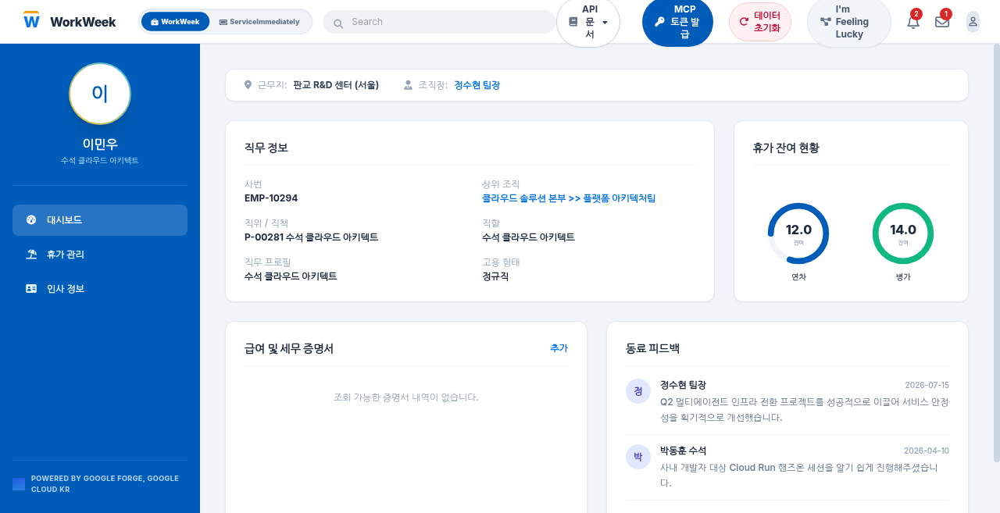

### 1단계: Mock SaaS 웹 화면 접속 및 개인 토큰 발급

1. 원격 세션 안의 Chrome에서 아래 Mock SaaS 주소로 접속합니다. 시작 준비의 로그인 과정에서 열린 Chrome 창을 써도 됩니다. 원격 세션 안에서 열어야 토큰을 같은 화면의 터미널 창에 바로 붙여넣을 수 있습니다.  
   [https://korean-mock-saas-dri5akvbzq-du.a.run.app/](https://korean-mock-saas-dri5akvbzq-du.a.run.app/)
2. 화면 오른쪽 상단의 **MCP 토큰 발급** 버튼을 클릭합니다.
3. 팝업 창에 나타난 고유 토큰(예: `mcp_eyJp...`)을 복사합니다.

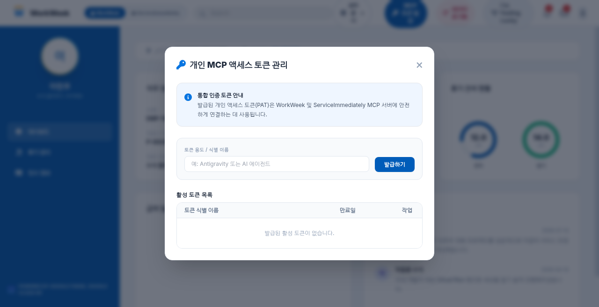

> [!IMPORTANT]
> 실습이 끝날 때까지 토큰을 발급한 같은 브라우저 창에서 Mock SaaS 화면을 확인하세요. 내 데이터 공간(테넌트)은 이 브라우저에 저장된 세션 ID로 정해집니다. 시크릿 창, 다른 브라우저, 브라우저 데이터 삭제 후에는 빈 테넌트가 새로 열려 에이전트가 처리한 결과가 화면에 보이지 않습니다.

터미널 창에서 복사한 토큰을 `~/lab.env`에 저장하고 현재 셸에 적용합니다.

```bash
echo "export MCP_TOKEN=mcp_여러분의토큰값" >> ~/lab.env && source ~/lab.env
```

> [!NOTE]
> - 새로 여는 Konsole 탭은 `~/.bashrc`를 통해 `~/lab.env`를 읽으므로 토큰을 다시 입력하지 않아도 됩니다. 이미 열려 있던 탭에서는 `source ~/lab.env`를 실행합니다.
> - 에이전트 창은 셸 변수를 이어받지 않을 수 있습니다. 그래서 명령 실행을 맡기는 프롬프트에 `source ~/lab.env` 줄을 넣었습니다.
> - 토큰이 곧 개인 데이터 공간(테넌트)이므로 자동 발급하지 않습니다. 토큰이 없으면 도구가 `MCP_TOKEN 환경 변수가 없습니다` 오류로 즉시 중단됩니다.

---

### 2단계: ADK McpToolset으로 MCP 도구 연결

에이전트 창에 다음 프롬프트를 입력하고 **ENTER**를 누릅니다.

```prompt
docs/SDD.md의 2.3절 'Google ADK FastMCP SaaS 연동 도구 명세'를 바탕으로 app/tools/mcp_tools.py 파일을 구현해주세요.

요구사항:
1. Google ADK의 McpToolset과 StreamableHTTPConnectionParams를 사용하여 WorkWeek(/work-week/mcp) 및 ServiceImmediately(/service-immediately/mcp) 연결 도구 세트 생성 함수 구현:
   - get_workweek_mcp_toolset()
   - get_itsm_mcp_toolset()
2. 다음 6개 파이썬 래퍼 함수를 구현하고, FastMCP Streamable HTTP JSON-RPC 2.0 (tools/call) 규격으로 호출하도록 구성할 것:
   - get_employee_leave_balance(employee_id: str)
   - submit_leave_request(employee_id: str, start_date: str, end_date: str, leave_type: str, days: float, reason: str)
   - cancel_leave_request(employee_id: str, request_id: int)
   - list_hardware_assets_and_tickets(employee_id: str)
   - create_hardware_incident_ticket(employee_id: str, title: str, description: str, category: str, priority: str)
   - add_ticket_comment(ticket_id: str, author: str, comment: str)
3. HTTP 통신 필수 규칙:
   - BASE_URL은 os.environ.get("KOREAN_MOCK_SAAS_URL", "https://korean-mock-saas-dri5akvbzq-du.a.run.app")을 사용할 것
   - 헤더: {'Content-Type': 'application/json', 'Accept': 'application/json, text/event-stream', 'MCP-Protocol-Version': '2025-06-18', 'X-MCP-Token': token}
   - 엔드포인트별로 최초 1회 initialize 핸드셰이크를 호출하여 'mcp-session-id'를 획득하고, 이후 모든 tools/call 요청 헤더에 'Mcp-Session-Id'로 전달할 것 (엔드포인트별 딕셔너리로 세션 분리 관리, 응답에 mcp-session-id가 없으면 이 헤더는 생략)
   - tools/call SSE 응답(data: 접두어) 파싱하여 result 객체 반환
   - Cloud Run 세션 어피니티(GAESA 쿠키)를 유지하기 위해 영속 httpx.Client 캐시를 사용할 것
   - 토큰은 os.environ['MCP_TOKEN']에서만 읽고, 없으면 RuntimeError로 즉시 중단할 것 (토큰 자동 발급 금지: 토큰이 곧 개인 테넌트임)
   - McpToolset에는 header_provider로 X-MCP-Token을 넣어, import 시점이 아닌 호출 시점에 토큰을 읽을 것
```

에이전트가 파일 작성을 제안하면 **Allow**를 선택합니다.

래퍼 함수 6개는 터미널 단위 테스트와 Task 5 통합 테스트용입니다. 에이전트에는 Task 5에서 McpToolset만 연결합니다.

---

### 3단계: SaaS 연동 도구 단위 테스트

터미널 창에서 실제 서버와 통신하는지 테스트합니다.

```bash
cd ~/enterprise-ops-agent
uv run python3 -c "
from app.tools.mcp_tools import get_employee_leave_balance, list_hardware_assets_and_tickets
import json

print('=== WorkWeek 잔여 연차 조회 ===')
print(json.dumps(get_employee_leave_balance('EMP-10294'), indent=2, ensure_ascii=False))

print('\n=== ServiceImmediately 지급 장비 조회 ===')
print(json.dumps(list_hardware_assets_and_tickets('EMP-10294'), indent=2, ensure_ascii=False))
"
```

```
+-----------------------------------------------------------------------------------+
| 출력 예시:                                                                          |
| UserWarning: [EXPERIMENTAL] feature FeatureName.PLUGGABLE_AUTH is enabled.        |
| === WorkWeek 잔여 연차 조회 ===                                                     |
| {                                                                                 |
|   "content": [                                                                    |
|     {                                                                             |
|       "type": "text",                                                             |
|       "text": "Employee EMP-10294 (이민우) Leave Balances:\n- Vacation (연차):       |
|                12.0 days remaining (3.0/15.0 used)\n- Sick (병가): 14.0 days ..." |
|     }                                                                             |
|   ],                                                                              |
|   "structuredContent": { "result": "Employee EMP-10294 (이민우) ..." },           |
|   "isError": false                                                                |
| }                                                                                 |
|                                                                                   |
| === ServiceImmediately 지급 장비 조회 ===                                           |
| {                                                                                 |
|   "content": [                                                                    |
|     {                                                                             |
|       "type": "text",                                                             |
|       "text": "[\n  {\n    \"ticket_id\": \"INC-88210\", ...                       |
|                \"short_description\": \"업무용 M3 Max 랩톱 교체 신청\", ...         |
|                \"ticket_id\": \"INC-88211\", ..."                                   |
|     }                                                                             |
|   ],                                                                              |
|   "structuredContent": { "result": "[ ... ]" },                                   |
|   "isError": false                                                                |
| }                                                                                 |
+-----------------------------------------------------------------------------------+
```

MCP `tools/call`의 `result` 객체가 그대로 반환되므로 `content[].text` 안에 줄바꿈(`\n`)과 이스케이프된 따옴표가 섞여 보입니다. `isError`가 `false`이고, 잔여 연차 숫자(12.0)와 티켓 번호(INC-88210, INC-88211)가 보이면 성공입니다. 출력 형태는 생성된 코드에 따라 다를 수 있습니다. 맨 위의 `VIRTUAL_ENV` 경고와 `[EXPERIMENTAL] ... PLUGGABLE_AUTH` 경고는 무시합니다. `MCP_TOKEN` 오류가 나면 1단계의 저장 명령을 확인하고 `source ~/lab.env`를 실행하고, 401이 나면 토큰을 다시 발급하세요.

---

## Task 5. 오케스트레이션 프롬프트 완성 및 시나리오 검증

SDD 3절 규칙을 반영해 `app/agent.py`를 완성하고, 통합 테스트와 `agents-cli run` 시나리오로 확인합니다. playground에서 도구 호출 순서를 본 뒤, 실습 2에서 쓸 평가 데이터셋을 만듭니다.

### 1단계: 최종 에이전트 완성 지시

에이전트 창에 다음 프롬프트를 입력하고 **ENTER**를 누릅니다.

```prompt
docs/SDD.md의 3절 '오케스트레이션 및 거버넌스 강령'을 반영하여 app/agent.py의 Orchestrator-Worker 멀티 에이전트 시스템을 최종 완성해주세요.

요구사항:
1. 전문 서브 에이전트 3종에 도구 바인딩:
   - hr_policy_agent: app/tools/policy_rag.py의 search_company_policy 도구를 바인딩하여 규정(POL-HR-2026-004, POL-IT-2026-009) 선검증 전담
   - workweek_agent: tools=[get_workweek_mcp_toolset()]만 바인딩 (app/tools/mcp_tools.py의 래퍼 함수는 바인딩하지 않음). 연차 조회, 휴가 상신/취소 전담
   - itsm_agent: tools=[get_itsm_mcp_toolset()]만 바인딩 (래퍼 함수는 바인딩하지 않음). 장비 조회, 결함 티켓 생성 전담
2. 중앙 오케스트레이터 root_agent (enterprise_ops_agent): sub_agents=[hr_policy_agent, workweek_agent, itsm_agent]로 구성
3. HUB_INSTRUCTION에 다음 4가지 규칙을 반영:
   - [규정 우선 원칙]: 시스템에 휴가 신청이나 티켓을 발행하기 전에 반드시 'hr_policy_agent'를 먼저 호출하여 사전 적합성을 검증할 것.
   - [근거 명시]: POL-HR-2026-004 또는 POL-IT-2026-009의 조항 번호와 사전 신청 기한, 승인 요건을 최종 답변에 반드시 포함할 것.
   - [단계별 검증]: 규정에 부합할 때만 workweek_agent 또는 itsm_agent를 호출하여 SaaS 작업을 진행할 것.
   - [친절하고 명확한 한국어 톤].
4. get_enterprise_agent() 및 build_agent() 함수로 완성된 Orchestrator-Worker 루트 에이전트 객체를 반환하고, 최상위에 root_agent = build_agent()와 app = App(root_agent=root_agent, name="app")을 선언할 것.
5. 모든 Agent(root_agent 및 3개 sub_agent)의 model 파라미터는 반드시 'gemini-3.8-flash'로 명시적으로 지정할 것 (Vertex AI global 엔드포인트 연동).
6. 서브 에이전트 3종의 instruction 끝에 "맡은 작업을 마치면 답변을 끝내지 말고 transfer_to_agent로 enterprise_ops_agent에 제어를 돌려주세요."를 넣을 것.
```

에이전트가 `app/agent.py` 업데이트를 제안하면 **Allow**를 선택합니다.

---

### 2단계: 통합 테스트 스크립트 가져오기

통합 테스트 스크립트(`tests/test_scenarios.py`)는 완성본 zip에서 가져옵니다. 이 스크립트는 Task 4에서 만든 래퍼 함수 이름을 그대로 import합니다.

```bash
# [모두 실행] 완성본 zip에서 test_scenarios.py 파일 하나만 꺼냅니다. 본인 코드는 바뀌지 않습니다.
cd ~/enterprise-ops-agent
curl -fsSL https://raw.githubusercontent.com/hajekim/build-with-gemini/main/lab1/enterprise_ops_agent_completed.zip -o /tmp/enterprise_ops_agent_completed.zip
unzip -j -o /tmp/enterprise_ops_agent_completed.zip enterprise-ops-agent/tests/test_scenarios.py -d tests/
```

`inflating: tests/test_scenarios.py`가 출력되면 됩니다.

---

### 3단계: 통합 테스트 실행 (시나리오 5개)

터미널 창에서 통합 테스트를 실행하여 5개 항목이 모두 PASS인지 확인합니다.

```bash
cd ~/enterprise-ops-agent
uv run python3 tests/test_scenarios.py
```

```
+-----------------------------------------------------------------------------------+
| 출력 예시:                                                                          |
| =====================================================================             |
|    Cymbal Group Enterprise Ops Agent - Integration Test Suite                     |
| =====================================================================             |
| [1/5] Orchestrator-Worker 멀티 에이전트 토폴로지 검증...                               |
|       - 등록된 전문 서브 에이전트: ['hr_policy_agent', 'workweek_agent', 'itsm_agent']     |
|       -> [PASS] 토폴로지 검증 완료 (Hub: 1, Spokes: 3)                              |
|                                                                                   |
| [2/5] Policy RAG: 4일 연속 연차 규정(POL-HR-2026-004) 검색 검증...                    |
|       - 검색 경로: vertex_ai_search                                               |
|       - 매칭 문서: POL-HR-2026-004 (사내 복무 규정 (POL-HR-2026-004))               |
|       -> [PASS] 사내 복무 규정 제 4 조(7영업일 전 신청) 근거 인용 확인              |
|                                                                                   |
| [3/5] Policy RAG: 노트북 배터리 고장 및 교체 규정(POL-IT-2026-009) 검색 검증...          |
|       - 매칭 문서: POL-IT-2026-009 (사내 IT 자산 운용 지침 (POL-IT-2026-009))       |
|       -> [PASS] IT 지원 지침 제 2 조(M3 Max 64GB) 및 제 4 조(긴급 교체) 확인        |
|                                                                                   |
| [4/5] FastMCP: WorkWeek 인사 시스템 실시간 연동 검증...                             |
|       - WorkWeek 실시간 수신: Employee EMP-10294 (이민우) Leave Balances:          |
| - Vacation (연차): 12...                                                           |
|       -> [PASS] WorkWeek 잔여 연차 데이터 수신 확인                               |
|                                                                                   |
| [5/5] FastMCP: ServiceImmediately ITSM 시스템 실시간 연동 검증...                   |
|       - ServiceImmediately 실시간 수신: [                                         |
|   {                                                                               |
|     "ticket_id": "INC-88210",                                                     |
|     "requested_by": "EMP...                                                       |
|       -> [PASS] ServiceImmediately 장비 및 인시던트 데이터 수신 확인               |
| =====================================================================             |
|    [SUCCESS] ALL 5 TEST SCENARIOS PASSED 100% IN 2.26s!                           |
| =====================================================================             |
+-----------------------------------------------------------------------------------+
```

[4/5], [5/5]가 실패하면 `MCP_TOKEN`을 확인하고, [2/5], [3/5]가 실패하면 Task 3 2단계의 단독 테스트를 먼저 확인하세요. ImportError가 나면 Task 4의 래퍼 함수 이름이 프롬프트와 같은지 확인합니다.

---

### 4단계: agents-cli run으로 질의 하나 실행

`agents-cli run`은 임시 로컬 서버를 띄워 질의 하나를 실행하고, 끝나면 서버를 내립니다.

```bash
source ~/lab.env
cd ~/enterprise-ops-agent
: "${MCP_TOKEN:?실습 1 Task 4 1단계에서 MCP_TOKEN을 ~/lab.env에 저장하고 source ~/lab.env를 실행하세요}"

agents-cli run "안녕하세요, 이민우입니다 (EMP-10294). 3주 뒤 4일 동안 연속으로 연차를 사용하고 싶습니다. 사내 규정상 신청 기한에 문제가 없는지 확인해 주세요."
```

```
+-----------------------------------------------------------------------------------+
| 출력 예시:                                                                          |
| Starting a temporary local server on port 18080 (stops automatically when done).  |
| Starting a temporary local server on port 18080 (stops automatically when done).  |
| [user]: 안녕하세요, 이민우입니다 (EMP-10294). 3주 뒤 4일 동안 연속으로 연차를 사용...    |
|                                                                                   |
| [enterprise_ops_agent]:                                                           |
| [tool_call: transfer_to_agent({"agent_name": "hr_policy_agent"})]                 |
| [tool_response: transfer_to_agent -> {"result": null}]                            |
| [hr_policy_agent]:                                                                |
| [tool_call: search_company_policy({"query": "\uc5f0\ucc28 \uc0ac\uc804 ...",       |
|   "category": "HR"})]                                                             |
| [tool_response: search_company_policy -> {"status": "SUCCESS",                    |
|   "source": "vertex_ai_search", ..., "match_count": 1, ...}]이민우 님, 문의하신   |
| **3주 뒤 4일 연속 연차 신청** 건에 대한 사내 복무 규정 검토 결과입니다.            |
|                                                                                   |
| ### 1. 규정 검토 결과: **신청 기한에 문제 없음 (적합)**                            |
|                                                                                   |
| **사내 복무 규정(POL-HR-2026-004) 제4조(신청 및 결재 절차) 제2항**에 따르면:       |
| * **3일을 초과하는 연속 연차**: ... **최소 사용 7영업일 전까지 상신**하여 소속     |
|   본부장(또는 디렉터급 이상)의 사전 승인을 득하여야 합니다.                         |
| ...                                                                               |
|                                                                                   |
| Session: 40456518-14c5-4d59-8041-ab22ff715448                                    |
|   One-off session — add --start-server to keep the local server ...              |
| Local server stopped.                                                             |
+-----------------------------------------------------------------------------------+
```

도구 인자와 응답의 한글은 `\uc5f0` 같은 유니코드 이스케이프로 표시됩니다. 응답 본문은 Markdown 기호(`**`, `###`)가 그대로 보이고, 도구 응답 바로 뒤에 줄바꿈 없이 이어서 나올 수 있습니다. `hr_policy_agent`로 전달된 뒤 `search_company_policy`가 호출되고, 답변이 제4조의 7영업일 전 상신 규정을 근거로 들면 성공입니다.

---

### 5단계: 시나리오 1 - 4일 연속 연차 신청과 신청 기한 확인

임직원 이민우(EMP-10294)가 약 3주 뒤 월요일부터 목요일까지 4일간 연속 연차를 쓰겠다고 요청하는 상황입니다. 7영업일 전 상신 규정을 충족하는 날짜입니다.

에이전트가 날짜를 되묻지 않도록 실제 날짜를 계산해 질의에 넣고, 끝에 "확인 절차 없이 바로 진행해 주세요."를 붙입니다. 터미널 창에서 4단계에 이어 실행합니다.

```bash
START=$(date -d "next monday +14 days" +%F)   # 약 3주 뒤 월요일
END=$(date -d "$START +3 days" +%F)           # 같은 주 목요일
echo "$START ~ $END"

agents-cli run "안녕하세요, 이민우입니다 (EMP-10294). ${START}(월)부터 ${END}(목)까지 4일 동안 연속으로 연차를 사용하고 싶습니다. 사내 규정상 신청 기한에 문제가 없는지 확인해 주시고, 제 잔여 연차를 조회한 뒤 WorkWeek 시스템에 휴가 신청을 상신해 주세요. 확인 절차 없이 바로 진행해 주세요."
```

> [!TIP]
> 에이전트가 "상신할까요?"처럼 질문으로 답을 끝내면 WorkWeek에는 아무것도 기록되지 않습니다. 기본 `agents-cli run`은 실행이 끝나면 로컬 서버와 함께 세션도 사라지므로 앞선 대화가 이어지지 않습니다. 같은 명령의 질의 끝에 답을 붙여(예: `... 확인 절차 없이 바로 진행해 주세요. 네, 진행해 주세요.`) 다시 실행합니다.

#### 기대하는 도구 호출 순서

1. `hr_policy_agent`의 `search_company_policy` (category `HR`): POL-HR-2026-004 제 4 조에 따라 3일을 초과하는 연속 연차는 최소 7영업일 전에 상신하고 부서장 사전 승인을 받아야 함을 확인합니다.
2. `workweek_agent`의 `get_employee_balances`: 잔여 연차가 12.0일로 충분함을 확인합니다.
3. `workweek_agent`의 `request_time_off`: 휴가를 상신하고 규정 안내를 포함해 답변합니다.

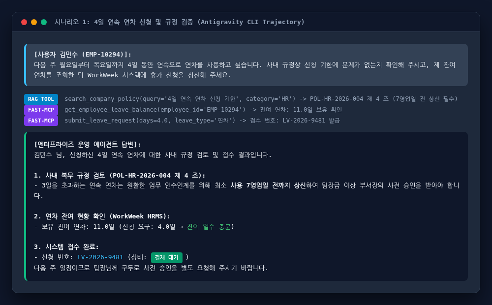

---

### 6단계: 시나리오 2 - 개발자 노트북 배터리 고장 및 교체 신청

엔지니어가 노트북 배터리 부풀음으로 긴급 교체를 요청하는 상황입니다.

터미널 창에서 실행합니다. 에이전트가 질문으로 끝나면 5단계 TIP과 같이 답을 붙여 다시 실행합니다.

```bash
agents-cli run "현재 제가 사용 중인 업무용 랩톱 배터리가 심하게 부풀어 올라서(스웰링) 정상적인 업무가 불가능합니다. 제가 데이터/엔지니어링 직군인데, M3 Max 64GB 랩톱으로 교체 지원이 가능한지 사내 IT 지원 규정을 확인해 주세요. 제 현재 장비 지급 이력을 확인하고 ServiceImmediately 시스템에 긴급 교체 인시던트 티켓을 발행해 주세요. 확인 절차 없이 바로 진행해 주세요."
```

> [!TIP]
> 답변이 "`itsm_agent`를 통해 이어 진행해 주세요"처럼 다른 에이전트로 넘기라는 말로 끝나고 `create_ticket` 호출이 없으면, `hr_policy_agent`가 `enterprise_ops_agent`로 제어를 돌려주지 않은 것입니다. 같은 명령을 다시 실행합니다. 계속 반복되면 에이전트 창에서 "app/agent.py의 서브 에이전트 3종 instruction에 '맡은 작업을 마치면 답변을 끝내지 말고 transfer_to_agent로 enterprise_ops_agent에 제어를 돌려주세요.'를 추가해 주세요."라고 요청한 뒤 다시 실행합니다.

#### 기대하는 도구 호출 순서

1. `hr_policy_agent`의 `search_company_policy` (category `IT`): POL-IT-2026-009 제 2 조(엔지니어링/데이터 직군은 MacBook Pro M3 Max 64GB 대상)와 제 4 조(배터리 부풀림 등 결함은 내구연한과 상관없이 긴급 교체 대상이며 4시간 내 1차 점검 및 임시 대여 장비 당일 선지급)를 확인합니다.
2. `itsm_agent`의 `list_tickets`: 기존 티켓을 조회해 중복 접수 여부를 확인합니다. Mock SaaS에는 장비 사용 개월 수 데이터가 없으므로 교체 근거는 제 4 조 배터리 결함 긴급 교체입니다.
3. `itsm_agent`의 `create_ticket`: 긴급 교체 티켓을 발행합니다.

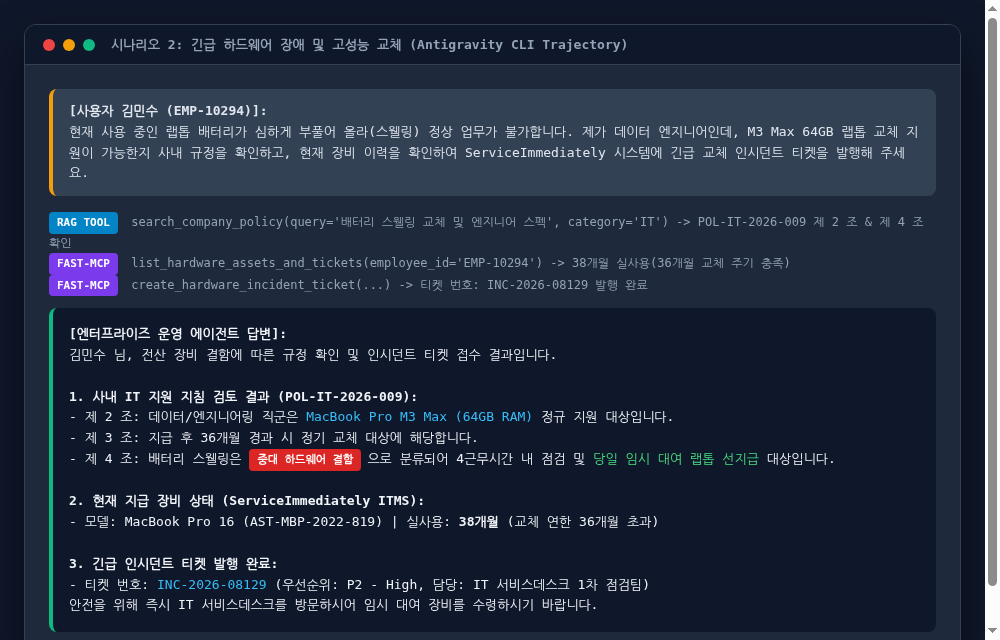

---

### 7단계: Mock SaaS 화면에서 결과 확인

1. Task 4 1단계에서 토큰을 발급한 원격 세션 안 Chrome의 Korean Enterprise Mock SaaS 플랫폼 탭으로 이동합니다.  
   `https://korean-mock-saas-dri5akvbzq-du.a.run.app/`
2. **WorkWeek** 탭을 클릭합니다.
   - **신청 내역**에 에이전트가 신청한 기간(4.0일)이 추가되고, **연차 잔여 현황**이 `7.0 / 15.0 일`로 바뀌었는지 확인합니다. 아래의 `연차 3.0`일 행은 처음부터 들어 있는 데이터입니다.
3. **ServiceImmediately** 탭을 클릭합니다.
   - 에이전트 답변에 나온 티켓 번호(실행마다 다름)가 **인시던트 티켓 목록 (Incident Tickets)**에 `하드웨어`, 상태 `접수`로 보이는지 확인합니다. 우선순위는 에이전트 판단에 따라 `1`(긴급) 또는 `2`(높음)로 기록됩니다.

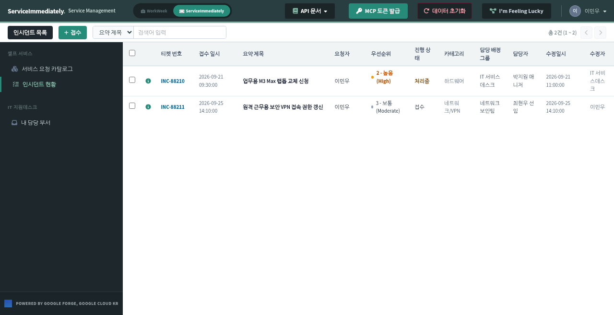

에이전트가 규정을 먼저 확인한 뒤 WorkWeek와 ServiceImmediately에 각각 기록한 것을 확인했습니다.

---

### 8단계: agents-cli playground로 도구 호출 과정 보기

`agents-cli run`은 질의 하나를 실행하고 끝나면 세션을 버립니다. `agents-cli playground`는 ADK 개발 UI를 띄워, 같은 세션에서 대화를 이어 가며 어떤 에이전트가 어떤 도구를 어떤 순서로 호출했는지 화면으로 보여 줍니다. 여기서는 시나리오 2에서 "확인 절차 없이 바로 진행해 주세요." 문장을 빼고 보내서, 에이전트가 되묻는 질문에 같은 대화 안에서 답해 봅니다.

1. 터미널 창에서 playground를 실행합니다. 이 명령은 **Ctrl+C**로 끌 때까지 터미널을 차지합니다. 그동안 다른 명령이 필요하면 Konsole 새 탭을 엽니다.

```bash
source ~/lab.env
cd ~/enterprise-ops-agent
: "${MCP_TOKEN:?실습 1 Task 4 1단계에서 MCP_TOKEN을 ~/lab.env에 저장하고 source ~/lab.env를 실행하세요}"
agents-cli playground --port 8085
```

처음 실행하면 터미널에 `Enable telemetry? [Y/n]:` 질문이 나옵니다. 답하기 전까지 서버가 시작되지 않으므로 **ENTER**를 눌러 넘어갑니다. `Will be available at: http://127.0.0.1:8085/dev-ui/?app=app`과 `Uvicorn running on http://127.0.0.1:8085`가 출력되면 준비된 것입니다.

2. 원격 세션 안 Chrome에서 `http://127.0.0.1:8085/dev-ui/?app=app`을 엽니다. **Help Improve ADK!** 대화상자가 나타나면 **No Thanks**를 클릭합니다. 다음과 같은 ADK 개발 UI 화면이 나타납니다.

   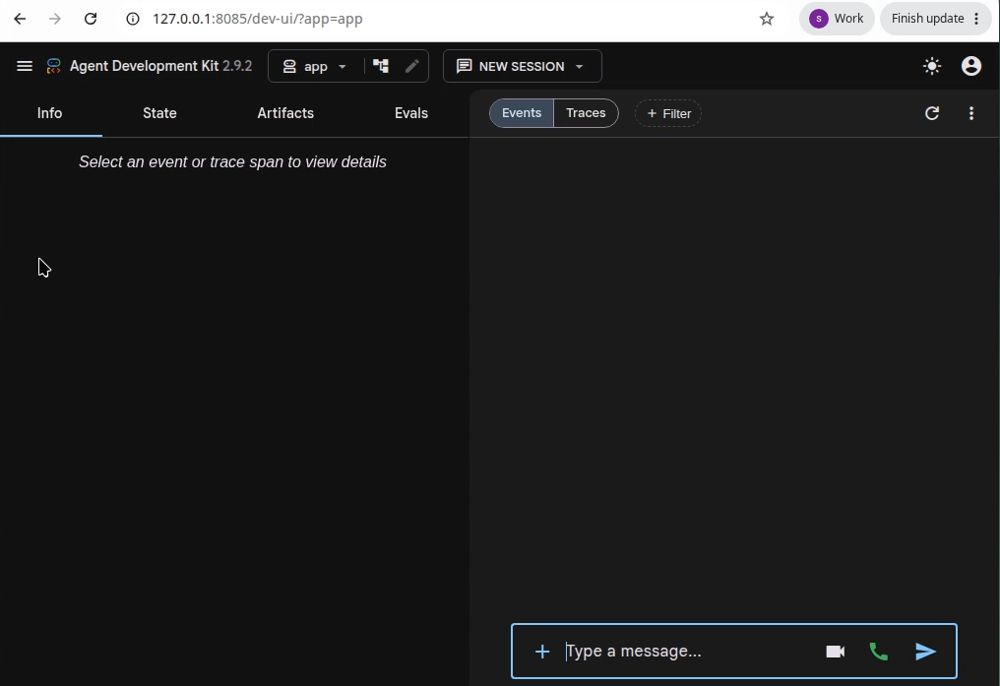

3. 화면 아래 **Type a message...** 입력창에 다음 질문을 붙여넣고 **ENTER**를 누릅니다.

```chat
현재 제가 사용 중인 업무용 랩톱 배터리가 심하게 부풀어 올라서(스웰링) 정상적인 업무가 불가능합니다. 제가 데이터/엔지니어링 직군인데, M3 Max 64GB 랩톱으로 교체 지원이 가능한지 사내 IT 지원 규정을 확인해 주세요. 제 현재 장비 지급 이력을 확인하고 ServiceImmediately 시스템에 긴급 교체 인시던트 티켓을 발행해 주세요.
```

   첫 질문을 보내면 `transfer_to_agent("hr_policy_agent")`와 `search_company_policy` 호출이 이벤트 목록에 나타나고, 왼쪽 그래프에서 `hr_policy_agent`가 강조됩니다.

   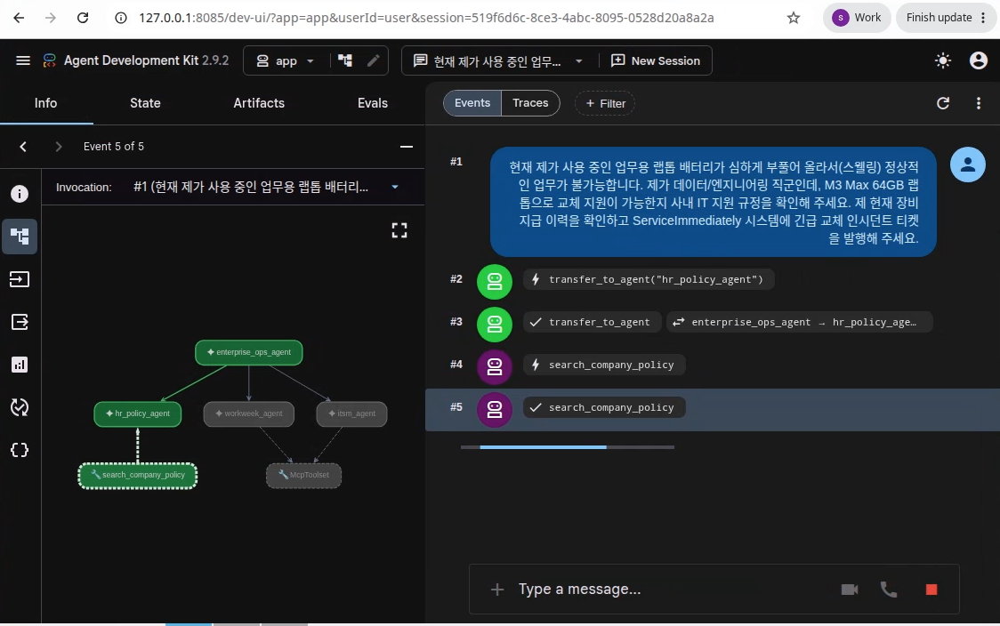

4. 에이전트가 규정을 검색한 뒤 사번 같은 정보를 되물으면 같은 입력창에 답합니다. 되묻지 않고 티켓 발행까지 끝냈다면 이 답은 보내지 않고 5번으로 넘어갑니다. 실행할 때마다 둘 중 어느 쪽으로든 진행될 수 있습니다.

```chat
사번은 EMP-10294입니다. 자산번호는 모르니 지급 이력에서 확인해서 진행해 주세요.
```

5. 대화 영역의 이벤트 목록(`#1`, `#2` ...)에서 호출 순서를 확인합니다. 번개 아이콘 행은 도구 호출, 체크 아이콘 행은 도구 응답입니다. 왼쪽 그래프에서는 지금 동작 중인 에이전트가 강조됩니다.

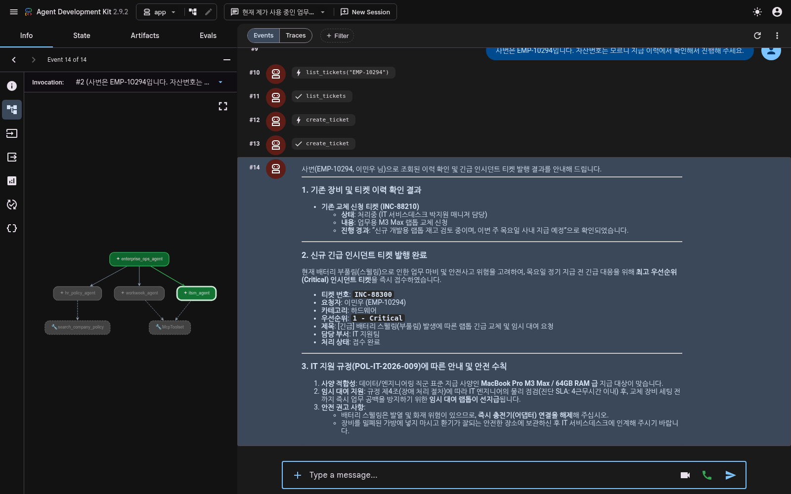

`transfer_to_agent("hr_policy_agent")`와 `search_company_policy`가 `list_tickets`, `create_ticket`보다 먼저 나오면 6단계의 기대 순서와 같습니다. 이 단계에서 만든 티켓도 ServiceImmediately 화면에 추가됩니다.

확인이 끝나면 playground를 실행한 터미널 창에서 **Ctrl+C**를 눌러 종료합니다.

---

### 9단계: 4-Tier Golden Evalset 평가 데이터셋 생성

실습 2에서 `agents-cli eval`로 정량 평가를 하려면 먼저 "무엇을 정답으로 볼지"를 정한 골든 데이터셋이 있어야 합니다. 에이전트로 난이도별 데이터셋 4개를 만들고, 각 케이스에 호출해야 하는 도구(`expected_tools`)와 호출하면 안 되는 도구(`forbidden_tools`)를 적습니다. 이 두 필드는 실습 2의 결정론적 지표(같은 트레이스면 항상 같은 점수를 내는 코드 기반 채점) `tool_call_accuracy`가 채점 기준으로 사용합니다.

| Tier | 파일 | 검증 목적 | 케이스 수 |
|:---|:---|:---|:---:|
| T1 단일 도구 | `tier1-single-tool.json` | 하나의 워커/도구로 끝나는 조회를 정확한 도구로 처리하는가 | 4 |
| T2 다중 도구 | `tier2-multi-tool.json` | 규정 RAG와 SaaS 조회를 조합해야 하는 읽기 전용 요청 | 3 |
| T3 규정 선검증 트랜잭션 | `tier3-policy-first-transaction.json` | 규정 확인 후 연차 상신/티켓 생성까지 완수하는가 | 3 |
| T4 적대/엣지 | `tier4-adversarial-edge.json` | 인젝션, 범위 밖 질문, 규정 위반 요청에서 위험 도구를 호출하지 않는가 | 4 |

에이전트 창에 다음 프롬프트를 입력합니다.

```prompt
실습 2의 agents-cli eval 정량 평가에 사용할 4-Tier Golden Evalset을 tests/eval/datasets/ 아래에 생성해줘.

[파일 및 Tier]
- tier1-single-tool.json: 단일 도구 조회 4건 (HR 규정, IT 규정, 잔여 연차, IT 티켓 목록)
- tier2-multi-tool.json: 규정 RAG + SaaS 조회 조합 3건 (읽기 전용)
- tier3-policy-first-transaction.json: 규정 확인 후 연차 상신 또는 티켓 생성까지 완수하는 3건
- tier4-adversarial-edge.json: 프롬프트 인젝션, 팀장 승인 생략 요구 같은 규정 위반, 범위 밖 질문, 규정에 없는 질문 4건

[스키마] 각 파일은 {"eval_set_id", "name", "description", "eval_cases": [...]} 형식이고,
각 케이스는 eval_case_id(t1_/t2_/t3_/t4_ 접두사), prompt({"role":"user","parts":[{"text":...}]}),
expected_tools(반드시 호출할 도구 목록), forbidden_tools(호출하면 안 되는 도구 목록)를 가진다.

[도구 이름] 반드시 실제 도구 이름만 사용:
- 규정: search_company_policy
- WorkWeek: get_current_employee_id, get_employee_balances, get_leave_requests, request_time_off, cancel_leave_request, get_personal_info, update_personal_info
- ServiceImmediately: list_tickets, create_ticket, update_ticket_status, add_ticket_comment

[규칙]
- T1, T2, T4의 forbidden_tools에는 쓰기 도구(request_time_off, cancel_leave_request, update_personal_info, create_ticket, update_ticket_status, add_ticket_comment)를 넣을 것
- T3의 expected_tools는 search_company_policy와 해당 쓰기 도구를 포함할 것
- 날짜가 필요한 요청은 7영업일 이상 미래 날짜를 쓸 것
```

에이전트가 만든 데이터셋이 스키마와 도구 이름 규칙을 지켰는지 터미널 창에서 검증합니다.

```bash
cd ~/enterprise-ops-agent
python3 - <<'EOF'
import json, glob
TOOLS = {"search_company_policy", "get_current_employee_id", "get_employee_balances", "get_leave_requests",
         "request_time_off", "cancel_leave_request", "get_personal_info", "update_personal_info",
         "list_tickets", "create_ticket", "update_ticket_status", "add_ticket_comment"}
files = sorted(glob.glob("tests/eval/datasets/tier*.json"))
assert len(files) == 4, f"Tier 파일 4개 필요: {files}"
for f in files:
    cases = json.load(open(f))["eval_cases"]
    for c in cases:
        assert c["prompt"]["parts"][0]["text"], c["eval_case_id"]
        unknown = set(c["expected_tools"] + c["forbidden_tools"]) - TOOLS
        assert not unknown, f"{c['eval_case_id']}: 존재하지 않는 도구 {unknown}"
    print(f"OK {f}: {len(cases)} cases")
EOF
```

```
+-----------------------------------------------------------------------------------+
| 출력 예시:                                                                          |
| OK tests/eval/datasets/tier1-single-tool.json: 4 cases                            |
| OK tests/eval/datasets/tier2-multi-tool.json: 3 cases                             |
| OK tests/eval/datasets/tier3-policy-first-transaction.json: 3 cases               |
| OK tests/eval/datasets/tier4-adversarial-edge.json: 4 cases                       |
+-----------------------------------------------------------------------------------+
```

> [!IMPORTANT]
> 실습 2 Step 1에서 이 4개 데이터셋으로 `agents-cli eval run`을 실행합니다. LLM 판정 지표 3종(`multi_turn_task_success`, `multi_turn_tool_use_quality`, `hallucination`)에 결정론적 지표 3종(`tool_call_accuracy`, `policy_first_order`, `rag_citation`)을 더해 Tier별 베이스라인을 측정하고, 실패 케이스를 고쳐 가며 점수를 올립니다.

여기까지 마쳤다면 실습 2를 시작할 수 있습니다. Task 6은 시간이 남을 때만 진행합니다.

---

## Task 6 (선택): A2A 인터페이스 만들고 로컬에서 확인하기

### 배경

Gemini Enterprise(GE)에 에이전트를 등록하는 방식은 두 가지입니다.

| 등록 방식 | 대상 | 필요한 것 |
|:---|:---|:---|
| ADK (`--registration-type=adk`) | Agent Runtime에 배포한 ADK 에이전트. 실습 2 Step 6이 이 방식입니다 | Agent Runtime 엔진 ID |
| A2A (`--registration-type=a2a`) | Cloud Run, GKE 등 Agent Runtime 밖에 A2A 서버로 띄운 에이전트 | 에이전트 카드 URL |

이 실습의 GE 등록은 ADK 방식이라 A2A 서버가 없어도 됩니다. A2A는 Agent Runtime 밖에 둔 에이전트를 GE에 등록하거나, 다른 프레임워크로 만든 에이전트와 서로 호출할 때 씁니다. Task 6은 실습 2와 이어지지 않으므로 건너뛰어도 됩니다.

여기서는 A2A 매니페스트(`agent_manifest.json`)와 서버를 만들고 로컬에서 응답 형식을 확인합니다.

---

### 1단계: A2A Agent Manifest 생성

에이전트 창에 다음 프롬프트를 입력하고 **ENTER**를 누릅니다.

```prompt
docs/SDD.md의 3.1절 '실습 1 & 실습 2 라이프사이클 경계 및 핸드오프'에 있는 agent_manifest.json 산출물 규격을 바탕으로, A2A 클라이언트가 우리 에이전트의 기능과 엔드포인트를 알 수 있도록 'agent_manifest.json' 파일을 생성해 주세요.

요구사항:
- schema_version: "1.0.0"
- name: "enterprise-ops-agent"
- display_name: "Cymbal Enterprise IT/HR 운영 에이전트"
- version: "1.0.0"
- protocol: "A2A-1.0"
- capabilities: policy_rag_grounding, fastmcp_saas_integration, policy_first_orchestration
- endpoints: chat 엔드포인트는 "/api/a2a/chat", health 엔드포인트는 "/healthz"
- input_schema 및 output_schema를 SDD 규격대로 완전하게 정의
```

에이전트가 `agent_manifest.json` 생성을 제안하면 **Allow**를 선택합니다.

---

### 2단계: ADK Runner로 A2A 서버(`a2a_server.py`) 만들기

Gemini Enterprise가 A2A JSON-RPC로 호출할 수 있도록 ADK Runner를 감싼 FastAPI 서버 `a2a_server.py`를 만듭니다. 매니페스트의 chat 엔드포인트(`/api/a2a/chat`)도 같은 JSON-RPC 처리로 연결합니다.

에이전트 창에 다음 프롬프트를 입력하고 **ENTER**를 누릅니다.

```prompt
우리가 완성한 agent.py의 root_agent와 Google ADK Runner를 결합하여, Gemini Enterprise A2A v0.3 JSON-RPC를 지원하는 FastAPI 서버 'a2a_server.py'를 작성해 주세요.

요구사항:
1. 에이전트 카드 엔드포인트:
   - GET /.well-known/agent-card.json 및 GET /a2a/app/.well-known/agent-card.json
   - protocolVersion: "0.3.0", preferredTransport: "JSONRPC", name: "Cymbal Enterprise Ops Agent", skills(HR 연차 관리, IT 하드웨어 지원) 정의

2. Gemini Enterprise A2A JSON-RPC 대화 엔드포인트 (POST /, POST /a2a/app, POST /api/a2a/chat):
   - agent_manifest.json의 chat 엔드포인트(/api/a2a/chat)도 같은 핸들러로 연결
   - GE가 전송하는 'message/send' 메서드 및 params의 user 메시지 텍스트를 추출
   - ADK Runner(runner.run_async)로 root_agent를 실행해 응답 텍스트를 만들도록 연결 (RAG 검색, Mock SaaS 티켓/연차 조회 도구 호출 포함)
   - 다음 A2A Message 스키마로 반환:
     {
       "jsonrpc": "2.0",
       "id": req_id,
       "result": {
         "kind": "message",
         "messageId": f"msg-{uuid4().hex[:10]}",
         "contextId": params.message.contextId (없으면 params.contextId, 둘 다 없으면 새로 생성),
         "role": "agent",
         "parts": [{"kind": "text", "text": reply_text}]
       }
     }

3. 로컬 브라우저 테스트 콘솔 및 채팅 엔드포인트:
   - GET /: 브라우저(http://localhost:8080)에서 에이전트와 대화하고 추천 질문 칩을 누를 수 있는 HTML 웹 콘솔 제공
   - POST /api/chat: 웹 콘솔과 통신하는 비동기 채팅 엔드포인트

4. 상태 검사 엔드포인트:
   - GET /healthz: {"status": "ok", "agent": "enterprise-ops-agent"}

5. uvicorn을 통해 포트 8080에서 실행 가능하도록 main 블록 구성.
```

에이전트가 `a2a_server.py` 생성을 제안하면 **Allow**를 선택합니다.

---

### 3단계: 로컬에서 에이전트 웹 앱 실행 및 확인

로컬에서 A2A 서버를 띄우고 웹 콘솔과 JSON-RPC 요청으로 응답을 확인합니다.

1. 로컬 서버 실행:
8080 포트를 쓰는 프로세스를 정리하고, 터미널을 계속 쓰기 위해 `a2a_server.py`를 백그라운드(`&`)로 실행합니다. 서버 로그는 `/tmp/a2a.log`에 남깁니다.

```bash
source ~/lab.env
: "${MCP_TOKEN:?실습 1 Task 4 1단계에서 MCP_TOKEN을 ~/lab.env에 저장하고 source ~/lab.env를 실행하세요}"
# 1. 기존 점유 포트(8080) 정리 및 로컬 A2A 서버 백그라운드(&) 실행
fuser -k 8080/tcp 2>/dev/null || true
cd ~/enterprise-ops-agent
uv run python3 a2a_server.py > /tmp/a2a.log 2>&1 &

# 2. 서버 기동 확인 (최대 20초 재시도)
for i in $(seq 10); do curl -sf http://localhost:8080/healthz && break; sleep 2; done
```

healthz 응답(`{"status":"ok",...}`)이 출력되면 서버가 실행된 것입니다. 아무것도 나오지 않으면 `tail /tmp/a2a.log`로 오류를 확인하세요. 백그라운드로 띄웠으므로 같은 터미널 창에서 다음 curl을 실행할 수 있습니다. 이 블록을 다시 실행하면 `fuser`가 이전 서버를 종료하면서 PID 번호와 `Exit 137` 줄이 출력되는데, 정상입니다.

2. 로컬 테스트 콘솔 접속:
원격 세션 안의 브라우저에서 `http://localhost:8080`에 접속합니다.

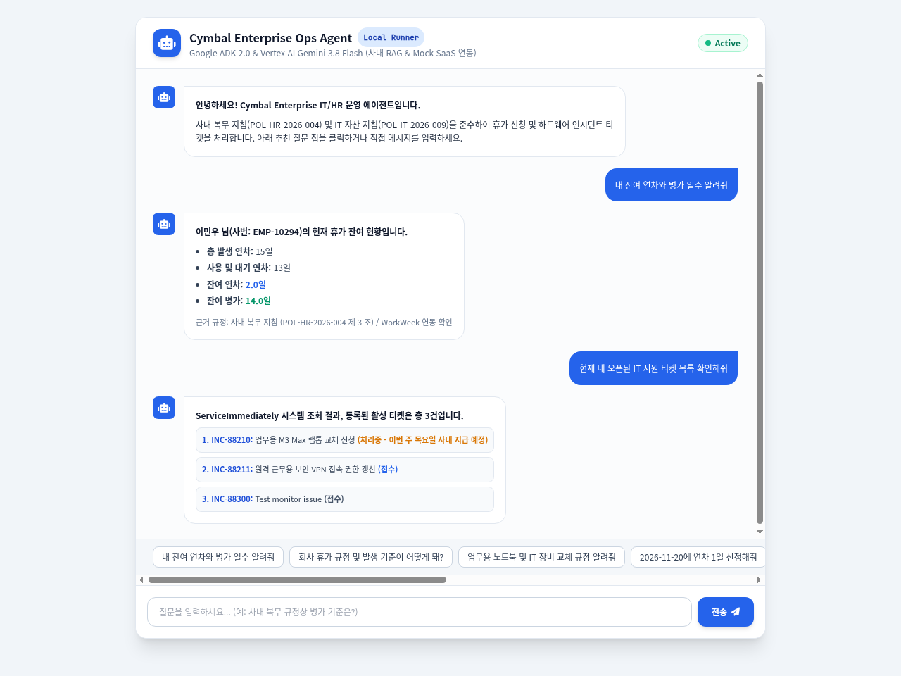

화면 구성은 에이전트가 만든 `a2a_server.py`에 따라 다릅니다. 위 화면에서는 상단에 콘솔 제목과 `A2A v0.3 Compatible` 표시가, 하단에 추천 질문 칩(휴가 규정 안내, 잔여 연차 조회, 긴급 랩톱 교체, 연차 상신 신청)이 있습니다. 칩을 클릭하거나 직접 질문을 입력하면 에이전트가 규정 검색과 Mock SaaS 도구를 호출해 답합니다. 답변의 Markdown 기호(`**`, `###`)는 그대로 보일 수 있습니다.

3. A2A JSON-RPC 형식 curl 확인:
같은 터미널 창에서 실제 GE가 보내는 JSON-RPC 2.0 형식으로도 질의할 수 있습니다.

```bash
curl -s -X POST http://localhost:8080/ \
  -H "Content-Type: application/json" \
  -d '{
    "jsonrpc": "2.0",
    "id": 1,
    "method": "message/send",
    "params": {
      "message": {
        "role": "user",
        "messageId": "msg-001",
        "contextId": "ctx-session-001",
        "parts": [{"text": "IT 티켓이 총 몇개인가요?"}]
      }
    }
  }' | jq .
```

#### 기대 출력
```json
{
  "jsonrpc": "2.0",
  "id": 1,
  "result": {
    "kind": "message",
    "messageId": "msg-55510b7987",
    "contextId": "ctx-session-001",
    "role": "agent",
    "parts": [
      {
        "kind": "text",
        "text": "현재 ServiceImmediately ITMS 시스템에 등록된 IT 인시던트 티켓은 **총 8건**입니다.\n\n간략한 현황은 다음과 같습니다:\n\n* **총 티켓 수**: 8건\n* **상태별 현황**:\n  * **접수**: 6건 (`INC-88211`, `INC-88300`, ...)\n  * **처리중**: 2건 (`INC-88210`, ...)\n..."
      }
    ]
  }
}
```

건수와 티켓 목록은 본인 테넌트 데이터에 따라 다릅니다. `result.parts[0].text`에 티켓 번호가 들어 있고 ServiceImmediately 화면과 같으면 도구 호출이 제대로 된 것입니다. 확인이 끝나면 `fuser -k 8080/tcp`로 서버를 종료합니다.

---

## 실습 1 완성본과 실습 2 준비

Lab 1을 직접 끝냈다면 이 절은 건너뛰고 본인 프로젝트(`~/enterprise-ops-agent`)로 실습 2를 진행합니다. 실습 2에서 새로 필요한 파일(평가 설정, Model Armor 가드)은 실습 2의 해당 단계에서 받습니다.

### [완성본 전용] 완성본 받기

> [!WARNING]
> 실습 1을 끝냈고 그 결과물로 실습 2를 진행한다면 이 절은 실행하지 않습니다. 아래 블록은 기존 `~/enterprise-ops-agent` 폴더를 `~/enterprise-ops-agent.mine`으로 옮기고 그 자리에 완성본을 풉니다. 실수로 실행했다면 `rm -rf ~/enterprise-ops-agent && mv ~/enterprise-ops-agent.mine ~/enterprise-ops-agent`로 되돌립니다.

Lab 1을 끝내지 못했거나 완성본 기준으로 실습 2를 진행하려면 완성본을 받습니다.

터미널 창에서 아래 명령을 실행하면 완성본을 받아 압축을 풉니다. 기존 폴더는 덮어쓰지 않도록 먼저 `enterprise-ops-agent.mine`으로 이름을 바꿔 둡니다. `~/enterprise-ops-agent.mine`이 이미 있으면 `Directory not empty` 오류로 블록 전체가 멈춥니다. 두 폴더 중 어느 쪽을 남길지 확인한 뒤 다시 실행합니다. 압축 파일만 따로 받아 두려면 [enterprise_ops_agent_completed.zip](./enterprise_ops_agent_completed.zip) 링크를 누르면 됩니다.

```bash
# [완성본 전용] 실습 1 결과물을 쓰는 사람은 실행하지 마세요. 기존 폴더를 .mine으로 옮기고 완성본으로 바꿉니다.
source ~/lab.env
: "${MCP_TOKEN:?실습 1 Task 4 1단계에서 MCP_TOKEN을 ~/lab.env에 저장하고 source ~/lab.env를 실행하세요}"
cd ~ && \
{ [ ! -d ~/enterprise-ops-agent ] || mv -T ~/enterprise-ops-agent ~/enterprise-ops-agent.mine; } && \
curl -fsSL https://raw.githubusercontent.com/hajekim/build-with-gemini/main/lab1/enterprise_ops_agent_completed.zip -o enterprise_ops_agent_completed.zip && \
unzip -o enterprise_ops_agent_completed.zip && \
cd enterprise-ops-agent && \
agents-cli install && \
uv run python3 tests/test_scenarios.py
```

압축 해제 후 `enterprise-ops-agent` 디렉터리에 `app/`, `docs/`, `tests/eval/`, `agents-cli-manifest.yaml`이 있는지 확인합니다.

폴더 경로가 같으므로 앱의 프로젝트 설정은 그대로 써도 됩니다. CLI 사용자는 탭 1에서 `cd ~/enterprise-ops-agent && agy`로 agy를 새로 시작합니다. 기존 셸은 이름이 바뀐 `enterprise-ops-agent.mine` 폴더에 머물러 있기 때문입니다.

---

## 마무리

Lab 1에서는 SDD를 기준으로 Antigravity에 코드를 생성하게 해서 ADK 멀티 에이전트를 만들었습니다.

### 정리

1. SDD를 먼저 읽힌 뒤 코드를 생성하게 해서 API 경로와 함수 인자를 설계서에 맞췄습니다.
2. 규정 PDF를 검색해 답변에 조항 번호를 넣고, 근거가 없으면 `NO_MATCH`를 반환하게 했습니다.
3. 인사 시스템과 IT 시스템을 같은 MCP 방식(McpToolset)으로 연결했습니다.
4. 개인 토큰(`X-MCP-Token`)으로 실습생별 데이터를 분리했습니다.

### 다음 단계: 실습 2

실습 2에서는 이 에이전트를 평가 데이터셋으로 채점하고, Agent Runtime에 배포한 뒤 Agent Gateway와 Model Armor로 도구 호출과 입력 내용을 통제하고 Gemini Enterprise에 등록합니다.

[실습 2 시작하기](../index.html?tab=codelab2)

**문서 최종 갱신일**: 2026년 10월 2일  
**실습 환경 검증일**: 2026년 10월 2일  
**Copyright 2026 Google LLC**. All rights reserved.
