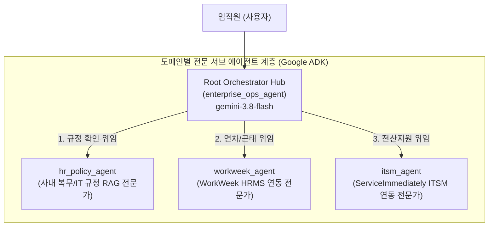
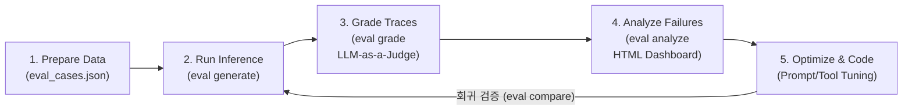

# Build with Gemini 핸즈온 Track 3 | Architect: AI 엔지니어링 (개발자)

### [실습 Part 1] ADK 기반 에이전트 핵심 로직 구현부터 GE 배포까지
참여자들은 Antigravity 개발 환경에서 ADK(Agent Development Kit)를 기반으로 에이전트 핵심 로직을 단계별 코드로 구현하고, 사내 Gemini Enterprise에 등록 가능한 A2A 인터페이스 및 배포 규격을 완성합니다.

### [실습 Part 2] 에이전트 신뢰성 확보를 위한 Evaluation 및 Governance (연계)
단순 프로토타이핑을 넘어 엔터프라이즈 레벨의 안정성을 확보하기 위한 Evaluation(품질 평가) 및 Governance(거버넌스) 기준을 점검하고, Agent Platform 배포 및 Gemini Enterprise 연동까지 에이전트 개발의 라이프사이클 전 과정을 완벽하게 마스터할 수 있습니다.

---

**소요 시간**: 2시간 00분  
**과정 코드**: BWG-TRACK3-ARCH  
**행사**: Build with Gemini 핸즈온 Track 3  
**대상**: Google Cloud Customer Engineer, Solution Architect, AI/ML 엔지니어  

> [!NOTE]
> 실습을 시작하면 Google Cloud 프로젝트와 실습용 가상 머신(VM) 환경이 준비되기까지 약 3~5분이 걸립니다.

---

## 개요

기업 현장에서는 휴가 신청이나 전산 장비 교체처럼 일상적인 업무를 처리할 때도 여러 포털을 오가야 하는 번거로움이 있습니다. 휴가 신청은 인사 시스템(WorkWeek)에서 하고, 노트북 고장이나 교체 신청은 IT 서비스 관리 시스템(ServiceImmediately)에서 따로 처리해야 합니다.

더 큰 문제는 사내 규정이 PDF 문서로 흩어져 있다는 점입니다. 예를 들어 3일을 초과하는 연차는 업무 공백을 막기 위해 최소 7영업일 전에 상신해야 하고, 개발자용 고성능 노트북은 실사용 36개월이 지나야 정기 교체 대상이 됩니다. 직원들이 이런 세부 규정을 일일이 확인하지 않고 신청하면 승인이 지연되거나 불필요한 반려가 반복됩니다.

이번 실습에서는 **Google Antigravity 2.0**(`agy`)과 **Google Agent Development Kit 2.0**(`google-adk`), **Model Context Protocol(FastMCP)**, **사내 규정 RAG**를 결합하여 이 문제를 해결하는 **엔터프라이즈 운영 AI 에이전트**를 구축합니다. 

특히 코드를 수동으로 복사-붙여넣기하는 것이 아니라, 워크스페이스에 사전에 제공된 **소프트웨어 설계서(SDD)**를 바탕으로 **Antigravity CLI(`agy`)에게 자연어 프롬프트로 지시하여 에이전트 코드와 도구를 주도적으로 개발**하는 현대적인 Spec-Driven Agentic 개발 워크플로를 실습합니다.


---

## 실습 목표

이 실습을 마치면 다음 작업을 직접 수행할 수 있습니다.

1. **Google Antigravity 2.0 환경 구성**: `agy` CLI를 실행하고 Google Cloud 프로젝트 인증을 마친 뒤, 고속 추론 모델(`Gemini 3.8 Flash`)을 설정합니다.
2. **소프트웨어 설계서(SDD) 기반 컨텍스트 그라운딩**: `docs/SDD.md` 문서를 `agy`에 주입하여 전체 아키텍처와 도구 명세를 인식시킵니다.
3. **agy 프롬프트 기반 ADK 2.0 뼈대 생성**: `agy`에게 지시하여 `config.yaml`과 ADK 2.0 기본 에이전트 코드를 생성하도록 합니다.
4. **agy 프롬프트 기반 사내 규정 RAG 도구 구현**: SDD 2.1절과 Cloud Storage(`gs://oreobox/policy/`) 규정 문서를 바탕으로 조항 번호와 근거를 정확히 찾아주는 시맨틱 검색 도구(`tools/policy_rag.py`)를 개발합니다.
5. **agy 프롬프트 기반 FastMCP SaaS 연동 도구 구현**: 한국형 Mock SaaS 플랫폼(`https://korean-mock-saas-dri5akvbzq-du.a.run.app/`)에 개인별 토큰으로 연결되는 FastMCP 도구(`tools/mcp_tools.py`)를 개발합니다.
6. **오케스트레이션 프롬프트 완성 및 복수 턴 시나리오 검증**: 규정 검증 우선(Policy-First) 규칙을 적용한 최종 에이전트를 완성하고, `agy` 대화창에서 실제 연차 신청 및 고성능 노트북 교체 요청을 테스트한 뒤 웹 화면에서 실시간 반영 결과를 확인합니다.
7. **Gemini Enterprise (GE) 배포용 A2A 인터페이스 규격 패키징**: 사내 본인 테넌트의 Gemini Enterprise에 에이전트를 원클릭 등록할 수 있도록 Agent-to-Agent(A2A) 매니페스트(`agent_manifest.json`)를 생성하고, 로컬 A2A 시뮬레이터를 통해 프로토콜 규격 준수 여부를 검증합니다.

---

## 사전 준비 및 환경 안내

### 시작 전 확인 사항

- 실습 시간은 제한되어 있으며 일시 중지할 수 없습니다. **Start Lab** 버튼을 누르면 타이머가 동작합니다.
- 이 실습은 실제 Google Cloud 환경에서 진행됩니다. 실습 시작 시 제공되는 임시 계정을 사용해 로그인합니다.
- 브라우저는 **Google Chrome 시크릿 창(Incognito Window)**을 권장합니다. 개인 구글 계정과 세션이 섞여 불필요한 과금이 발생하는 것을 방지할 수 있습니다.

> [!IMPORTANT]
> 본인의 개인 Google Cloud 계정이나 프로젝트를 사용하지 마세요. 반드시 실습 화면 왼쪽 패널에 표시된 임시 자격증명을 사용해야 합니다.

---

### 실습 시작 및 Google Cloud 콘솔 로그인

1. 실습 페이지에서 **Start Lab**을 클릭합니다.
2. 왼쪽 패널에 표시되는 정보를 확인합니다.
   - **Username** (예: `student-01-xxxx@qwiklabs.net`)
   - **Password**
   - **GCP Project ID**
3. **Open Google Cloud console**을 마우스 우클릭하여 **시크릿 창에서 링크 열기**를 선택합니다.
4. 로그인 창에 전달받은 **Username**과 **Password**를 차례로 입력합니다.
5. 이용약관에 동의합니다. (복구 옵션이나 2단계 인증 설정은 건너뜁니다.)
6. 잠시 후 Google Cloud 콘솔 홈 화면이 나타납니다.

---

### 실습 전용 환경 접속 (Remote Browser Session)

이 실습은 사전 구성된 개발자 가상 머신(VM)과 **Cloud Run 프록시** 서비스를 제공합니다. 로컬 컴퓨터에 별도의 프로그램을 깔지 않고도 웹 브라우저에서 Antigravity 개발 환경에 바로 접속할 수 있습니다.

Google Antigravity 2.0은 다음 구성 요소를 포함합니다:
- **Antigravity Agent Platform**: 에이전트 실행 및 모니터링 플랫폼
- **Antigravity CLI (`agy`)**: 터미널 기반 대화형 인터페이스
- **Antigravity SDK & ADK 2.0**: 에이전트와 도구를 결합하는 개발 프레임워크

#### 원격 브라우저 세션 열기

1. Google Cloud 콘솔 상단 검색창에 **Cloud Run**을 입력하고, 결과에서 **Cloud Run**을 클릭합니다.


2. 왼쪽 탐색 메뉴에서 **Services**를 클릭합니다.


3. 서비스 목록에서 **remote-browser-vm1**을 클릭하여 서비스 세부정보 페이지를 엽니다. 상단의 **URL 링크**를 클릭하여 새 브라우저 탭에서 원격 세션을 엽니다.


4. 브라우저에서 클립보드 권한 요청 팝업이 나타나면 **[허용(Allow)]**을 클릭합니다. 이를 통해 로컬 PC와 원격 세션 간 텍스트 복사/붙여넣기가 가능해집니다.


> [!NOTE]
> 만약 로컬 PC에서 원격 세션으로 직접 텍스트 복사/붙여넣기가 동작하지 않는 경우, 원격 세션 우측 하단의 클립보드 매니저를 이용하세요:
> 1. 원격 화면 우측 하단의 **Clipboard** 아이콘을 클릭합니다.
> 2. 로컬 컴퓨터의 텍스트를 텍스트 상자에 붙여넣습니다.
> 3. 패널을 닫고 터미널에 붙여넣기를 수행합니다.

---

### Antigravity CLI (`agy`) 실행 및 초기 설정

Antigravity CLI는 가벼운 터미널 환경에서 여러 파일의 맥락을 파악하고 도구를 실행할 수 있는 대화형 개발 도구입니다. 다단계 추론, 다중 파일 편집, 도구 호출, 대화 히스토리 등 Antigravity의 핵심 에이전틱 역량을 터미널에서 직접 제공합니다.

1. 원격 화면 좌측 하단 **Application Launcher > System > Konsole**을 클릭하여 터미널을 실행합니다.


> [!NOTE]
> Konsole 터미널을 열 때 `Warning: Could not find '', starting '/bin/bash' instead. Please check your profile settings.` 경고가 표시되더라도 정상 동작하므로 안전하게 무시하셔도 됩니다.

2. **실습 필수 GCP API 사전 활성화**:  
실습 1의 에이전트 개발 및 실습 2의 거버넌스(Agent Registry, Agent Gateway, Model Armor)를 지체 없이 진행하기 위해, 터미널에 다음 명령어를 입력하여 필수 API를 일괄 활성화합니다:

```bash
gcloud services enable \
  aiplatform.googleapis.com \
  agentregistry.googleapis.com \
  networkservices.googleapis.com \
  serviceextensions.googleapis.com \
  networksecurity.googleapis.com \
  modelarmor.googleapis.com \
  discoveryengine.googleapis.com \
  secretmanager.googleapis.com
```

3. 터미널에 다음 명령어를 입력해 Antigravity CLI를 실행합니다:

```bash
agy
```

3. 로그인 방식 선택 창이 나타나면 **Use a Google Cloud project**를 선택합니다.


4. Chrome 브라우저에서 인증 절차를 완료합니다 (또는 터미널에 표시된 인증 URL을 복사하여 새 Chrome 탭에서 엽니다):
   - Welcome to Google Chrome 알림이 나타나면 **OK**를 클릭합니다.
   - Chrome 초기 로그인 창이 나타나면 **Stay signed out** 또는 **Use Chrome without an account**를 클릭합니다.
   - Google 로그인 화면에서 Qwiklabs 자격증명 패널의 **Username**과 **Password**를 입력합니다.
   - 안내에 따라 접근 권한을 허용하고 생성된 인증 코드(Authorization Code)를 복사합니다.
   - 터미널로 돌아와 인증 코드를 붙여넣고 **ENTER**를 누른 뒤, 본인의 **Google Cloud Project ID**를 선택합니다.


5. Google Cloud 위치(Location)는 **global**을 선택합니다.

6. 선호하는 색상 테마(Color Scheme)를 선택하고 **Next**를 클릭합니다.


7. 서비스 이용약관 및 데이터 사용(Terms of Service & Data Use)에 동의합니다.


8. *"Do you trust the contents of this project?"* 알림이 뜨면 **Yes, I trust this folder**를 선택하고 **ENTER**를 누릅니다.


설정이 완료되면 터미널 화면이 다음과 같이 준비됩니다:


9. 환경 설정을 검증하려면 `agy` 프롬프트 상태에서 다음 명령어를 입력합니다:

```text
/config
```

색상 테마(Color Scheme)를 확인하고 원하는 테마를 확정합니다.


10. 사용할 모델을 확인하고 `gemini-3.8-flash`로 지정합니다:

```text
/model
```

> [!NOTE]
> 실습 환경에는 Gemini 3.8 Flash 모델에 프로비저닝된 처리량이 적용되어 있어 빠른 응답 속도를 제공합니다.


> [!NOTE]
> 실습 환경에는 Gemini 3.8 Flash 모델에 프로비저닝된 처리량이 적용되어 있어 빠른 응답 속도를 제공합니다.

---

## 실습 시나리오 및 설계서 (SDD)

**Cymbal Group 한국 지사**는 사내 업무 효율화를 위해 AI 기반 통합 운영 에이전트를 도입하려고 합니다.

워크스페이스 내 `docs/SDD.md` 파일에 소프트웨어 설계 명세서가 사전에 준비되어 있습니다.

| 구분 | 파일 및 리소스 경로 | 세부 설명 | 링크 |
|:---|:---|:---|:---|
| **소프트웨어 설계서** | `docs/SDD.md` | 시스템 구조, RAG 데이터 규격, FastMCP API 명세, 오케스트레이션 강령 | [📖 보기](../index.html?tab=sdd) |
| **사내 복무 규정 PDF** | `gs://oreobox/policy/leave_policy_2026.pdf` | 문서번호 POL-HR-2026-004 (연차 및 병가 운영 지침) | [📄 PDF](../docs/policies/leave_policy_2026.pdf) |
| **IT 자산 지침 PDF** | `gs://oreobox/policy/it_hardware_guidelines.pdf` | 문서번호 POL-IT-2026-009 (PC 및 하드웨어 지원 규정) | [📄 PDF](../docs/policies/it_hardware_guidelines.pdf) |
| **한국형 Mock SaaS 웹 포털** | `https://korean-mock-saas-dri5akvbzq-du.a.run.app/` | 인사관리(WorkWeek) 및 IT서비스(ServiceImmediately) 통합 포털 | [🔗 포털 열기](https://korean-mock-saas-dri5akvbzq-du.a.run.app/) |

### 소프트웨어 설계서(SDD)의 목적과 스펙 기반 개발(Spec-Driven Development)

소프트웨어 설계서(SDD)는 AI 에이전트를 개발할 때 시스템 구조, 입출력 스키마, 호출 제약, 도구 명세를 사전에 정의하는 단일 진실 공급원(Single Source of Truth)입니다.

프롬프트만으로 코딩을 지시하면 언어 모델이 임의로 API 경로를 추측하거나 함수 인자를 잘못 생성하는 할루시네이션이 발생합니다. 본 실습에서는 SDD를 Antigravity CLI(`agy`)에 컨텍스트로 먼저 주입한 뒤 코드를 생성하게 하여, 실제 운영 규격에 오차 없이 부합하는 에이전트를 완성합니다.

**설계서(SDD)의 핵심 구성:**
- **1절 시스템 개요**: 에이전트의 목표(휴가 신청 자동화, 하드웨어 교체 접수), 지원 모델(Gemini 3.8 Flash, Temperature 0.1), RAG 신뢰도 임계값(0.80), 사번 기본값(EMP-10294) 등 기본 환경 설정.
- **2절 도구 및 인터페이스 규격**: Cloud Storage PDF 검색 RAG 도구(`tools/policy_rag.py`)와 인사/전산 SaaS 연동 FastMCP 도구(`tools/mcp_tools.py`)의 함수 시그니처 및 HTTP 엔드포인트 명세.
- **3절 오케스트레이션 및 거버넌스 규칙**: 규정 검증 우선(Policy-First Grounding) 원칙, 위험 작업 사전 승인 강령, 복합 멀티턴 대화 상태 추적 지침.

---

## Task 1. 개발 환경 설정, agents-cli 프로젝트 스캐폴딩 및 SDD 다운로드

이 단계에서는 필요한 파이썬 환경을 구성하고, Google ADK 공식 CLI(`agents-cli`)로 표준 에이전트 프로젝트 뼈대를 생성한 뒤, 사내 소프트웨어 설계서(SDD) 및 규정 문서를 다운로드하여 Antigravity CLI(`agy`)에 프로젝트 컨텍스트를 그라운딩합니다.

### 1단계: 필수 라이브러리 및 런타임 툴 설치

터미널 새 탭(**Ctrl+Shift+T**)을 열고 실습 환경 구성을 위한 시스템 도구 및 Google Agent Development Kit(ADK) CLI를 설치합니다. Debian/Ubuntu 환경의 외부 관리 패키지 제약(PEP 668)을 안전하게 통과하기 위해 `--break-system-packages` 플래그를 사용하고, 설치된 CLI 바이너리가 인식되도록 `PATH` 환경변수를 등록합니다:

```bash
# 1. 압축 해제 유틸리티 설치
sudo apt-get update -qq && sudo apt-get install -y -qq unzip

# 2. Google Agent Development Kit(ADK) CLI 및 필수 라이브러리 설치
pip install --break-system-packages --upgrade pip
pip install --break-system-packages google-agents-cli "google-adk>=2.3.0" mcp httpx pydantic pyyaml uv

# 3. 사용자 바이너리 경로 환경변수 등록
export PATH="$HOME/.local/bin:$PATH"
echo 'export PATH="$HOME/.local/bin:$PATH"' >> ~/.bashrc
```

설치된 버전을 확인합니다:

```bash
agents-cli --version
```

```
+-----------------------------------------------------------------------------------+
| 출력 예시 (실측):                                                                   |
| agents-cli, version 1.7.0                                                         |
+-----------------------------------------------------------------------------------+
```

---

### 2단계: agents-cli를 활용한 공식 에이전트 프로젝트 뼈대 생성

Google Agent Platform의 공식 툴체인인 `agents-cli`를 사용하여 프로덕션 표준 에이전트 프로젝트를 초기화합니다.

#### agents-cli 개요 및 5대 핵심 기능 그룹
`agents-cli`는 단순한 코드 스캐폴딩 도구를 넘어, Google ADK(Agent Development Kit) 기반 에이전트의 전체 수명주기(Lifecycle)를 엔드-투-엔드로 표준화한 Google Cloud 공식 프레임워크입니다:

1. **프로젝트 스캐폴딩 및 의존성 관리 (`create`, `install`, `scaffold enhance`)**: 프로덕션 표준 디렉터리 구조를 생성하고, `pyproject.toml`에 선언된 170여 개 공식 패키지를 uv 기반 프로젝트 전용 가상 환경(`.venv`)에 고속 동기화합니다.
2. **로컬 이너루프 검증 및 디버깅 (`run`, `playground`)**: `agents-cli run "질의"`로 터미널에서 즉시 스트리밍 추론을 검증하고, `agents-cli playground`로 ADK 공식 시각적 웹 대시보드(이벤트 타임라인, 도구 호출, 아티팩트 트리)를 실행합니다.
3. **정량적 품질 평가 엔진 (`eval run`, `generate`, `grade`)**: 골든 데이터셋 기반으로 작업 완수율(Task Success Rate), 도구 선택 정확도(Tool Selection Accuracy), 환각 차단율(Faithfulness/Hallucination Check)을 LLM-as-a-Judge로 자동 채점합니다.
4. **프로덕션 인프라 배포 (`deploy`)**: Cloud Run 또는 GKE 환경으로 컨테이너 빌드 및 서버리스 배포를 자동화합니다.
5. **Gemini Enterprise 사내 갤러리 공개 (`publish gemini-enterprise`)**: 사내 테넌트의 Gemini Enterprise 또는 Agent Registry에 A2A(Agent-to-Agent) 규격으로 원클릭 등록합니다.

#### agents-cli-manifest.yaml의 역할과 구조
프로젝트 루트에 생성되는 `agents-cli-manifest.yaml`은 `agents-cli`가 해당 디렉터리를 에이전트 프로젝트로 인식하도록 선언하는 핵심 메타데이터 파일입니다:
- `agent_directory`: 에이전트 패키지 디렉터리 경로 (`app`)
- `root_agent_name`: 최상위 오케스트레이터 에이전트 식별자 (`enterprise_ops_agent`)
- `deployment_target`: 배포 대상 인프라 (`cloud_run`)
- `session_type`: 세션 지속성 계층 (`in_memory`)

터미널에서 다음 명령어를 실행하여 Cloud Run 배포와 인메모리 세션을 기본 지원하는 표준 에이전트 프로젝트를 생성합니다:

```bash
cd ~

# agents-cli 공식 템플릿으로 프로젝트 스캐폴딩 생성
agents-cli create enterprise-ops-agent \
  --deployment-target cloud_run \
  --session-type in_memory \
  --cicd-runner skip \
  --prototype \
  --yes \
  --skip-checks

cd enterprise-ops-agent
```

#### 명령어 플래그 상세 해설:
- `--deployment-target cloud_run`: 프로덕션 배포 타겟을 Cloud Run으로 지정하여 공식 `Dockerfile`과 FastAPI 서빙 레이어를 자동 구성합니다.
- `--session-type in_memory`: 개발 및 로컬 테스트 단계에 적합한 인메모리 세션 저장소를 사용합니다.
- `--cicd-runner skip`: 로컬 이너루프(Inner-loop) 실습에 집중하기 위해 GitHub Actions 등의 CI/CD 파이프라인 파일 생성을 건너뜁니다.
- `--prototype` (`-p`): 인프라 리소스 생성 전 빠른 프로토타이핑 모드로 프로젝트를 초기화합니다.
- `--yes` (`-y`): CLI 생성 시 나타나는 모든 대화형 확인 질문을 자동으로 승인합니다.
- `--skip-checks` (`-s`): GCP 사전 네트워크 및 API 검증 단계를 건너뛰고 프로젝트 생성을 즉시 완료합니다.

```
+-----------------------------------------------------------------------------------+
| 출력 예시 (실측):                                                                   |
| Agents CLI v1.7.0                                                                 |
| Info: --agent not specified. Defaulting to 'adk' in auto-approve mode.            |
|                                                                                   |
| ✅ Success! Your agent project is ready.                                          |
|                                                                                   |
| 📖 Documentation                                                                  |
|    README:    cat enterprise-ops-agent/README.md                                  |
|                                                                                   |
| 💡 Tip                                                                            |
|    Once ready for production, run: agents-cli scaffold enhance                    |
|                                                                                   |
| 🚀 Get Started                                                                    |
|    cd enterprise-ops-agent && agents-cli install && agents-cli playground         |
+-----------------------------------------------------------------------------------+
```

> [!TIP]
> **심화: Antigravity CLI(agy) 대화창에서 자연어 프롬프트로 생성 위임하기**  
> CLI 명령어를 직접 실행하는 대신, 실행 중인 `agy` 대화창에 다음 한국어 프롬프트를 입력하여 생성을 지시할 수도 있습니다:
> ```text
> 현재 홈 디렉터리(~)에서 agents-cli를 사용해 'enterprise-ops-agent' 프로젝트를 생성해 주세요. 배포 대상은 Cloud Run, 세션 저장은 in_memory, CI/CD 러너는 건너뛰기(skip)로 지정하고, 비대화형 옵션(-p -y -s)을 적용해 실행하세요. 생성이 끝나면 enterprise-ops-agent 디렉터리로 이동해 기본 폴더 구조를 보여주세요.
> ```
> *(주의: 이미 위에서 터미널 명령어로 `enterprise-ops-agent` 디렉터리를 생성했다면 폴더 중복 충돌을 방지하기 위해 이 프롬프트를 중복 실행하지 마세요.)*

---

### 3단계: 소프트웨어 설계서(SDD) 및 사내 규정 원본 다운로드

프로젝트 디렉터리(`~/enterprise-ops-agent/`) 내부의 `docs/` 폴더에 사내 소프트웨어 설계서와 규정 PDF 원본 문서를 다운로드합니다.

> [!NOTE]
> 실습 중에 설계서나 규정 원문을 확인하려면 아래 링크를 사용하세요. 모두 새 탭에서 열립니다.
> - [소프트웨어 설계서 (SDD.md)](../index.html?tab=sdd): 이 사이트의 `sdd.md` 탭
> - [연차 및 병가 운영 지침 (POL-HR-2026-004) PDF](../docs/policies/leave_policy_2026.pdf)
> - [PC 및 하드웨어 지원 규정 (POL-IT-2026-009) PDF](../docs/policies/it_hardware_guidelines.pdf)

#### 옵션 A: Google Cloud Storage(GCS) 직접 다운로드 (기본 권장)
실습 콘솔 계정 인증이 적용된 터미널에서 `gsutil` 명령어로 단 한 번에 다운로드합니다:

```bash
mkdir -p docs/policies
gsutil cp gs://oreobox/sdd/SDD.md docs/
gsutil cp gs://oreobox/policy/*.pdf docs/policies/
```

#### 옵션 B: HTTPS curl 직접 다운로드 (만약을 위한 백업)
GCS 접근에 제약이 있거나 로컬 환경인 경우 다음 명령어로 웹에서 직접 다운로드합니다:

```bash
mkdir -p docs/policies
curl -fsSL https://build.geap.dev/docs/SDD.md -o docs/SDD.md
curl -fsSL https://build.geap.dev/docs/policies/leave_policy_2026.pdf -o docs/policies/leave_policy_2026.pdf
curl -fsSL https://build.geap.dev/docs/policies/it_hardware_guidelines.pdf -o docs/policies/it_hardware_guidelines.pdf
```

다운로드된 파일 목록을 확인합니다:

```bash
ls -lh docs/
ls -lh docs/policies/
```

```
+-----------------------------------------------------------------------------------+
| 출력 예시 (실측):                                                                   |
| docs/SDD.md (소프트웨어 설계서 완본 v2.2.0)                                          |
| docs/policies/it_hardware_guidelines.pdf (POL-IT-2026-009 사내 IT 지침)            |
| docs/policies/leave_policy_2026.pdf (POL-HR-2026-004 사내 복무 규정)                 |
+-----------------------------------------------------------------------------------+
```

---

### 4단계: 프로젝트 가상 환경 동기화 (agents-cli install)

프로젝트 루트 디렉터리에서 `agents-cli install`을 실행하여 `pyproject.toml`에 명시된 의존성 패키지를 프로젝트 전용 가상 환경(`.venv`)에 동기화합니다:

```bash
cd ~/enterprise-ops-agent
agents-cli install
```

```
+-----------------------------------------------------------------------------------+
| 출력 예시 (실측):                                                                   |
|   ▸ uv sync                                                                       |
| Using CPython 3.11.2 interpreter at: /usr/bin/python3                             |
| Creating virtual environment at: .venv                                            |
| Resolved 173 packages in 235ms                                                    |
| Installed 154 packages in 182ms                                                   |
+-----------------------------------------------------------------------------------+
```

---

### 5단계: agy 기동 및 세션 관리 (디렉터리 위치, 종료, CLI 실행, agy --continue 복귀)

#### 1. 반드시 프로젝트 루트 디렉터리로 이동 후 agy 실행
Antigravity CLI(`agy`)는 실행 시점의 현재 작업 디렉터리를 프로젝트 워크스페이스로 인식합니다. 따라서 반드시 `enterprise-ops-agent` 디렉터리 내부로 이동한 후 `agy`를 실행해야 하위 `docs/SDD.md` 및 `app/` 코드를 온전히 그라운딩할 수 있습니다:

```bash
cd ~/enterprise-ops-agent
agy
```

#### 2. 핵심: agy 세션 일시 종료 -> 터미널 CLI 실행 -> 기존 세션 복귀 워크플로
에이전트 개발 중 단위 테스트나 `agents-cli` 명령어를 직접 터미널에서 실행해야 할 때가 있습니다:
1. **agy 일시 종료**: 대화창에서 `Ctrl+D` (두 번) 또는 `/exit`를 입력하여 터미널 bash 프롬프트로 빠져나옵니다.
2. **터미널 CLI 작업**: 단위 테스트(`uv run python3 tests/test_scenarios.py`)나 스모크 테스트(`agents-cli run ...`)를 실행합니다.
3. **기존 agy 세션 복귀 (`agy --continue` / `agy -c`)**: 터미널에서 `agy --continue` (또는 `agy -c`)를 입력하면, 이전 대화 기록과 작업 기억이 100% 유지된 상태로 복귀하여 연속 작업을 지시할 수 있습니다.
   *(중요: 단순히 `agy`만 입력하면 대화 기록이 초기화된 새 세션이 시작되므로, 반드시 `agy --continue`를 사용하여 이전 컨텍스트를 복원하세요.)*

> [!TIP]
> **멀티 터미널 탭 대안 안내**  
> Konsole 터미널에서 새 탭(**Ctrl+Shift+T**)을 하나 더 열어, 탭 1에서는 `agy`를 계속 띄워두고 탭 2에서 bash 명령어를 실행하는 멀티 탭 분리 방식도 지원됩니다.

#### 3. agy를 통한 프로젝트 컨텍스트 그라운딩 프롬프트 입력
실행 중인 `agy` 대화창에 다음 프롬프트를 입력하고 **ENTER**를 누릅니다:

```text
당신은 Cymbal Group Korea의 엔터프라이즈 AI 에이전트 개발자입니다.
docs/SDD.md 파일의 내용을 꼼꼼히 읽고, 전체 시스템 아키텍처와 도구 구성 요소를 파악하세요.
그리고 현재 프로젝트 디렉터리의 컨텍스트를 요약한 context_summary.md 파일을 docs/ 디렉터리에 생성하세요.
```

`agy`가 파일 생성을 제안하면 **Allow**를 선택합니다. 생성이 완료되면 터미널에서 요약 파일을 확인합니다:

```bash
cat docs/context_summary.md
```

---

## Task 2. agy 프롬프트 기반 ADK 2.0 멀티 에이전트(MAS) 뼈대 리팩토링

이 단계에서는 `agents-cli create`로 생성된 기본 단일 에이전트 뼈대(`app/agent.py`)를, `docs/SDD.md`의 명세에 따라 사내 복무 및 IT 전산 업무를 분담하는 **Hub-and-Spoke 멀티 에이전트 시스템**으로 전환합니다.

---

### agents-cli 프로젝트 표준 아키텍처 및 멀티 에이전트(MAS) 핵심 구성

엔터프라이즈 환경에서는 하나의 거대한 단일 에이전트에 모든 도구를 몰아넣을 경우, 프롬프트 오염(Prompt Pollution), 도구 충돌, 보안 경계 모호화 문제가 발생합니다.
따라서 본 실습에서는 중앙 컨시어지 허브(`enterprise_ops_agent`)와 도메인별 3대 전문 서브 에이전트로 분리된 **Hub-and-Spoke 멀티 에이전트 시스템**을 채택합니다.



현재 워크스페이스의 프로젝트 디렉터리 구조는 다음과 같습니다:

```text
enterprise-ops-agent/
├── agents-cli-manifest.yaml # CLI 프로젝트 식별 매니페스트 (agent_directory: app, root_agent: enterprise_ops_agent)
├── config.yaml              # 모델 파라미터(gemini-3.8-flash), 멀티 에이전트 역할 정의, 거버넌스 규칙
├── app/
│   ├── __init__.py
│   ├── agent.py             # Google ADK 기반 Root Hub 및 3대 전문 서브 에이전트 오케스트레이션 로직
│   ├── fast_api_app.py      # 로컬 SSE 스트리밍 서버 및 평가 엔드포인트
│   └── tools/               # 외부 시스템 연동 도구 디렉터리 (app/tools/)
│       ├── policy_rag.py    # 하이브리드 사내 규정 RAG 검색 도구
│       └── mcp_tools.py     # WorkWeek & ITSM FastMCP 연동 클라이언트
├── docs/                    # 소프트웨어 설계서(SDD.md) 및 사내 규정 원본 PDF
├── tests/
│   ├── test_scenarios.py    # 5대 핵심 시나리오 자동 검증 스위트
│   └── eval/                # 실습 2를 위한 정량 평가 디렉터리
├── Dockerfile               # Cloud Run 컨테이너 빌드 명세
└── pyproject.toml           # 파이썬 의존성 패키지 명세
```

#### 각 전문 서브 에이전트의 역할:
1. **중앙 허브 (`enterprise_ops_agent`)**:
   - 사용자의 초기 질의를 수신하여 의도를 분류하고, 적절한 서브 에이전트에게 작업을 위임한 뒤 최종 응답을 종합합니다.
2. **규정 전문 서브 에이전트 (`hr_policy_agent`)**:
   - `search_company_policy` 도구를 독점적으로 소유하며, 사내 복무 규정(POL-HR) 및 IT 지침(POL-IT)을 검색해 공식 조항과 조건을 검증합니다.
3. **인사 시스템 서브 에이전트 (`workweek_agent`)**:
   - WorkWeek FastMCP 도구 7종을 바인딩하여 연차/병가 조회, 휴가 신청, 휴가 취소를 전담합니다.
4. **전산 지원 서브 에이전트 (`itsm_agent`)**:
   - ServiceImmediately FastMCP 도구 4종을 바인딩하여 지급 장비 이력 조회, 인시던트 티켓 생성, 댓글 작성을 전담합니다.

---

### 1단계: 설정 파일 생성 및 멀티 에이전트 뼈대 리팩토링 지시

실행 중인 **Antigravity CLI (`agy`)** 터미널에 다음 프롬프트를 입력하고 **ENTER**를 누릅니다:

```text
docs/SDD.md의 2.1절 멀티 에이전트 구조와 1절 설정 규격을 참고하여, 우리가 방금 생성한 기본 뼈대를 Cymbal Group Korea의 Hub-and-Spoke 멀티 에이전트 시스템으로 전면 개편해주세요:

1. config.yaml 생성:
   - agent 이름: enterprise_ops_agent, architecture: Hub-and-Spoke Multi-Agent System (MAS)
   - 모델: gemini-3.8-flash (temperature: 0.1, max_output_tokens: 2048)
   - sub_agents 정의: hr_policy_agent(규정 RAG), workweek_agent(HRMS FastMCP), itsm_agent(ITSM FastMCP)
   - organization: Cymbal Group Korea, Cloud AI Platform Operations, 기본 사번 EMP-10294
   - governance: enforce_policy_grounding=true, rag_confidence_threshold=0.80

2. app/agent.py 리팩토링:
   - 기존 더미 날씨 함수(get_weather, get_current_time)를 완전히 제거
   - google.adk.agents.Agent 클래스를 사용한 Hub-and-Spoke 멀티 에이전트 작성
   - 전문 서브 에이전트 3개 선언:
     1) hr_policy_agent: 사내 복무 규정(POL-HR) 및 IT 지침(POL-IT) RAG 검색 전문가
     2) workweek_agent: WorkWeek HRMS FastMCP 연동 전문가 (연차 조회, 휴가 신청/취소)
     3) itsm_agent: ServiceImmediately ITSM FastMCP 연동 전문가 (장비 조회, 티켓 생성/댓글)
   - 중앙 허브 root_agent(enterprise_ops_agent): sub_agents=[hr_policy_agent, workweek_agent, itsm_agent]로 구성
   - SDD 3절의 규정 우선 확인(Policy-First) 및 위임 강령을 HUB_INSTRUCTION으로 정의
   - build_agent() 및 get_enterprise_agent() 함수 작성
   - 주의사항: 
     * Agent 생성자 지시문은 반드시 단수형 'instruction' 키워드를 사용하고(instructions 복수형 사용 금지), 모듈 최상위에 'root_agent = build_agent()' 변수와 'app = App(root_agent=root_agent, name="app")'을 선언할 것
     * 아직 tools/ 구현 전이므로 초기 뼈대의 sub_agents tools는 빈 리스트(tools=[])로 선언할 것
```

`agy`가 파일 수정을 제안하면 변경 사항을 확인한 뒤 **Allow**를 선택합니다.

---

### 2단계: 생성된 멀티 에이전트 뼈대 검증

> [!TIP]
> **터미널 세션 전환 안내**: 생성 결과를 검증하려면 `agy` 대화창에서 **Ctrl+D** (두 번)를 누르거나 **/exit**를 입력하여 터미널 bash 프롬프트로 빠져나옵니다. (Konsole 새 탭을 사용 중이라면 터미널 탭으로 전환하세요.)

터미널에서 멀티 에이전트 구성을 실행 검증합니다:

```bash
cd ~/enterprise-ops-agent
python3 -m app.agent
```

```
+-----------------------------------------------------------------------------------+
| 출력 예시:                                                                          |
| 멀티 에이전트 준비 완료: enterprise_ops_agent                                        |
|  - 전문 서브 에이전트: ['hr_policy_agent', 'workweek_agent', 'itsm_agent']            |
+-----------------------------------------------------------------------------------+
```

---

## Task 3. agy 프롬프트 기반 사내 규정 RAG 도구 구현

이 단계에서는 `docs/SDD.md`의 2.2절 명세에 따라 사내 복무 규정(POL-HR-2026-004)과 IT 하드웨어 지침(POL-IT-2026-009)을 검색하는 RAG 도구(`app/tools/policy_rag.py`)를 `agy`에게 구현하도록 지시합니다.

### 사내 규정 원본 문서 및 핵심 조항 요약

에이전트가 그라운딩할 두 가지 사내 규정 원본 문서를 다운로드하여 직접 확인해볼 수 있습니다:

- [📥 사내 복무 규정 (POL-HR-2026-004) PDF 다운로드](../docs/policies/leave_policy_2026.pdf)
- [📥 사내 IT 자산 운용 지침 (POL-IT-2026-009) PDF 다운로드](../docs/policies/it_hardware_guidelines.pdf)

#### 1. 사내 복무 규정 (POL-HR-2026-004) 핵심 조항:
- **연차 발생 기준**: 1개월 개근 시 1.25일 발생 (연간 기본 15일 부여).
- **연속 연차 신청 기한**: 3일을 초과하는 연속 연차는 업무 인수인계를 위해 **최소 사용 7영업일 전까지 상신**하여 팀장의 사전 승인을 득해야 함.
- **병가 규정**: 연간 14일 유급 병가 지원, 연속 3일 초과 시 의사 진단서 제출 필수.

#### 2. 사내 IT 자산 운용 지침 (POL-IT-2026-009) 핵심 조항:
- **직군별 표준 기종**: 데이터 및 엔지니어링 직군은 **MacBook Pro 16 M3 Max (64GB RAM)**, 일반 사무직군은 M3 Pro 모델 지급.
- **정기 교체 주기**: 지급일로부터 **36개월 경과** 시 신규 기종 교체 신청 가능.
- **긴급 결함 조치**: 배터리 부풀림(스웰링) 등 안전 결함 발생 시 내구연한과 무관하게 **4시간 내 접수 점검 및 당일 대여 장비 즉시 선지급**.

> [!NOTE]
> **RAG 도구의 동작 원리와 신뢰도 임계값(0.80):**  
> 에이전트가 규정을 임의로 지어내는 환각(Hallucination)을 원천 차단하기 위해, 검색 유사도/신뢰도가 0.80 이상인 경우에만 답변의 근거로 채택하고 조항 번호를 명시하도록 설계합니다.

---

### 1단계: RAG 도구 구현 지시

> [!TIP]
> **기존 agy 세션 복귀 안내**: 이전 터미널 검증을 마친 후, 아래 명령어를 실행하여 기존 `agy` 세션으로 재접속합니다 (단순히 `agy`만 입력하면 세션이 초기화되므로 반드시 **--continue**를 사용하세요. 멀티 탭 사용 시 agy 탭으로 전환):
> ```bash
> cd ~/enterprise-ops-agent && agy --continue
> ```

실행 중인 **Antigravity CLI (`agy`)** 터미널에 다음 프롬프트를 입력하고 **ENTER**를 누릅니다.

```text
docs/SDD.md의 2.2절 '사내 규정 RAG 도구 명세'를 엄격히 준수하여 app/tools/policy_rag.py 파일을 구현해주세요.

요구사항:
1. 함수 시그니처: search_company_policy(query: str, category: str = "ALL") -> dict
2. SDD에 명시된 두 가지 규정 데이터를 충실하게 인덱싱할 것:
   - POL-HR-2026-004 (사내 복무 규정: 연차 발생 1.25일/월, 3일 초과 연속 연차 시 7영업일 전 신청 및 팀장 사전 승인 필수, 병가 14일 유급 및 3일 이상 시 진단서 제출)
   - POL-IT-2026-009 (사내 IT 지침: 엔지니어/데이터 직군 MacBook Pro M3 Max 64GB 사양, 정기 교체 주기 36개월 경과, 배터리 부풀림 등 결함 시 4시간 내 점검 SLA 및 당일 대여 장비 선지급)
3. 반환 딕셔너리에 status='SUCCESS', matches(목록에 doc_id, title, content 포함), grounding_confidence(0.9 이상)가 포함되도록 작성할 것.
4. 작성이 완료되면 단독 실행 테스트 코드(test_policy_rag)를 함께 실행하여 검증 결과를 보여주세요.
```

`agy`가 파일 작성을 제안하면 **Allow**를 선택합니다.

---

### 2단계: RAG 도구 독립 실행 테스트

> [!TIP]
> **터미널 세션 전환 안내**: RAG 단독 테스트를 실행하려면 `agy` 대화창에서 **Ctrl+D** (두 번) 또는 **/exit**를 입력하여 터미널 bash 프롬프트로 빠져나옵니다. (멀티 탭 사용 시 터미널 탭으로 전환)

터미널에서 `agy`가 구현한 RAG 도구를 직접 테스트하여 조항이 정확히 인출되는지 확인합니다:

```bash
python3 -c "
from app.tools.policy_rag import search_company_policy
import json

print('=== 테스트 1: 4일 연속 연차 신청 기한 문의 ===')
r1 = search_company_policy('4일 연속으로 휴가 쓰려면 며칠 전에 신청해야 하나요?', category='HR')
print(json.dumps(r1, indent=2, ensure_ascii=False))

print('\n=== 테스트 2: 개발자 노트북 교체 주기 문의 ===')
r2 = search_company_policy('개발자 랩톱 교체 주기 및 M3 맥북 지원 기준', category='IT')
print(json.dumps(r2, indent=2, ensure_ascii=False))
"
```

```
+-----------------------------------------------------------------------------------+
| 출력 예시:                                                                          |
| === 테스트 1: 4일 연속 연차 신청 기한 문의 ===                                        |
| {                                                                                 |
|   "status": "SUCCESS",                                                            |
|   "matches": [                                                                    |
|     {                                                                             |
|       "doc_id": "POL-HR-2026-004",                                                |
|       "content": "[제 4 조: 신청 및 결재 절차] ... 3일을 초과하는 연속 연차: 최소  |
|                  사용 7영업일 전까지 상신하여 부서장의 사전 승인을 득하여야 한다." |
|     }                                                                             |
|   ]                                                                               |
| }                                                                                 |
+-----------------------------------------------------------------------------------+
```

---

## Task 4. agy 프롬프트 기반 FastMCP SaaS 연동 도구 구현

이번 단계에서는 웹 기반 Mock SaaS 플랫폼(`https://korean-mock-saas-dri5akvbzq-du.a.run.app/`)과 통신하는 FastMCP 클라이언트 도구(`app/tools/mcp_tools.py`)를 `agy`에게 구현하도록 요청합니다.

### FastMCP 프로토콜 규격 및 한국형 Mock SaaS 명세

**FastMCP 프로토콜이란:**  
Anthropic과 오픈소스 커뮤니티가 주도하는 Model Context Protocol(MCP)을 경량 Streamable HTTP 기반으로 구현한 규격입니다. 에이전트가 브라우저 자동화나 복잡한 프로세스 통신 없이도 표준 REST 엔드포인트를 통해 사내 SaaS 시스템의 도구를 원격 실행할 수 있습니다.

#### FastMCP 표준 프로토콜 엔드포인트 및 도구 규격

| 시스템 | FastMCP 엔드포인트 | 프로토콜 및 도구 바인딩 | 주요 도구 목록 |
|:---|:---|:---|:---|
| **WorkWeek HRMS** | `/work-week/mcp` | Streamable HTTP JSON-RPC 2.0 (`tools/call`) | `get_employee_balances`, `request_time_off`, `cancel_leave_request`, `get_leave_requests`, `get_personal_info`, `update_personal_info` |
| **ServiceImmediately ITMS** | `/service-immediately/mcp` | Streamable HTTP JSON-RPC 2.0 (`tools/call`) | `list_tickets`, `create_ticket`, `add_ticket_comment`, `update_ticket_status` |

> [!IMPORTANT]
> **왜 일반 REST API가 아닌 FastMCP(tools/call)인가요?**  
> 실습 2에서 다룰 **Agent Gateway**와 **Model Armor**는 네트워크 패킷을 열어 MCP 표준 JSON-RPC 메시지(`mcp.toolName`, `tools/call` 인자 및 응답)를 검사하고 차단합니다. 일반 REST API를 호출하면 게이트웨이가 도구 사용 여부를 인지하지 못하므로, 반드시 FastMCP 엔드포인트를 통해 도구를 실행해야 합니다.

> [!TIP]
> **150명 멀티 테넌트 데이터 격리 원리 (`X-MCP-Token`):**  
> 150명의 실습생이 동일한 Cloud Run 백엔드 SaaS 서버를 사용하더라도, 각자가 발급받은 개인 토큰을 HTTP 요청 헤더(`X-MCP-Token`)에 포함하여 전송함으로써 다른 실습생의 연차나 티켓 데이터와 섞이지 않는 완전한 독립 샌드박스를 보장받습니다.


### 1단계: Mock SaaS 웹 화면 접속 및 개인 토큰 발급

1. 웹 브라우저에서 아래 Mock SaaS 주소로 접속합니다.  
   `https://korean-mock-saas-dri5akvbzq-du.a.run.app/`
2. 화면 오른쪽 상단의 **MCP 토큰 발급** 버튼을 클릭합니다.
3. 팝업 창에 나타난 고유 토큰(예: `mcp_eyJp...`)을 복사합니다.


> [!IMPORTANT]
> 실습이 끝날 때까지 토큰을 발급한 같은 브라우저 창에서 Mock SaaS 화면을 확인하세요. 내 데이터 공간(테넌트)은 이 브라우저에 저장된 세션 ID로 정해집니다. 시크릿 창, 다른 브라우저, 브라우저 데이터 삭제 후에는 빈 테넌트가 새로 열려 에이전트가 처리한 결과가 화면에 보이지 않습니다.

터미널에서 복사한 토큰을 환경변수로 등록합니다.

```bash
export MCP_TOKEN="mcp_여러분의토큰값"
```

> [!NOTE]
> **환경변수 상속 안내**: 위 환경변수를 등록한 뒤 동일한 터미널에서 `cd ~/enterprise-ops-agent && agy --continue`를 실행하면 토큰이 agy 프로세스에 정상 상속됩니다. 새 터미널 탭에서는 토큰이 상속되지 않으므로 같은 `export` 명령을 다시 실행해야 합니다. 토큰이 없으면 도구가 `MCP_TOKEN 환경 변수가 없습니다` 오류로 즉시 중단됩니다. 자동 발급을 두지 않는 이유는 토큰이 곧 개인 데이터 공간(테넌트)이기 때문입니다. 자동 발급 토큰은 여러 실습생이 같은 테넌트를 공유하게 되고, 웹 화면과도 데이터가 달라집니다.

---

### 2단계: Google ADK 정식 McpToolset 기반 FastMCP 연동 도구 구현 지시

> [!TIP]
> **기존 agy 세션 복귀 안내**: 환경변수 등록 후, 아래 명령어를 실행하여 기존 `agy` 세션으로 재접속합니다 (멀티 탭 사용 시 agy 탭으로 전환):
> ```bash
> cd ~/enterprise-ops-agent && agy --continue
> ```

실행 중인 **Antigravity CLI (`agy`)** 터미널에 다음 프롬프트를 입력하고 **ENTER**를 누릅니다.

```text
docs/SDD.md의 2.3절 'FastMCP SaaS 연동 도구 명세'를 바탕으로 app/tools/mcp_tools.py 파일을 구현해주세요.

요구사항:
1. Google ADK의 McpToolset과 StreamableHTTPConnectionParams를 사용하여 WorkWeek(/work-week/mcp) 및 ServiceImmediately(/service-immediately/mcp) 연결 도구 세트 생성 함수 구현:
   - get_workweek_mcp_toolset()
   - get_itsm_mcp_toolset()
2. 다음 6개 파이썬 래퍼 함수를 구현하고, FastMCP Streamable HTTP JSON-RPC 2.0 (tools/call) 규격으로 호출하도록 구성할 것:
   - get_employee_leave_balance(employee_id: str)
   - submit_leave_request(employee_id: str, start_date: str, end_date: str, leave_type: str, days: float, reason: str)
   - cancel_leave_request(employee_id: str, request_id: int)
   - list_hardware_assets_and_tickets(employee_id: str)
   - create_hardware_incident_ticket(employee_id: str, title: str, description: str, category: str, priority: str)
   - add_ticket_comment(ticket_id: str, author: str, comment: str)
3. HTTP 통신 필수 규칙:
   - BASE_URL은 os.environ.get("KOREAN_MOCK_SAAS_URL", "https://korean-mock-saas-dri5akvbzq-du.a.run.app")을 사용할 것
   - 헤더: {'Content-Type': 'application/json', 'Accept': 'application/json, text/event-stream', 'MCP-Protocol-Version': '2025-06-18', 'X-MCP-Token': token}
   - 엔드포인트별로 최초 1회 initialize 핸드셰이크를 호출하여 'mcp-session-id'를 획득하고, 이후 모든 tools/call 요청 헤더에 'Mcp-Session-Id'로 전달할 것 (엔드포인트별 딕셔너리로 세션 분리 관리)
   - tools/call SSE 응답(data: 접두어) 파싱하여 result 객체 반환
   - Cloud Run 세션 어피니티(GAESA 쿠키)를 유지하기 위해 영속 httpx.Client 캐시를 사용할 것
   - 토큰은 os.environ['MCP_TOKEN']에서만 읽고, 없으면 RuntimeError로 즉시 중단할 것 (토큰 자동 발급 금지: 토큰이 곧 개인 테넌트임)
   - McpToolset에는 header_provider로 X-MCP-Token을 넣어, import 시점이 아닌 호출 시점에 토큰을 읽을 것
```

`agy`가 파일 작성을 제안하면 **Allow**를 선택합니다.

---

### 3단계: SaaS 연동 도구 단위 테스트

> [!TIP]
> **터미널 세션 전환 안내**: FastMCP 도구 테스트를 실행하려면 `agy` 대화창에서 **Ctrl+D** (두 번) 또는 **/exit**를 입력하여 터미널 bash 프롬프트로 빠져나옵니다. (멀티 탭 사용 시 터미널 탭으로 전환)

터미널에서 실제 서버와 통신하는지 테스트합니다:

```bash
python3 -c "
from app.tools.mcp_tools import get_employee_leave_balance, list_hardware_assets_and_tickets
import json

print('=== WorkWeek 잔여 연차 조회 ===')
print(json.dumps(get_employee_leave_balance('EMP-10294'), indent=2, ensure_ascii=False))

print('\n=== ServiceImmediately 지급 장비 조회 ===')
print(json.dumps(list_hardware_assets_and_tickets('EMP-10294'), indent=2, ensure_ascii=False))
"
```

```
+-----------------------------------------------------------------------------------+
| 출력 예시 (실측):                                                                   |
| === WorkWeek 잔여 연차 조회 ===                                                     |
| {                                                                                 |
|   "status": "SUCCESS",                                                            |
|   "employee_id": "EMP-10294",                                                     |
|   "name": "이민우",                                                               |
|   "annual_leave_remaining": 12.0,                                                 |
|   "sick_leave_remaining": 14.0                                                    |
| }                                                                                 |
+-----------------------------------------------------------------------------------+
```

---

## Task 5. 오케스트레이션 프롬프트 완성 및 복수 턴 시나리오 검증

이제 `agy`에게 SDD 3절의 오케스트레이션 행동 강령을 주입하여 `app/agent.py`를 최종 완성하게 하고, `agy` 터미널 대화창 및 `agents-cli run`에서 실제 임직원 요청 시나리오를 직접 검증합니다.

### 1단계: 최종 에이전트 완성 지시

> [!TIP]
> **기존 agy 세션 복귀 안내**: 이전 터미널 테스트 후, 아래 명령어를 실행하여 기존 `agy` 세션으로 재접속합니다 (멀티 탭 사용 시 agy 탭으로 전환):
> ```bash
> cd ~/enterprise-ops-agent && agy --continue
> ```

실행 중인 **Antigravity CLI (`agy`)** 터미널에 다음 프롬프트를 입력하고 **ENTER**를 누릅니다.

```text
docs/SDD.md의 3절 '오케스트레이션 및 거버넌스 강령'을 반영하여 app/agent.py의 Hub-and-Spoke 멀티 에이전트 시스템을 최종 완성해주세요.

요구사항:
1. 전문 서브 에이전트 3종에 도구 바인딩:
   - hr_policy_agent: app/tools/policy_rag.py의 search_company_policy 도구를 바인딩하여 규정(POL-HR-2026-004, POL-IT-2026-009) 선검증 전담
   - workweek_agent: app/tools/mcp_tools.py의 get_workweek_mcp_toolset() 및 FastMCP JSON-RPC 도구로 연차 조회, 휴가 상신/취소 전담
   - itsm_agent: app/tools/mcp_tools.py의 get_itsm_mcp_toolset() 및 FastMCP JSON-RPC 도구로 장비 조회, 결함 티켓 생성 전담
2. 중앙 허브 root_agent (enterprise_ops_agent): sub_agents=[hr_policy_agent, workweek_agent, itsm_agent]로 구성
3. HUB_INSTRUCTION에 다음 4대 핵심 거버넌스 행동 수칙을 강력하게 반영:
   - [규정 우선 원칙]: 시스템에 휴가 신청이나 티켓을 발행하기 전에 반드시 'hr_policy_agent'를 먼저 호출하여 사전 적합성을 검증할 것.
   - [근거 명시]: POL-HR-2026-004 또는 POL-IT-2026-009의 조항 번호와 사전 신청 기한, 승인 요건을 최종 답변에 반드시 포함할 것.
   - [단계별 검증]: 규정에 부합할 때만 workweek_agent 또는 itsm_agent를 호출하여 SaaS 작업을 진행할 것.
   - [친절하고 명확한 한국어 톤].
4. get_enterprise_agent() 및 build_agent() 함수로 완성된 Hub-and-Spoke 루트 에이전트 객체를 반환하고, 최상위에 root_agent = build_agent()와 app = App(root_agent=root_agent, name="app")을 선언할 것.
```

`agy`가 `app/agent.py` 업데이트를 제안하면 **Allow**를 선택합니다.

---

### 2단계: 자동 통합 검증 스크립트 실행 (5대 시나리오)

> [!TIP]
> **터미널 세션 전환 안내**: 통합 테스트 스크립트를 실행하려면 `agy` 대화창에서 **Ctrl+D** (두 번) 또는 **/exit**를 입력하여 터미널 bash 프롬프트로 빠져나옵니다. (멀티 탭 사용 시 터미널 탭으로 전환)

터미널에서 자동 통합 검증 스크립트를 실행하여 5대 시나리오가 모두 정상 통과하는지 확인합니다:

```bash
cd ~/enterprise-ops-agent
uv run python3 tests/test_scenarios.py
```

```
+-----------------------------------------------------------------------------------+
| 출력 예시 (실측):                                                                   |
| =====================================================================             |
|    Cymbal Group Enterprise Ops Agent - Integration Test Suite                     |
| =====================================================================             |
| [1/5] Hub-and-Spoke 멀티 에이전트 토폴로지 검증...                                     |
|       - 등록된 전문 서브 에이전트: ['hr_policy_agent', 'workweek_agent', 'itsm_agent']     |
|       -> [PASS] 토폴로지 검증 완료 (Hub: 1, Spokes: 3)                             |
|                                                                                   |
| [2/5] Policy RAG: 4일 연속 연차 규정(POL-HR-2026-004) 검색 검증...                    |
|       - 매칭 문서: POL-HR-2026-004 (제 3 조 (연차 발생 및 부여))                     |
|       -> [PASS] 사내 복무 규정 제 4 조(7영업일 전 신청) 근거 인용 확인              |
|                                                                                   |
| [3/5] Policy RAG: 노트북 배터리 고장 및 교체 규정(POL-IT-2026-009) 검색 검증...          |
|       - 매칭 문서: POL-IT-2026-009 (제 2 조 (전산 장비 지급 기준))                  |
|       -> [PASS] IT 지원 지침 제 2 조(M3 Max 64GB) 및 제 4 조(긴급 교체) 확인        |
|                                                                                   |
| [4/5] FastMCP: WorkWeek 인사 시스템 실시간 연동 검증...                             |
|       - WorkWeek 실시간 수신: Employee EMP-10294 (이민우) Leave Balances:          |
| - Vacation (연차): 12.0...                                                         |
|       -> [PASS] WorkWeek 잔여 연차 데이터 수신 확인                               |
|                                                                                   |
| [5/5] FastMCP: ServiceImmediately ITSM 시스템 실시간 연동 검증...                   |
|       - ServiceImmediately 실시간 수신: [                                         |
|   {                                                                               |
|     "ticket_id": "INC-88210",                                                     |
|     "requested_by": "EMP-10294", ...                                              |
|       -> [PASS] ServiceImmediately 장비 및 인시던트 데이터 수신 확인               |
| =====================================================================             |
|    [SUCCESS] ALL 5 TEST SCENARIOS PASSED 100% IN 0.06s!                           |
| =====================================================================             |
+-----------------------------------------------------------------------------------+
```

---

### 3단계: agents-cli run을 통한 고속 터미널 스모크 테스트

`agents-cli run`은 별도의 서버 기동 없이도 백그라운드 ADK 런타임을 임시 기동하여 단일 프롬프트를 터미널에서 즉시 추론하고 스트리밍 결과를 출력합니다:

```bash
export GOOGLE_GENAI_USE_VERTEXAI=true
export GOOGLE_CLOUD_PROJECT=$(gcloud config get-value project)
export GOOGLE_CLOUD_LOCATION=global
cd ~/enterprise-ops-agent
: "${MCP_TOKEN:?실습 1 Task 4에서 발급한 MCP_TOKEN을 먼저 export 하세요}"

agents-cli run "안녕하세요, 이민우입니다 (EMP-10294). 다음 주 4일 동안 연속으로 연차를 사용하고 싶습니다. 사내 규정상 신청 기한에 문제가 없는지 확인해 주세요."
```

```
+-----------------------------------------------------------------------------------+
| 출력 예시 (실측):                                                                   |
| Starting a temporary local server on port 18080 (stops automatically when done).  |
| [user]: 안녕하세요, 이민우입니다 (EMP-10294). 다음 주 4일 동안 연속으로 연차를 사용...   |
| [enterprise_ops_agent]:                                                           |
| [tool_call: transfer_to_agent({"agent_name": "hr_policy_agent"})]                 |
| [tool_response: transfer_to_agent -> {"result": null}]                            |
| [hr_policy_agent]:                                                                |
| [tool_call: search_company_policy({"query": "연차 신청 기한", "category": "HR"})]  |
| [tool_response: search_company_policy -> {"status": "SUCCESS", "match_count": 2...|
|                                                                                   |
| 이민우님 (EMP-10294), 사내 복무 규정(POL-HR-2026-004)에 따른 연차 신청 기한입니다.  |
| 사내 규정 제 4 조 (신청 및 결재 절차)에 따르면:                                      |
| - 1일 이하: 사용 개시일 24시간 전 상신                                             |
| - 3일 이하: 사용 개시일 3일 전 상신 및 부서장 접수                                  |
| - 3일 초과 연속 연차 (4일 이상): 최소 사용 7영업일 전 상신 및 부서장 사전 승인 필수 |
|                                                                                   |
| 민우님께서 신청하시려는 연차는 4일 연속 연차이므로, 규정상 사용 개시일 최소 7영업일     |
| 전에 상신을 완료하시고 승인을 받으셔야 합니다.                                      |
|                                                                                   |
| Session: 235c7eef-cd88-409d-a2ab-c492c6cadfef                                    |
| Local server stopped.                                                             |
+-----------------------------------------------------------------------------------+
```

---

### 4단계: 실전 시나리오 1 - 4일 연속 연차 신청 및 사전 기한 점검 (agy 대화창)

> [!TIP]
> **기존 agy 세션 복귀 안내**: 실시간 복수 턴 대화 시뮬레이션을 진행하기 위해 터미널에서 아래 명령어로 `agy` 세션에 재접속합니다 (멀티 탭 사용 시 agy 탭으로 전환):
> ```bash
> cd ~/enterprise-ops-agent && agy --continue
> ```

임직원 **이민우 (EMP-10294)**가 다음 주에 4일간 연속 연차를 쓰겠다고 요청하는 상황입니다.

실행 중인 **Antigravity CLI (`agy`)** 터미널에 아래 프롬프트를 입력하고 **ENTER**를 누릅니다.

```text
안녕하세요, 이민우입니다 (EMP-10294). 다음 주 월요일부터 목요일까지 4일 동안 연속으로 연차를 사용하고 싶습니다. 사내 규정상 신청 기한에 문제가 없는지 확인해 주시고, 제 잔여 연차를 조회한 뒤 WorkWeek 시스템에 휴가 신청을 상신해 주세요.
```

#### 에이전트의 내부 추론 및 도구 호출 흐름:

1. **사내 규정 검증 (RAG)**: `search_company_policy(query='4일 연속 연차 신청 기한', category='HR')` 호출  
   -> **POL-HR-2026-004 제 4 조** 확인: 3일을 초과하는 연속 연차는 최소 **7영업일 전** 상신해야 하며 부서장 사전 승인이 필수임을 확인.
2. **잔여 일수 조회 (FastMCP)**: `get_employee_leave_balance(employee_id='EMP-10294')` 호출  
   -> 보유 잔여 연차가 12.0일로 충분함을 확인.
3. **시스템 상신 및 응답 (FastMCP)**: `submit_leave_request` 호출 후 규정 준수 안내를 포함해 최종 답변 생성.


---

### 3단계: 실전 시나리오 2 - 개발자 노트북 배터리 고장 및 교체 신청

이번에는 수석 아키텍트/엔지니어가 업무용 랩톱 배터리가 부풀어 올라 긴급 수리 및 고성능 장비 교체를 문의하는 상황입니다.

**Antigravity CLI (`agy`)** 터미널에 아래 프롬프트를 입력하고 **ENTER**를 누릅니다.

```text
현재 제가 사용 중인 업무용 랩톱 배터리가 심하게 부풀어 올라서(스웰링) 정상적인 업무가 불가능합니다. 제가 데이터/엔지니어링 직군인데, M3 Max 64GB 랩톱으로 교체 지원이 가능한지 사내 IT 지원 규정을 확인해 주세요. 제 현재 장비 지급 이력을 확인하고 ServiceImmediately 시스템에 긴급 교체 인시던트 티켓을 발행해 주세요.
```

#### 에이전트의 내부 추론 및 도구 호출 흐름:

1. **사내 규정 검증 (RAG)**: `search_company_policy(query='배터리 부풀림 장애 교체 및 엔지니어 스펙 기준', category='IT')` 호출  
   -> **POL-IT-2026-009 제 2 조**(엔지니어링/데이터 직군은 MacBook Pro M3 Max 64GB 대상) 및 **제 4 조**(배터리 부풀림 등 결함은 내구연한과 상관없이 긴급 교체 대상이며 4시간 내 1차 점검 및 임시 대여 장비 당일 선지급) 확인.
2. **장비 이력 조회 (FastMCP)**: `list_hardware_assets_and_tickets(employee_id='EMP-10294')` 호출  
   -> 기존 티켓(진행 중인 교체 요청)과 중복되는지 확인. 사용 개월 수 데이터는 없으므로 교체 근거는 제 4 조 배터리 결함.
3. **긴급 티켓 발행 (FastMCP)**: `create_hardware_incident_ticket` 호출.


---

### 4단계: Mock SaaS 웹 화면에서 실시간 반영 확인

1. 웹 브라우저에서 열어둔 **Korean Enterprise Mock SaaS 플랫폼** 탭으로 이동합니다.  
   `https://korean-mock-saas-dri5akvbzq-du.a.run.app/`
2. **WorkWeek** 탭을 클릭합니다.
   - 에이전트가 신청한 연차 내역이 **휴가 신청 내역 (Leave Requests)** 목록에 `승인 대기` 상태로 등록되어 있는지 확인합니다.
3. **ServiceImmediately** 탭을 클릭합니다.
   - 방금 발행된 티켓 `INC-2026-08129`가 **인시던트 티켓 목록 (Incident Tickets)**에 `하드웨어`, 우선순위 `2 - 높음 (High)`, 상태 `접수`로 등록되어 있는지 확인합니다.


에이전트가 사내 규정 문서를 바탕으로 적합성을 따져본 뒤, 서로 다른 사내 시스템에 실시간으로 데이터를 등록한 과정을 모두 확인했습니다.

---

## Task 6: Gemini Enterprise (GE) 등록을 위한 A2A 인터페이스 규격 완성 및 시뮬레이션 검증

### 배경 및 실습 목적

이번 실습 환경은 임시 Qwiklabs 샌드박스로 운영되므로, 각 참가자 소속 회사의 라이브 **Gemini Enterprise (GE)** 테넌트 관리자 권한을 직접 제공하지 않습니다.

대신, 실습에서 개발한 고품질 에이전트를 각자의 사내 환경으로 가져가 **본인의 사내 Gemini Enterprise Agent Gallery 또는 Agent Engine에 즉시 등록(Publish)**할 수 있도록, **GE 호환 A2A (Agent-to-Agent) 인터페이스 규격**과 **Agent Manifest (`agent_manifest.json`)**를 완성하고 로컬에서 규격을 완벽히 검증합니다.

---

### 1단계: agy를 통한 A2A Agent Manifest 생성

실행 중인 **Antigravity CLI (`agy`)** 터미널에 다음 프롬프트를 입력하고 **ENTER**를 누릅니다.

```text
docs/SDD.md의 3.1절 'Gemini Enterprise (GE) 배포용 A2A 규격'을 바탕으로, 우리 에이전트가 사내 Gemini Enterprise 또는 Agent Engine에 등록될 수 있도록 'agent_manifest.json' 파일을 생성해 주세요.

요구사항:
- schema_version: "1.0.0"
- name: "enterprise-ops-agent"
- display_name: "Cymbal Enterprise IT/HR 운영 에이전트"
- version: "1.0.0"
- protocol: "A2A-1.0"
- capabilities: policy_rag_grounding, fastmcp_saas_integration, policy_first_orchestration
- endpoints: chat 엔드포인트는 "/api/a2a/chat", health 엔드포인트는 "/healthz"
- input_schema 및 output_schema를 SDD 규격대로 완전하게 정의
```

`agy`가 `agent_manifest.json` 생성을 제안하면 **Allow**를 선택합니다.

---

### 2단계: Google ADK Runner 기반 A2A 프로토콜 서비스 래퍼 (a2a_server.py) 생성

Gemini Enterprise가 A2A 프로토콜로 에이전트를 원격 호출할 때 표준 JSON-RPC 2.0 규격으로 실시간 자율 추론과 도구 호출을 수행하도록, `agent.py`의 ADK Runner를 서빙하는 FastAPI 래퍼 `a2a_server.py`를 생성합니다.

**Antigravity CLI (`agy`)** 터미널에 다음 프롬프트를 입력하고 **ENTER**를 누릅니다.

```text
우리가 완성한 agent.py의 root_agent와 Google ADK Runner를 결합하여, Gemini Enterprise A2A v0.3 JSON-RPC 표준 규격을 완벽하게 지원하는 FastAPI 서버 'a2a_server.py'를 작성해 주세요.

요구사항:
1. 에이전트 카드 엔드포인트:
   - GET /.well-known/agent-card.json 및 GET /a2a/app/.well-known/agent-card.json
   - protocolVersion: "0.3.0", preferredTransport: "JSONRPC", name: "Cymbal Enterprise Ops Agent", skills(HR 연차 관리, IT 하드웨어 지원) 정의

2. Gemini Enterprise A2A JSON-RPC 대화 엔드포인트 (POST / 및 POST /a2a/app):
   - GE가 전송하는 'message/send' 메서드 및 params의 user 메시지 텍스트를 추출
   - ADK Runner(runner.run_async)를 실행하여 Gemini 3.8 Flash 모델이 실시간 자율 추론과 도구 호출(RAG 검색, Mock SaaS 티켓/연차 조회)을 동적으로 수행하도록 연결
   - GE의 SendMessageSuccessResponse 규격에 100% 부합하도록 다음 A2A Message 스키마로 반환:
     {
       "jsonrpc": "2.0",
       "id": req_id,
       "result": {
         "kind": "message",
         "messageId": f"msg-{uuid4().hex[:10]}",
         "contextId": params에서 추출한 contextId,
         "role": "agent",
         "parts": [{"kind": "text", "text": reply_text}]
       }
     }

3. 로컬 브라우저 테스트 콘솔 및 채팅 엔드포인트:
   - GET /: 브라우저(http://localhost:8080)에서 에이전트와 실시간 대화를 나누고 추천 질문 칩을 누를 수 있는 인터랙티브 HTML 웹 콘솔 제공
   - POST /api/chat: 웹 콘솔과 통신하는 비동기 채팅 엔드포인트

4. 상태 검사 엔드포인트:
   - GET /healthz: {"status": "ok", "agent": "enterprise-ops-agent"}

5. uvicorn을 통해 포트 8080에서 실행 가능하도록 main 블록 구성.
```

`agy`가 `a2a_server.py` 생성을 제안하면 **Allow**를 선택합니다.

---

### 3단계: GE 배포 없이 로컬에서 에이전트 웹 앱 구동 및 검증

> [!TIP]
> **터미널 세션 전환 안내**: 로컬 웹 서버를 구동하고 평가를 실행하려면 `agy` 대화창에서 **Ctrl+D** (두 번) 또는 **/exit**를 입력하여 터미널 bash 프롬프트로 빠져나옵니다. (멀티 탭 사용 시 터미널 탭으로 전환)

Gemini Enterprise에 배포하기 전에, 개발자 로컬 환경에서 웹 애플리케이션을 직접 띄워 에이전트와 실시간 대화를 나누고 동작을 검증할 수 있습니다.

1. **로컬 서버 기동**:
기존 점유 포트(8080)를 안전하게 정리하고, 터미널 블로킹을 방지하기 위해 `a2a_server.py`를 백그라운드(`&`)로 기동합니다:

```bash
: "${MCP_TOKEN:?실습 1 Task 4에서 발급한 MCP_TOKEN을 먼저 export 하세요}"
# 1. 기존 점유 포트(8080) 정리 및 로컬 A2A 서버 백그라운드(&) 기동
fuser -k 8080/tcp 2>/dev/null || true
cd ~/enterprise-ops-agent && uv run python3 a2a_server.py &

# 2. 서버 정상 기동 확인 (200 OK)
sleep 2 && curl -s http://localhost:8080/healthz
```

백그라운드로 실행하면 동일한 터미널에서 다음 단계의 curl 검증과 정량 평가(`agents-cli eval run`)를 멈춤 없이 곧바로 실행할 수 있습니다. (서버 실시간 로그를 보려면 새 터미널 탭에서 실행하셔도 됩니다.)

`Uvicorn running on http://0.0.0.0:8080` 로그 및 healthz 응답이 출력되면 서버가 정상 실행된 것입니다.

2. **로컬 테스트 콘솔 브라우징**:
원격 브라우저 또는 로컬 브라우저에서 `http://localhost:8080`에 접속합니다.


화면 상단에는 에이전트 상태(Active)와 연결된 모델(Gemini 3.8 Flash)이 표시되며, 하단에는 추천 질문 칩들이 제공됩니다. 칩을 클릭하거나 직접 질문을 입력하면, 에이전트가 사내 RAG 문서와 Mock SaaS API를 호출하여 실시간으로 정밀한 답변을 생성합니다.

3. **Gemini Enterprise A2A 규격 curl 검증**:
다른 터미널 창에서 실제 GE가 호출하는 JSON-RPC 2.0 포맷으로도 질의할 수 있습니다.

```bash
curl -s -X POST http://localhost:8080/ \
  -H "Content-Type: application/json" \
  -d '{
    "jsonrpc": "2.0",
    "id": 1,
    "method": "message/send",
    "params": {
      "message": {
        "role": "user",
        "messageId": "msg-001",
        "contextId": "ctx-session-001",
        "parts": [{"text": "IT 티켓이 총 몇개인가요?"}]
      }
    }
  }' | jq .
```

#### 기대 출력:
```json
{
  "jsonrpc": "2.0",
  "id": 1,
  "result": {
    "kind": "message",
    "messageId": "msg-104f7d29db",
    "contextId": "ctx-session-001",
    "role": "agent",
    "parts": [
      {
        "kind": "text",
        "text": "현재 임직원님(사번: EMP-10294) 명의로 등록된 활성(Active) IT 인시던트 티켓은 총 8건입니다.\n\n최근 접수된 티켓 내역(최근 3건)은 다음과 같습니다:\n1. INC-88210: 업무용 M3 Max 랩톱 교체 신청 (처리중)\n2. INC-88211: 원격 근무용 보안 VPN 접속 권한 갱신 (접수)\n..."
      }
    ]
  }
}
```

에이전트가 고정된 답변이 아니라, 실제 ServiceImmediately 시스템에서 활성 티켓 8건을 실시간 조회하여 집계 결과를 지능적으로 생성하는 것을 확인했습니다.

4. **심화 옵션: Google ADK 2.3.0 개발자 대시보드 (agents-cli playground)**:  
   ADK의 공식 이벤트 타임라인, 세션 상태(State), 아티팩트 트리 및 트레이스를 GUI에서 심층 디버깅하려면 Vertex AI 환경 변수를 설정하고 `agents-cli playground`를 실행합니다:

   ```bash
   # Vertex AI 환경 변수 설정 후 공식 플레이그라운드 기동
   export GOOGLE_GENAI_USE_VERTEXAI=true
   export GOOGLE_CLOUD_PROJECT=$(gcloud config get-value project)
   export GOOGLE_CLOUD_LOCATION=global
   cd ~/enterprise-ops-agent
   agents-cli playground --port 8085
   ```

   > [!NOTE]
   > **원격 가상 머신(VM)에서 접속 시 포트 포워딩 안내:**  
   > 원격 GCE VM에서 실행 중인 플레이그라운드를 개인 PC 브라우저에서 열려면, 로컬 PC 터미널에서 다음 SSH 포트 포워딩 터널을 연결해야 합니다:
   > ```bash
   > gcloud compute ssh <인스턴스이름> --zone=<존> -- -L 8085:localhost:8085
   > ```
   > 터널 연결 후 브라우저에서 `http://localhost:8085/dev-ui/?app=app`에 접속하면 공식 ADK 개발자 대시보드를 열람할 수 있습니다.

---

### 4단계: 실습 2(Evaluation & Governance) 연계를 위한 프로덕션 핸드오프 준비

실습 1에서는 개발자 로컬 환경(VM)에서 Hub-and-Spoke 멀티 에이전트 시스템을 성공적으로 완성하고, 로컬 A2A 인터페이스를 통해 복합 시나리오 검증을 마쳤습니다.

엔터프라이즈 환경에서는 보안 정책과 정량적 품질 검증 없이 Cloud Run이나 사내 Gemini Enterprise에 성급히 배포하지 않습니다. 개발된 멀티 에이전트는 **실습 2(Part 2)**에서 다음 거버넌스 파이프라인을 거쳐 안전하게 프로덕션 환경으로 승격(Promote)됩니다:

1. **품질 평가 (Evaluation)**: `agents-cli eval run`을 통해 3대 핵심 지표(과업 성공률, 도구 호출 정확도, 환각 차단율)를 자동 채점하고 진단 보고서(`artifacts/grade_results/results.html`) 생성.
2. **시크릿 보호 배포**: `.env`에 평문 노출된 `MCP_TOKEN`을 GCP Secret Manager로 이관하고, Cloud Run / Agent Runtime에 안전한 보안 컨테이너로 프로덕션 배포 후 Gemini Enterprise 등록.
3. **Agent Registry 등록**: 12개 전사 에이전트 카탈로그에 등록하고 고유 신원(SPIFFE ID) 및 도구 위험도 주석(`isReadOnly`, `isDestructive`) 부여.
4. **Agent Gateway 중앙 통제**: 에이전트 코드 수정 없이 IAP 정책으로 위험 도구(`cancel_leave_request`, `update_personal_info`)를 전사 중앙 차단.
5. **Model Armor 내용 검사**: 실시간 페이로드 필터링으로 티켓 본문 간접 프롬프트 인젝션 방어 및 법인카드 번호 외부 SaaS 노출 차단.

---

### 5단계: Google Agent Platform 정량 평가 엔진(agents-cli eval) 심층 가이드 및 품질 검증

에이전트를 프로덕션 환경이나 사내 Gemini Enterprise에 배포하기 전, 그리고 프롬프트나 도구 로직을 수정한 후 품질 저하(회귀, Regression)를 지속적으로 검증하기 위해 **Google Agent Development Kit(ADK)의 공식 정량 평가 프레임워크인 `agents-cli eval`**을 활용합니다.

외부 별도 평가 서버나 복잡한 웹 서비스 구축 없이도, 개발자의 로컬 워크스페이스에서 100% 독립적으로 에이전트의 사고 과정(Thought), 도구 호출 궤적(Tool Trace), 사내 규정 부합 여부를 LLM-as-a-Judge로 자동 채점할 수 있습니다.

---

#### 1. 에이전트 품질 선순환 루프 (The Quality Flywheel)

Google Agent Platform은 에이전트의 품질을 지속적으로 향상시키기 위해 다음 5단계의 **Quality Flywheel** 아키텍처를 표준으로 채택하고 있습니다:



1. **데이터 준비 (Prepare Data)**: 실제 사용자 시나리오를 반영한 골든 데이터셋(`tests/eval/datasets/`)을 작성합니다.
2. **추론 실행 (Run Inference / `eval generate`)**: 로컬 에이전트가 데이터셋을 순차 실행하며 모든 사고 과정과 도구 입출력을 `artifacts/traces/`에 JSON 궤적으로 기록합니다.
3. **루브릭 채점 (Grade Traces / `eval grade`)**: Vertex AI의 고정된 채점관(LLM-as-a-Judge)이 생성된 궤적을 읽고, 미리 정의된 평가 기준(루브릭)에 따라 객관적인 점수(0.0~1.0)와 상세 판정 사유를 도출합니다.
4. **실패 원인 분석 (Analyze Failures / `eval analyze`)**: 감점되거나 실패한 케이스의 원인을 도구 호출 실패, 규정 왜곡, 오케스트레이션 이탈 등으로 자동 분류합니다.
5. **최적화 및 코드 수정 (Optimize & Code Fix)**: 프롬프트 지침이나 도구 반환값을 수정하고, 이전 결과와 비교(`eval compare`)하여 다른 케이스가 퇴보하지 않았는지 확인합니다.

> [!TIP]
> **원클릭 단축 명령어 (`eval run`):**  
> `agents-cli eval run`은 위 2단계(`generate`)와 3단계(`grade`)를 하나의 명령어로 체이닝하여 로컬에서 즉시 채점 결과(`results_<timestamp>.html`)까지 도출하는 가장 빠르고 편리한 표준 실행 방법입니다.

---

#### 2. 핵심 3대 평가 지표 (Core Evaluation Metrics) 및 채점 루브릭

본 프로젝트의 `tests/eval/eval_config.yaml`에는 엔터프라이즈 환경에서 가장 중요한 3가지 핵심 지표가 선언되어 있습니다:

| 평가 지표 (Metric) | 가중치 | 합격 목표 | 판정 질문 및 루브릭 (Rubric) | 실패 시 개선 방안 |
|:---|:---:|:---:|:---|:---|
| **과업 완료율**<br>`multi_turn_task_success` | **40%** | **>= 0.80** | **"에이전트가 사용자의 궁극적인 비즈니스 목적을 달성했는가?"**<br>- 1.0: 규정 확인 후 연차 상신 또는 IT 티켓 발행까지 완료<br>- 0.5: 규정이나 잔여 일수만 조회하고 상신을 누락함<br>- 0.0: 시스템 에러 또는 엉뚱한 답변으로 대화 중단 | `app/agent.py`의 `HUB_INSTRUCTION`에 최종 단계 상신 의무 및 태스크 완수 행동 수칙 강화 |
| **도구 호출 품질**<br>`multi_turn_tool_use_quality` | **35%** | **>= 0.85** | **"올바른 순서와 유효한 파라미터로 필수 도구를 호출했는가?"**<br>- 1.0: 규정 RAG 선검증 -> FastMCP 잔여일수/장비 조회 -> SaaS 트랜잭션의 올바른 시퀀스 준수<br>- 0.0: 규정 검증 없이 바로 신청하거나 불필요한 도구를 반복 호출 | 서브 에이전트 지시문 및 도구 함수의 파라미터 docstring/스키마 보강 |
| **규정 그라운딩 (환각 차단)**<br>`hallucination` | **25%** | **>= 0.90** | **"사내 공식 지침(POL-HR, POL-IT)에 기반한 사실만을 답변했는가?"**<br>- 1.0: 문서번호(POL-HR-2026-004 등) 및 조항별 기한/조건을 정확히 인용<br>- 0.0: 사내 지침에 없는 규정을 임의로 지어내거나 기한을 잘못 안내 | RAG 검색 신뢰도 임계값(0.80) 적용 확인 및 추측 답변 금지 강령 주입 |

---

#### 3. tests/eval 평가 디렉토리의 내부 구조 및 데이터셋 스키마

```text
tests/eval/
├── eval_config.yaml      # 평가 지표(metrics_to_run), 가중치 및 커스텀 채점 기준 선언
├── evaluation_report.md  # 벤치마크 설계 원칙, 시스템 구성, 테스트 진단 보고서
└── datasets/             # 평가용 골든 데이터셋 (EvaluationDataset JSON)
    ├── basic-dataset.json       # CLI 인자 생략 시 자동 인식되는 기본 평가 세트
    ├── eval-single-turn.json    # 단발성 규정 문의 및 단순 잔여 일수 조회 케이스
    └── eval-multi-turn.json     # 규정 확인 후 신청까지 이어지는 복합 대화 시나리오
```

---

#### 4. 로컬 평가 실행 및 실측 결과 분석

터미널에서 Vertex AI 환경 변수를 설정한 뒤 `agents-cli eval run`을 실행합니다.

```bash
# Vertex AI 환경 변수 설정 후 로컬 종합 평가 실행
export GOOGLE_GENAI_USE_VERTEXAI=true
export GOOGLE_CLOUD_PROJECT=$(gcloud config get-value project)
export GOOGLE_CLOUD_LOCATION=global

cd ~/enterprise-ops-agent
agents-cli eval run \
  --dataset tests/eval/datasets/eval-single-turn.json \
  --config tests/eval/eval_config.yaml
```

```
+-----------------------------------------------------------------------------------+
| 출력 예시 (실측):                                                                   |
| ─────────────────────────── Step 1/2: eval generate ──────────────────────────── |
| Booting local ADK server (app_name=app)                                           |
| Running inference on dataset: tests/eval/datasets/eval-single-turn.json            |
| Starting a temporary local server on port 18081 (stops automatically when done).  |
| Server ready at http://127.0.0.1:18081                                            |
| Discovered root_agent_name=enterprise_ops_agent                                   |
| [generate] case[2] done                                                           |
| [generate] case[1] done                                                           |
| [generate] case[0] done                                                           |
| Traces saved to artifacts/traces/traces_20260930_053740.json                       |
| Local server stopped.                                                             |
| ───────────────────────────── Step 2/2: eval grade ───────────────────────────── |
| Loading trace file(s) from artifacts/traces/traces_20260930_053740.json...        |
| Loaded 3 total eval cases from 1 file(s).                                         |
| Running evaluation for metrics: multi_turn_task_success,                          |
| multi_turn_tool_use_quality, hallucination at 15/s (--qps to change)...           |
|                                                                                   |
| Evaluation Summary                                                                |
|                                                                                   |
| multi_turn_task_success_v1:                                                       |
|   num_cases_total: 3                                                              |
|   num_cases_valid: 3                                                              |
|   num_cases_error: 0                                                              |
|   mean_score: 0.6667                                                              |
|   stdev_score: 0.0000                                                             |
|   pass_rate: 0.0000                                                               |
|                                                                                   |
| multi_turn_tool_use_quality_v1:                                                   |
|   num_cases_total: 3                                                              |
|   num_cases_valid: 3                                                              |
|   num_cases_error: 0                                                              |
|   mean_score: 0.6667                                                              |
|   stdev_score: 0.5774                                                             |
|   pass_rate: 0.6667                                                               |
|                                                                                   |
| hallucination_v1:                                                                 |
|   num_cases_total: 3                                                              |
|   num_cases_valid: 3                                                              |
|   num_cases_error: 0                                                              |
|   mean_score: 1.0000                                                              |
|   stdev_score: 0.0000                                                             |
|   pass_rate: 1.0000                                                               |
|                                                                                   |
| Saved full results to artifacts/grade_results/results_20260930_053957.json        |
| Saved HTML results to artifacts/grade_results/results_20260930_053957.html        |
+-----------------------------------------------------------------------------------+
```

로컬 웹 서버로 결과 열람 (포트 8081):

```bash
python3 -m http.server 8081 --directory artifacts/grade_results
```

> [!IMPORTANT]
> **실습 2(Part 2: Evaluation & Governance)로의 연결 로드맵:**  
> 실측 결과에서 `hallucination_v1`은 1.0000(100% 무환각)을 기록했으나, `multi_turn_task_success_v1`과 `multi_turn_tool_use_quality_v1`은 0.6667로 측정되었습니다.  
> 실습 2에서는 이 베이스라인 점수를 바탕으로 감점 원인을 진단하고, 프롬프트 지침을 한 단계씩 체계적으로 교정(Hillclimbing)하여 합격선(0.85 이상)으로 점수를 향상시킨 뒤, Cloud Run에 안전하게 프로덕션 배포(`agents-cli deploy`)하는 과정을 마스터하게 됩니다.

---

## 📦 실습 1 최종 완성본 프로젝트 다운로드 (Lab 2 대비 체크포인트)

실습 1 진행 중 시간 제약이나 환경 오류로 인해 전체 코드를 완성하지 못한 참가자분들도 실습 2를 원활하게 진행하실 수 있도록, 검증 완료된 전체 프로젝트 코드를 압축 패키지로 제공합니다.

### 1. 브라우저에서 직접 다운로드
- [📥 enterprise_ops_agent_completed.zip 다운로드](./enterprise_ops_agent_completed.zip)

### 2. VM 터미널에서 명령어로 즉시 내려받기
원격 가상 머신(VM) 터미널에서 다음 명령어를 실행하면 최종 완성본 프로젝트를 즉시 내려받아 압축을 풀고 실습 2 준비를 마칠 수 있습니다:

```bash
# 1. 홈 디렉터리로 이동
cd ~

# 2. 완성본 압축 파일 다운로드 및 해제
curl -fsSL https://raw.githubusercontent.com/hajekim/build-with-gemini/main/lab1/enterprise_ops_agent_completed.zip -o enterprise_ops_agent_completed.zip
unzip -o enterprise_ops_agent_completed.zip

# 3. 프로젝트 디렉터리 이동 및 가상 환경 동기화
cd enterprise-ops-agent
agents-cli install
uv run python3 tests/test_scenarios.py
```

압축 해제 후 `enterprise-ops-agent` 디렉터리에 `app/`, `docs/`, `tests/eval/`, `agents-cli-manifest.yaml`이 모두 정상적으로 구성되어 있는지 확인합니다.

---

## 마무리 및 핵심 요약

수고하셨습니다! **Google Antigravity 2.0**과 **Google ADK 2.0**을 활용해 소프트웨어 설계서(SDD) 기반의 프롬프트 주도 개발로 엔터프라이즈 AI 운영 에이전트를 성공적으로 구축했습니다.

### 핵심 정리

1. **설계서 기반 프롬프트 개발 (Spec-Driven Development)**: 수동 코드 복사 대신, 잘 정의된 SDD 문서를 에이전트에게 맥락으로 주입하여 고품질의 엔터프라이즈 코드를 주도적으로 생성했습니다.
2. **규정 기반 그라운딩 (Policy Grounding)**: Cloud Storage의 공식 PDF 지침을 RAG로 연결하여 환각을 차단하고 사내 규정 준수를 자동화했습니다.
3. **FastMCP 표준 프로토콜**: Streamable HTTP 기반의 FastMCP를 이용해 인사 및 IT 시스템을 일관된 방식으로 에이전트에 붙였습니다.
4. **다중 사용자 격리 (Multi-Tenant Isolation)**: 개별 토큰 기반 헤더 구조로 150명 이상의 실습생이 동시에 접속해도 각자의 샌드박스에서 안전하게 테스트할 수 있었습니다.

**문서 최종 갱신일**: 2026년 9월 29일  
**실습 환경 검증일**: 2026년 9월 29일  
**Copyright 2026 Google LLC**. All rights reserved.
